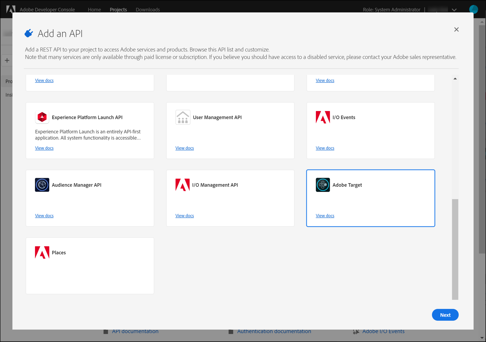
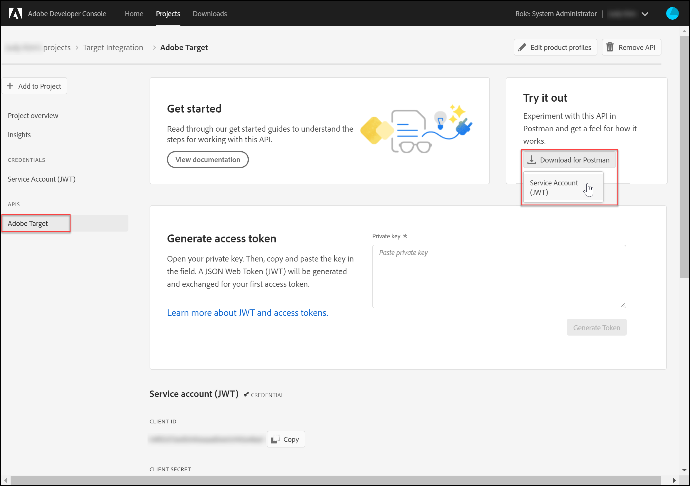
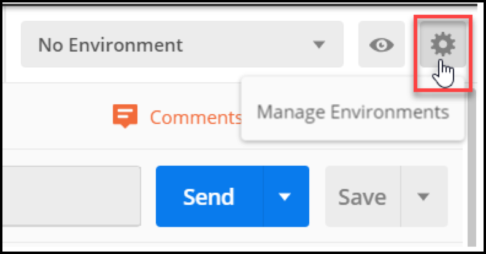
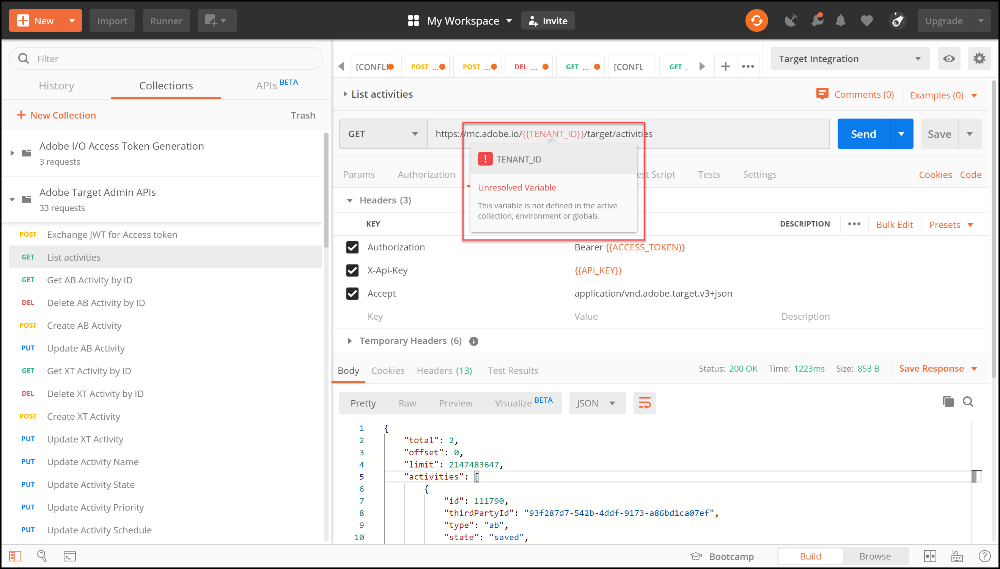

# Configura autenticazione per le API [!DNL Adobe Target]

Le API dell&#39;amministratore [!DNL Adobe Target], incluse le API [!DNL Recommendations Admin], sono protette dall&#39;autenticazione per garantire che solo gli utenti autorizzati possano utilizzarle per accedere a [!DNL Adobe Target]. Utilizza [Adobe Developer Console](https://developer.adobe.com/console/home) per gestire questa autenticazione per tutti i [!DNL Adobe Experience Cloud solutions], incluso [!DNL Adobe Target].

>[!IMPORTANT]
>
>Le credenziali dell’account di servizio (JWT) descritte in questo articolo diventeranno obsolete e verranno sostituite dalle nuove credenziali server-to-server OAuth.
>
>Le credenziali dell’account di servizio (JWT) continueranno a funzionare fino al 1° gennaio 2025. È necessario migrare l’applicazione o l’integrazione per utilizzare le nuove credenziali server-to-server OAuth prima del 1° gennaio 2025.
>
>Per ulteriori informazioni e istruzioni dettagliate per la migrazione dell&#39;integrazione, vedere [Migrazione delle credenziali dall&#39;account di servizio (JWT) alle credenziali server-to-server OAuth](https://developer.adobe.com/developer-console/docs/guides/authentication/ServerToServerAuthentication/migration/){target=_blank} nella documentazione di *Developer Console*.
>
>Per informazioni sulla configurazione delle nuove credenziali OAuth, vedi [Implementazione delle credenziali da server a server OAuth](https://developer.adobe.com/developer-console/docs/guides/authentication/ServerToServerAuthentication/implementation/){target=_blank} nella documentazione di *Developer Console*.

Di seguito sono riportati i passaggi preliminari necessari per generare i token di autenticazione JWT legacy necessari per interagire correttamente con le API [!DNL Adobe Target]:

1. Creare un progetto (precedentemente denominato integrazione) in [!DNL Adobe Developer Console].
1. Esporta dettagli progetto in Postman.
1. Genera un token di accesso bearer.
1. Verifica il token di accesso bearer.

## Prerequisiti

| Risorsa | Dettagli |
| --- | --- |
| Postman | Per completare correttamente questi passaggi, ottieni l&#39;[app Postman](https://www.postman.com/downloads/) per il tuo sistema operativo. Postman basic è gratuito con la creazione dell&#39;account. Anche se non è necessario per utilizzare le API di [!DNL Adobe Target] in generale, Postman semplifica i flussi di lavoro API e [!DNL Adobe Target] fornisce diverse raccolte Postman per aiutarle a eseguire le API e a capire come funzionano. Il resto di questa guida presuppone una conoscenza operativa di Postman. Per assistenza, consulta la [documentazione di Postman](https://learning.getpostman.com/). |
| Riferimenti | Per il resto di questa guida si presume che le risorse seguenti siano familiari:<ul><li>[Github Adobe I/O](https://github.com/adobeio)</li><li>[Documentazione API per l&#39;amministrazione di Target e il profilo](../administer/admin-api/admin-api-overview-new.md)</li><li>[Documentazione API Recommendations](https://developer.adobe.com/target/administer/recommendations-api/)</li></ul> |

## Creazione di un progetto di Adobe I/O

In questa sezione, accederai a [!DNL Adobe Developer Console] e creerai un progetto per [!DNL Adobe Target]. Per ulteriori informazioni, consulta la [documentazione sui progetti](https://developer.adobe.com/developer-console/docs/guides/projects/).

&lt;!— (1) Genera la tua chiave privata e il certificato pubblico, in base alla [documentazione sull&#39;autenticazione](https://developer.adobe.com/developer-console/docs/guides/authentication/). // [//]: # (come descritto in **Passaggio 1** di [Come configurare Adobe IO: Authentication - Passaggio dopo passaggio](https://helpx.adobe.com/marketing-cloud-core/kb/adobe-io-authentication-step-by-step.html). Dopo aver completato il passaggio 1, torna a questa guida e riprendi con il passaggio 2, di seguito. // Il risultato di questo passaggio deve essere la creazione di un file `private.key` e di un file `certificate_pub.crt`. Tornate a questa guida dopo aver generato questi due file.)—>

1. In [Adobe Admin Console](https://adminconsole.adobe.com/), assicurati che all&#39;account utente [!DNL Adobe] sia stato concesso l&#39;accesso di livello [Amministratore prodotto](https://helpx.adobe.com/it/enterprise/using/admin-roles.html) e [Sviluppatore](https://helpx.adobe.com/it/enterprise/using/manage-developers.html) a [!DNL Target].

1. In [Adobe Developer Console](https://developer.adobe.com/console/home), selezionare [!UICONTROL Experience Cloud Organization] per cui si desidera creare questa integrazione. Si noti che è probabile che si abbia accesso solo a un singolo [!UICONTROL Experience Cloud Organization].

   

1. Fare clic su **[!UICONTROL Create new project]**.

   

1. Fare clic su **[!UICONTROL Add API]** per aggiungere un&#39;API REST al progetto per accedere ai servizi e ai prodotti [!DNL Adobe].

   

1. Selezionare **[!DNL Adobe Target]** come servizio [!DNL Adobe] da integrare con. Fare clic sul pulsante **[!UICONTROL Next]** visualizzato.

   

1. Selezionare un&#39;opzione per associare le chiavi pubbliche e private all&#39;integrazione dell&#39;account del servizio che si sta creando per [!DNL Target]. Per questo esempio, selezionare **[!UICONTROL Option 1: Generate a key pair]** e fare clic su **[!UICONTROL Generate keypair]**.

   

1. Come indicato, prendere nota del file di configurazione scaricato automaticamente (`config`), che contiene la chiave privata. Fare clic su **[!UICONTROL Next]**.

   

1. Nel file system verificare il percorso di `config`, ovvero il file di configurazione compresso creato nel passaggio precedente. Anche in questo caso, il file `config` contiene la chiave privata, che sarà necessaria in seguito. La posizione esatta all’interno del file system potrebbe essere diversa da quella mostrata qui.

   

1. In Adobe Developer Console, seleziona i [profili di prodotto](https://helpx.adobe.com/it/enterprise/using/manage-products-and-profiles.html) corrispondenti alle proprietà in cui utilizzi Adobe Recommendations. Se non si utilizzano le proprietà, selezionare l&#39;opzione Default Workspace. Fare clic su **[!UICONTROL Save configured API]**.

   

1. Fare clic su **[!UICONTROL Create Integration]**. Dovresti ricevere un messaggio temporaneo che indica che l’API è stata configurata correttamente.
1. Come ultimo passaggio, rinomina il progetto con un nome più significativo dell&#39;originale `Project 1`. A questo scopo, accedi al progetto utilizzando il percorso di navigazione come mostrato, fai clic su **[!UICONTROL Edit project]** per accedere al modale **[!UICONTROL Edit Project]** e rinomina il progetto.

   

>[!NOTE]
>
>In questo esempio, il progetto viene denominato &quot;[!DNL Target] Integration.&quot; Se prevedi di utilizzare il progetto per più di [!DNL Adobe Target], potrebbe essere utile denominarlo di conseguenza. Ad esempio, puoi scegliere di denominarla &quot;API Adobe&quot; o &quot;API Experience Cloud&quot;, in quanto può essere utilizzata con altre soluzioni in Adobe Experience Cloud.

## Esporta dettagli progetto

Ora che disponi di un progetto Adobe utilizzabile per accedere a [!DNL Target], devi assicurarti di inviare i dettagli del progetto insieme alle richieste API Adobe. Questi dettagli sono necessari per interagire con diverse API Adobe, tra cui diverse API [!DNL Target]. Ad esempio, i dettagli dell&#39;integrazione includono le informazioni di autorizzazione e autenticazione richieste dalle API amministratore [!DNL Target]. Pertanto, per utilizzare le API con Postman, è necessario inserire tali dettagli in Postman.

Esistono diversi modi per specificare i dettagli del progetto in Postman, ma in questa sezione sfrutta alcune funzioni e raccolte predefinite. Innanzitutto (in questa sezione), esporterai i dettagli dell’integrazione in un ambiente Postman. Nella sezione successiva verrà generato un token di accesso Bearer per consentire l’accesso alle risorse Adobi necessarie.

>[!NOTE]
>
>Per istruzioni video applicabili a qualsiasi soluzione Experience Cloud, incluso [!DNL Target], vedi [Utilizzare Postman con le API Experience Platform](https://experienceleague.adobe.com/docs/platform-learn/tutorials/platform-api-authentication.html?lang=it). Le sezioni seguenti sono rilevanti per le API [!DNL Target]: 1. Creazione ed esportazione di Experience Platform API in Postman 2. Generare un token di accesso con Postman. Questi passaggi sono descritti anche di seguito.

1. Sempre in [Adobe Developer Console](https://developer.adobe.com/console/home), passa a visualizzare le credenziali **[!UICONTROL Service Account (JWT)]** del nuovo progetto. Utilizzare la barra di navigazione a sinistra o la sezione **[!UICONTROL Credentials]** come illustrato.

   

   In **[!UICONTROL Credential details]**, si noti che è possibile visualizzare **[!UICONTROL Public key(s)]**, **[!UICONTROL Client ID]** e altre informazioni relative all&#39;account del servizio.

   

1. Fare clic per passare alle informazioni sull&#39;API **[!DNL Adobe Target]**. Utilizza la navigazione a sinistra o la sezione **Prodotti e servizi connessi** come mostrato.

   

1. Fai clic su **[!UICONTROL Download for Postman]** > **[!UICONTROL Service Account (JWT)]** per creare un file JSON che acquisisce le informazioni di autenticazione per un ambiente Postman.

   

   Prendi nota del file JSON nel file system.

   

1. In Postman, fai clic sull&#39;icona a forma di ingranaggio per gestire gli ambienti, quindi fai clic su **[!UICONTROL Import]** per importare il file JSON (ambiente).

   

1. Scegli il tuo file e fai clic su **[!UICONTROL Open]**.

   

1. Nella finestra modale **Gestisci ambienti** di Postman, fai clic sul nome dell&#39;ambiente appena importato per esaminarlo. (Il nome dell’ambiente potrebbe essere diverso da quello mostrato qui. Modifica il nome come desiderato. Non deve necessariamente corrispondere al nome del progetto [!DNL Adobe].)

   

1. I valori delle note `CLIENT_SECRET` e `API_KEY` (insieme ad altre variabili) sono precompilati, presi dall&#39;integrazione definita in Adobe Developer Console. La variabile Postman `CLIENT_SECRET` deve corrispondere alla credenziale di Adobe `CLIENT SECRET` come visualizzata in Developer Console e `API_KEY` in Postman deve corrispondere a `CLIENT ID` in Developer Console. Le note `PRIVATE_KEY`, `JWT_TOKEN` e `ACCESS_TOKEN` sono invece vuote. Iniziamo fornendo il valore `PRIVATE_KEY`.

   

1. Dal file system, aprire il file `config` e aprire il file di chiave `private`.

   

1. Selezionare e copiare l&#39;intero contenuto del file di chiave `private`.

   

1. In Postman, incolla il valore della chiave privata nei campi **[!UICONTROL INITIAL VALUE]** e **[!UICONTROL CURRENT VALUE]**.

   

1. Fare clic su **[!UICONTROL Update]** e chiudere la finestra modale Ambienti.

## Genera il token di accesso bearer

In questa sezione viene generato il token di accesso bearer, necessario per autenticare l&#39;interazione con le API [!DNL Adobe Target]. Per generare il token di accesso bearer, devi inviare i dettagli di integrazione (stabiliti nelle sezioni precedenti) al [servizio Identity Management Adobe (IMS)](https://www.adobe.io/authentication/auth-methods.html#!AdobeDocs/adobeio-auth/master/AuthenticationOverview/AuthenticationGuide.md). Esistono alcuni modi diversi per farlo, ma in questa guida utilizziamo una raccolta Postman contenente una chiamata IMS predefinita che rende il processo diretto e semplice. Dopo aver importato la raccolta, puoi riutilizzarla quando necessario, per generare nuovi token non solo per [!DNL Adobe Target], ma anche per altre API di Adobe.

1. Passa alle [chiamate di Adobe dell&#39;API del servizio Identity Management](https://github.com/adobe/experience-platform-postman-samples/tree/master/apis/ims).

   

1. Fare clic su **[!UICONTROL Adobe I/O Access Token Generation Postman collection]**.

   

1. Ottenere il JSON non elaborato per questa raccolta facendo clic su **[!UICONTROL Raw]** e copiando il JSON risultante negli Appunti. In alternativa, puoi salvare il file JSON non elaborato come file .json.

   

1. In Postman, importa la raccolta incollando e inviando il JSON non elaborato dagli Appunti. In alternativa, puoi caricare il file .json salvato. Fare clic su **[!UICONTROL Continue]**.

   

1. Selezionare la richiesta **[!UICONTROL IMS: JWT Generate + Auth via User Token]** nell&#39;insieme Postman di generazione token di accesso Adobe I/O, verificare che l&#39;ambiente sia selezionato e fare clic su **[!UICONTROL Send]** per generare il token.

   

   >[!NOTE]
   >
   >Questo token di accesso al bearer sarà valido per 24 ore. Invia nuovamente la richiesta ogni volta che devi generare un nuovo token.

1. Apri nuovamente la finestra modale Manage Environments (Gestisci ambienti) e seleziona l’ambiente.

   

1. Nota: i valori `ACCESS_TOKEN` e `JWT_TOKEN` sono ora compilati.

   

Domanda: devo utilizzare la raccolta Postman di generazione del token di accesso Adobe I/O per generare il token web JSON (JWT) e il token di accesso bearer?

Risposta: No. L’insieme Postman Adobe I/O Access Token Generation è disponibile per semplificare la generazione del token di accesso JWT e bearer in Postman. In alternativa, puoi utilizzare le funzionalità di Adobe Developer Console per generare manualmente il token di accesso bearer.

## Verifica il token di accesso bearer

In questo esercizio utilizzerai il nuovo token di accesso bearer inviando una richiesta API per recuperare un elenco di attività dal tuo account [!DNL Target]. Una risposta corretta indica che il progetto [!DNL Adobe] e l&#39;autenticazione funzionano come previsto per utilizzare l&#39;API.

1. Importa la [[!DNL Adobe Target] raccolta Postman API amministratore](https://developers.adobetarget.com/api/#admin-postman-collection). Segui tutti i prompt finché la raccolta non viene importata in Postman.

   

1. Espandere la raccolta e prendere nota della richiesta **[!UICONTROL List activities]**.

   

1. Variabili come `{{access_token}}` inizialmente non risolte. È possibile risolvere il problema in diversi modi, ad esempio definendo una nuova variabile di raccolta denominata `{{access_token}}`. In questa guida verrà invece modificata la richiesta API per sfruttare l&#39;ambiente Postman utilizzato in precedenza. Questo consentirà all’ambiente di continuare a fungere da consolidamento unico e coerente di tutte le variabili comuni tra le API Adobe.

   

1. Digitare per sostituire `{{access_token}}` con `{{ACCESS_TOKEN}}`.

   

1. Digitare per sostituire `{{api_key}}` con `{{API_KEY}}`.

   

1. Digitare per sostituire `{{tenant}}` con `{{TENANT_ID}}`. Nota `{{TENANT_ID}}` non ancora riconosciuta.

   

1. Apri la finestra modale Manage Environments (Gestisci ambienti) e seleziona l’ambiente.

   

1. Digitare per aggiungere una nuova variabile di ambiente `{{TENANT_ID}}`. Copia e incolla il valore ID tenant nei campi **[!UICONTROL INITIAL VALUE]** e **[!UICONTROL CURRENT VALUE]** per la nuova variabile di ambiente `TENANT_ID`.

   

   >[!NOTE]
   >
   >L&#39;ID tenant è diverso da [!DNL Target] `clientcode`. L&#39;ID tenant esiste nell&#39;URL al momento dell&#39;accesso a [!DNL Target]. Per ottenere l&#39;ID tenant, accedi a Adobe Experience Cloud, apri [!DNL Target] e fai clic sulla scheda Target. Utilizza il valore ID tenant indicato nel sottodominio URL. Ad esempio, se l&#39;URL al momento dell&#39;accesso a [!DNL Adobe Target] è `<https://mycompany.experiencecloud.adobe.com/...>`, l&#39;ID tenant sarà &quot;mycompany&quot;.

1. Invia la richiesta, dopo aver verificato di aver selezionato l’ambiente corretto. Dovresti ricevere una risposta contenente l’elenco delle attività.

   

Dopo aver verificato l&#39;autenticazione Adobe, è possibile utilizzarla per interagire con le API [!DNL Adobe Target] (nonché con altre API Adobe). Ad esempio, puoi [utilizzare le API di Recommendations](recs-api/overview.md) per creare o gestire i consigli, oppure puoi utilizzarle con [API di consegna di Target](/help/dev/implement/delivery-api/overview.md).
