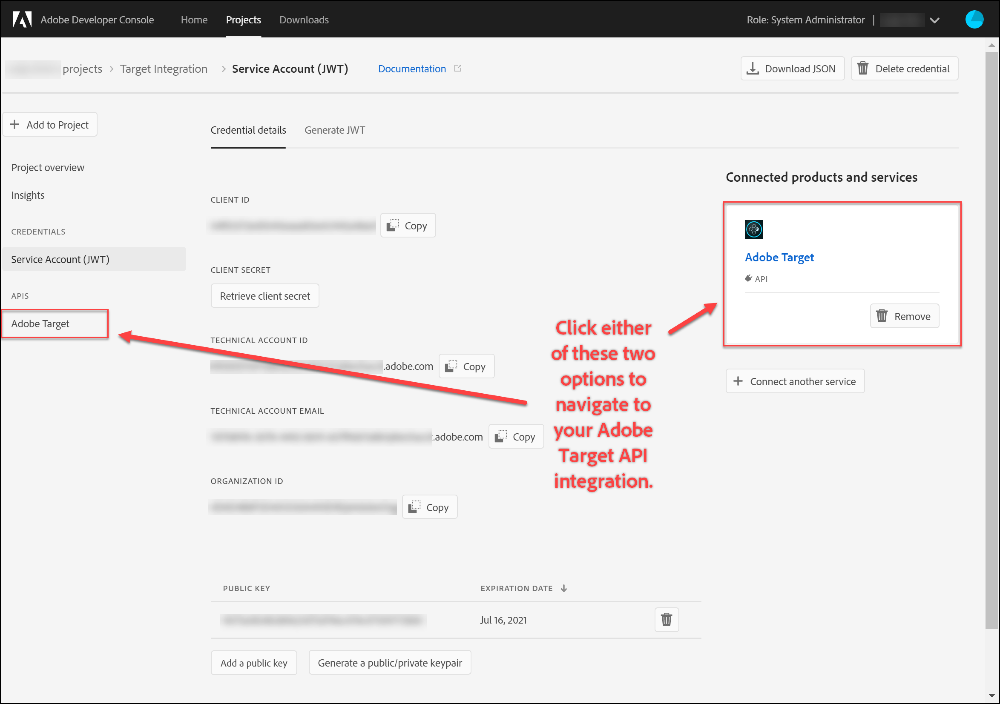
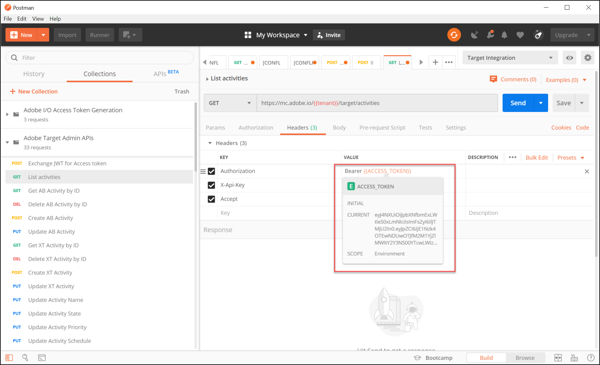

# Configura autenticazione per [!DNL Adobe Target] API

Il [!DNL Adobe Target] API di amministrazione, tra cui [!DNL Recommendations Admin] Le API sono protette dall&#39;autenticazione per garantire che solo gli utenti autorizzati possano accedervi [!DNL Adobe Target]. Utilizza il [Console Adobe Developer](https://developer.adobe.com/console/home) per gestire questa autenticazione per tutti [!DNL Adobe Experience Cloud solutions], tra cui [!DNL Adobe Target].

>[!IMPORTANT]
>
>Le credenziali dell’account di servizio (JWT) descritte in questo articolo diventeranno obsolete e verranno sostituite dalle nuove credenziali server-to-server OAuth.
>
>Le credenziali dell’account di servizio (JWT) continueranno a funzionare fino al 1° gennaio 2025. È necessario migrare l’applicazione o l’integrazione per utilizzare le nuove credenziali server-to-server OAuth prima del 1° gennaio 2025.
>
>Per ulteriori informazioni e istruzioni dettagliate per la migrazione dell’integrazione, consulta [Migrazione dalle credenziali dell’account di servizio (JWT) alle credenziali server-to-server OAuth](https://developer.adobe.com/developer-console/docs/guides/authentication/ServerToServerAuthentication/migration/){target=_blank} nel *Console per sviluppatori* documentazione.
>
>Per informazioni sulla configurazione delle nuove credenziali OAuth, consulta [Implementazione delle credenziali server-to-server OAuth](https://developer.adobe.com/developer-console/docs/guides/authentication/ServerToServerAuthentication/implementation/){target=_blank} nel *Console per sviluppatori* documentazione.

Di seguito sono riportati i passaggi preliminari necessari per generare i token di autenticazione JWT legacy necessari per interagire correttamente con [!DNL Adobe Target] API:

1. Creare un progetto (precedentemente denominato integrazione) in [!DNL Adobe Developer Console].
1. Esporta dettagli progetto in Postman.
1. Genera un token di accesso bearer.
1. Verifica il token di accesso bearer.

## Prerequisiti

| Risorsa | Dettagli |
| --- | --- |
| Postman | Per completare correttamente questi passaggi, scarica il [app Postman](https://www.postman.com/downloads/) per il sistema operativo. Postman basic è gratuito con la creazione dell&#39;account. Sebbene non sia necessario per utilizzare [!DNL Adobe Target] API in generale, Postman semplifica i flussi di lavoro API e [!DNL Adobe Target] fornisce diverse raccolte Postman per aiutarti a eseguire le API e a scoprire come funzionano. Il resto di questa guida presuppone una conoscenza operativa di Postman. Per assistenza, consulta [Documentazione di Postman](https://learning.getpostman.com/). |
| Riferimenti | Per il resto di questa guida si presume che le risorse seguenti siano familiari:<ul><li>[Adobe I/O Github](https://github.com/adobeio)</li><li>[Documentazione API per l’amministrazione di Target e il profilo](../administer/admin-api/admin-api-overview-new.md)</li><li>[Documentazione API di Recommendations](https://developers.adobetarget.com/api/recommendations/)</li></ul> |

## Creazione di un progetto di Adobe I/O

In questa sezione, potrai accedere al [!DNL Adobe Developer Console] e crea un progetto per [!DNL Adobe Target]. Per ulteriori informazioni, consulta [documentazione sui progetti](https://developer.adobe.com/developer-console/docs/guides/projects/).

&lt;!---(1. Genera la tua chiave privata e il certificato pubblico, in base al [documentazione sull’autenticazione](https://developer.adobe.com/developer-console/docs/guides/authentication/). // [//]: # (come descritto in **Passaggio 1** di [Come impostare Adobe IO: Authentication - procedura dettagliata](https://helpx.adobe.com/marketing-cloud-core/kb/adobe-io-authentication-step-by-step.html). Dopo aver completato il passaggio 1, torna a questa guida e riprendi con il passaggio 2, di seguito. // Il risultato di questa fase dovrebbe essere la creazione di un `private.key` file e un `certificate_pub.crt` file. Tornate a questa guida dopo aver generato questi due file.)—>

1. In [Adobe Admin Console](https://adminconsole.adobe.com/), assicurati che [!DNL Adobe] l&#39;account utente è stato concesso entrambi [Amministratore prodotto](https://helpx.adobe.com/enterprise/using/admin-roles.html) e [Sviluppatore](https://helpx.adobe.com/enterprise/using/manage-developers.html) livello di accesso a [!DNL Target].

1. In [Console Adobe Developer](https://developer.adobe.com/console/home), seleziona la [!UICONTROL Organizzazione Experience Cloud] per la quale desideri creare questa integrazione. (È probabile che tu abbia accesso a un solo [!UICONTROL Organizzazione Experience Cloud].)

   

1. Clic **[!UICONTROL Crea nuovo progetto]**.

   

1. Clic **[!UICONTROL Aggiungi API]** per aggiungere un’API REST al progetto per accedere a [!DNL Adobe] servizi e prodotti.

   

1. Seleziona **[!DNL Adobe Target]** come [!DNL Adobe] servizio che desideri integrare con. Fai clic su **[!UICONTROL Successivo]** che viene visualizzato.

   

1. Seleziona un’opzione per associare le chiavi pubbliche e private all’integrazione dell’account di servizio per cui stai creando l’app [!DNL Target]. Per questo esempio, seleziona **[!UICONTROL Opzione 1: generazione di una coppia di chiavi]** e fai clic su **[!UICONTROL Genera coppia di chiavi]**.

   

1. Come da istruzioni, annota il file di configurazione scaricato automaticamente (`config`), che contiene la tua chiave privata. Fai clic su **[!UICONTROL Successivo]**.

   

1. Nel file system, verificare la posizione di `config`, file di configurazione compresso creato nel passaggio precedente. Ancora una volta, questo `config` Il file contiene la tua chiave privata, che ti servirà in seguito. La posizione esatta all’interno del file system potrebbe essere diversa da quella mostrata qui.

   

1. Nella console Adobe Developer, seleziona la [profilo/i di prodotto](https://helpx.adobe.com/it/enterprise/using/manage-products-and-profiles.html) corrisponde alle proprietà in cui utilizzi Adobe Recommendations. Se non utilizzi le proprietà, seleziona l’opzione Area di lavoro predefinita. Clic **[!UICONTROL Salva API configurata]**.

   

1. Clic **[!UICONTROL Creare un’integrazione]**. Dovresti ricevere un messaggio temporaneo che indica che l’API è stata configurata correttamente.
1. Come passaggio finale, rinomina il progetto in un nome più significativo dell’originale `Project 1`. A questo scopo, accedi al progetto utilizzando il percorso di navigazione come mostrato, fai clic su **[!UICONTROL Modifica progetto]** per accedere a **[!UICONTROL Modifica Progetto]** e rinominare il progetto.

   

>[!NOTE]
>
>In questo esempio, diamo un nome al nostro progetto &quot;[!DNL Target] Integrazione.&quot; Se prevedi di utilizzare il progetto per più di [!DNL Adobe Target], è possibile denominarlo di conseguenza. Ad esempio, puoi scegliere di denominarla &quot;API Adobe&quot; o &quot;API Experience Cloud&quot;, in quanto può essere utilizzata con altre soluzioni in Adobe Experience Cloud.

## Esporta dettagli progetto

Ora che hai un progetto di Adobe che puoi utilizzare per accedere a [!DNL Target], devi assicurarti di inviare i dettagli di quel progetto insieme alle richieste API di Adobe. Questi dettagli sono necessari per interagire con diverse API di Adobe, tra cui diverse [!DNL Target] API. Ad esempio, i dettagli di integrazione includono le informazioni di autorizzazione e autenticazione richieste da [!DNL Target] API di amministrazione. Pertanto, per utilizzare le API con Postman, è necessario inserire tali dettagli in Postman.

Esistono diversi modi per specificare i dettagli del progetto in Postman, ma in questa sezione sfrutta alcune funzioni e raccolte predefinite. Innanzitutto (in questa sezione), esporterai i dettagli dell’integrazione in un ambiente Postman. Nella sezione successiva verrà generato un token di accesso Bearer per consentire l’accesso alle risorse Adobi necessarie.

>[!NOTE]
>
>Per istruzioni video applicabili a qualsiasi soluzione di Experience Cloud, tra cui [!DNL Target], vedi [Utilizzare Postman con le API Experienci Platform](https://experienceleague.adobe.com/docs/platform-learn/tutorials/platform-api-authentication.html). Le sezioni seguenti sono rilevanti per [!DNL Target] API: 1. Creazione ed esportazione di Experienci Platform API in Postman 2. Generare un token di accesso con Postman. Questi passaggi sono descritti anche di seguito.

1. Ancora in [Console Adobe Developer](https://developer.adobe.com/console/home), passa a visualizzare i **[!UICONTROL Account di servizio (JWT)]** credenziali. Utilizza la barra di navigazione a sinistra o **[!UICONTROL Credenziali]** come mostrato nella.

   

   In entrata **[!UICONTROL Dettagli delle credenziali]**, nota: è possibile visualizzare **[!UICONTROL Chiavi pubbliche]**, **[!UICONTROL ID client]** e altre informazioni relative al tuo account di servizio.

   

1. Fai clic su per passare alle informazioni su **[!DNL Adobe Target]** API. Utilizza la barra di navigazione a sinistra o **Prodotti e servizi connessi** come mostrato nella.

   

1. Clic **[!UICONTROL Scarica per Postman]** > **[!UICONTROL Account di servizio (JWT)]** per creare un file JSON che acquisisca le informazioni di autenticazione per un ambiente Postman.

   

   Prendi nota del file JSON nel file system.

   

1. In Postman, fai clic sull’icona a forma di ingranaggio per gestire gli ambienti, quindi fai clic su **[!UICONTROL Importa]** per importare il file JSON (ambiente).

   

1. Scegli il file e fai clic su **[!UICONTROL Apri]**.

   

1. In Postman **Gestisci ambienti** , fai clic sul nome dell’ambiente appena importato per esaminarlo. (Il nome dell’ambiente potrebbe essere diverso da quello mostrato qui. Modifica il nome come desiderato. Non deve necessariamente corrispondere al nome del [!DNL Adobe] project.)

   

1. Nota `CLIENT_SECRET` e `API_KEY` (insieme ad altre variabili) hanno i loro valori precompilati, tratti dall&#39;integrazione come definita nella console Adobe Developer. (Postman `CLIENT_SECRET` deve corrispondere al valore `CLIENT SECRET` credenziali di Adobe visualizzate in Console sviluppatori e `API_KEY` in Postman deve corrispondere `CLIENT ID` nella Console per sviluppatori.) Al contrario, nota `PRIVATE_KEY`, `JWT_TOKEN`, e `ACCESS_TOKEN` sono vuoti. Iniziamo fornendo il `PRIVATE_KEY` valore.

   

1. Dal file system, apri `config` e aprire il file `private` file di chiave.

   

1. Seleziona e copia l’intero contenuto del `private` file di chiave.

   

1. In Postman, incolla il valore della chiave privata nel **[!UICONTROL VALORE INIZIALE]** e **[!UICONTROL VALORE CORRENTE]** campi.

   

1. Clic **[!UICONTROL Aggiorna]** e chiudi la finestra modale Ambienti.

## Genera il token di accesso bearer

In questa sezione viene generato il token di accesso bearer, necessario per autenticare l’interazione con [!DNL Adobe Target] API. Per generare il token di accesso bearer, devi inviare i dettagli dell’integrazione (stabiliti nelle sezioni precedenti) a [Servizio Identity Management di Adobe (IMS)](https://www.adobe.io/authentication/auth-methods.html#!AdobeDocs/adobeio-auth/master/AuthenticationOverview/AuthenticationGuide.md). Esistono alcuni modi diversi per farlo, ma in questa guida utilizziamo una raccolta Postman contenente una chiamata IMS predefinita che rende il processo diretto e semplice. Dopo aver importato la raccolta, puoi riutilizzarla quando necessario, per generare nuovi token non solo per [!DNL Adobe Target], ma anche altre API di Adobe.

1. Accedi a [Adobe di chiamate di esempio per l’API dei servizi Identity Management](https://github.com/adobe/experience-platform-postman-samples/tree/master/apis/ims).

   

1. Fai clic su **[!UICONTROL Adobe I/O di raccolta Postman per la generazione di token di accesso]**.

   

1. Ottieni il JSON non elaborato per questa raccolta facendo clic su **[!UICONTROL Raw]**, quindi copiando il JSON risultante negli Appunti. In alternativa, puoi salvare il file JSON non elaborato come file .json.

   

1. In Postman, importa la raccolta incollando e inviando il JSON non elaborato dagli Appunti. In alternativa, puoi caricare il file .json salvato. Fate clic su **[!UICONTROL Continue]** (Continua).

   

1. Seleziona la **[!UICONTROL IMS: JWT Generate + Auth tramite token utente]** nell’insieme Postman per la generazione di token di accesso Adobe I/O, assicurati che l’ambiente sia selezionato e fai clic su **[!UICONTROL Invia]** per generare il token.

   

   >[!NOTE]
   >
   >Questo token di accesso al bearer sarà valido per 24 ore. Invia nuovamente la richiesta ogni volta che devi generare un nuovo token.

1. Apri nuovamente la finestra modale Manage Environments (Gestisci ambienti) e seleziona l’ambiente.

   

1. Osserva `ACCESS_TOKEN` e `JWT_TOKEN` I valori ora sono compilati.

   

Domanda: devo utilizzare la raccolta Postman di generazione del token di accesso Adobe I/O per generare il token web JSON (JWT) e il token di accesso bearer?

Risposta: No. L’insieme Postman Adobe I/O Access Token Generation è disponibile per semplificare la generazione del token di accesso JWT e bearer in Postman. In alternativa, puoi utilizzare le funzionalità all’interno della console Adobe Developer per generare manualmente il token di accesso bearer.

## Verifica il token di accesso bearer

In questo esercizio, utilizzerai il nuovo token di accesso bearer inviando una richiesta API che recupera un elenco di attività dal tuo [!DNL Target] account. Una risposta corretta indica che [!DNL Adobe] Il progetto e l’autenticazione funzionano come previsto per utilizzare l’API.

1. Importa [[!DNL Adobe Target] Raccolta Postman di API amministratore](https://developers.adobetarget.com/api/#admin-postman-collection). Segui tutti i prompt finché la raccolta non viene importata in Postman.

   

1. Espandi la raccolta e prendi nota della **[!UICONTROL Elencare attività]** richiesta.

   

1. Tieni presente che le variabili come `{{access_token}}` sono inizialmente non risolti. Puoi risolvere questo problema in diversi modi, ad esempio definendo una nuova variabile di raccolta denominata `{{access_token}}`— In questa guida, modificherai invece la richiesta API per sfruttare l’ambiente Postman che utilizzavi in precedenza. Questo consentirà all’ambiente di continuare a fungere da consolidamento unico e coerente di tutte le variabili comuni tra le API Adobe.

   

1. Digita per sostituire `{{access_token}}` con `{{ACCESS_TOKEN}}`.

   

1. Digita per sostituire `{{api_key}}` con `{{API_KEY}}`.

   

1. Digita per sostituire `{{tenant}}` con `{{TENANT_ID}}`. Nota `{{TENANT_ID}}` non è ancora stato riconosciuto.

   

1. Apri la finestra modale Manage Environments (Gestisci ambienti) e seleziona l’ambiente.

   

1. Digita per aggiungere una nuova `{{TENANT_ID}}` variabile di ambiente. Copia e incolla il valore ID tenant in **[!UICONTROL VALORE INIZIALE]** e **[!UICONTROL VALORE CORRENTE]** campi per il nuovo `TENANT_ID` variabile di ambiente.

   

   >[!NOTE]
   >
   >L’ID tenant è diverso dal tuo [!DNL Target] `clientcode`. L’ID tenant esiste nell’URL al momento dell’accesso a [!DNL Target]. Per ottenere l’ID tenant, accedi a Adobe Experience Cloud, apri [!DNL Target]e fai clic sulla scheda Target. Utilizza il valore ID tenant indicato nel sottodominio URL. Ad esempio, se l’URL di è stato registrato in [!DNL Adobe Target] è `<https://mycompany.experiencecloud.adobe.com/...>` quindi il tuo ID tenant è &quot;mia azienda&quot;.

1. Invia la richiesta, dopo aver verificato di aver selezionato l’ambiente corretto. Dovresti ricevere una risposta contenente l’elenco delle attività.

   

Dopo aver verificato l’autenticazione Adobe, puoi utilizzarla per interagire con [!DNL Adobe Target] API di (nonché altre API di Adobe). Ad esempio, puoi [Utilizzare le API di Recommendations](recs-api/overview.md) per creare o gestire i consigli, oppure puoi utilizzarli con [API di consegna di Target](/help/dev/implement/delivery-api/overview.md).
