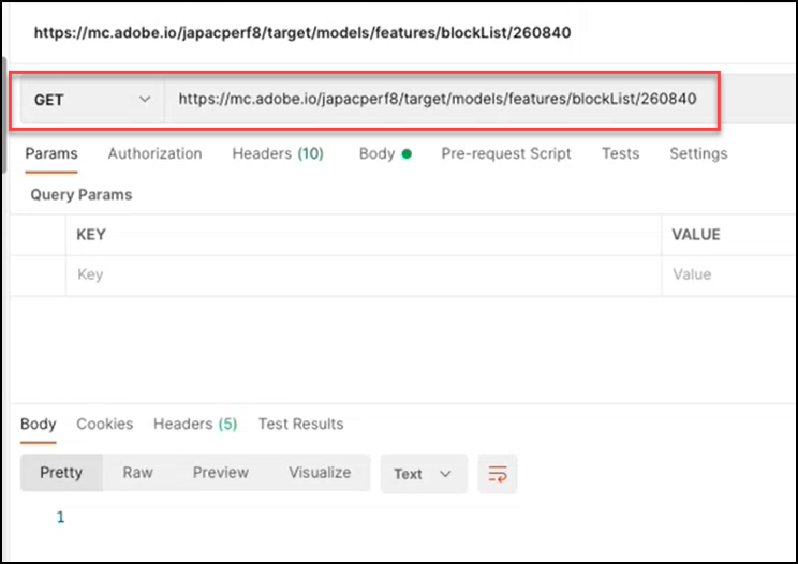

# Panoramica di Models API

L’API Models, denominata anche API di Inserire nell&#39;elenco Bloccati, consente agli utenti di visualizzare e gestire l’elenco di funzioni utilizzate nei modelli di apprendimento automatico per l’apprendimento automatico di. [!UICONTROL Automated Personalization] (AP) [!DNL Auto-Target] attività (AT). Se un utente desidera escludere una funzione dall’utilizzo da parte dei modelli per attività di AP o AT, può utilizzare l’API Models per aggiungere tale funzione al &quot;inserisco nell&#39;elenco Bloccati di&quot;.

A **[!UICONTROL INSERISCO NELL&#39;ELENCO BLOCCATI DI]** definisce l&#39;insieme di feature che verranno escluse da [!DNL Adobe Target] dai modelli di apprendimento automatico. Per ulteriori informazioni sulle funzioni, consulta [Dati utilizzati da [!DNL Target] algoritmi di apprendimento automatico](https://experienceleague.adobe.com/docs/target/using/activities/automated-personalization/ap-data.html).

È possibile definire i Inserisce nell&#39;elenco Bloccati di attività (livello di attività) o per tutte le attività all’interno di una [!DNL Target] account (livello globale).

<!-- To get started with the Models API in order to create and manage your blocklist, download the Postman Collection [here](https://git.corp.adobe.com/target/ml-configuration-management-service/tree/nextRelease/rest_api_library). Note this is an Adobe internal link. Need to publish this publicly if want to share with customers. -->

## Specifiche di Models API

Visualizza la specifica Models API [qui](../administer/models-api/models-api-overview.md).

## Prerequisiti

Per utilizzare Models API, devi configurare l’autenticazione utilizzando [Console Adobe Developer](https://developer.adobe.com/console/home), proprio come faresti con il [API amministratore di Target](../administer/admin-api/admin-api-overview-new.md). Per ulteriori informazioni, consulta [Come configurare l’autenticazione](../before-administer/configure-authentication.md).

## Linee guida per l’utilizzo delle API per modelli

Come gestire i inserisce nell&#39;elenco Bloccati di

[**Passaggio 1:**](#step1) Visualizzare l’elenco delle funzioni per un’attività

[**Passaggio 2:**](#step2) Controlla il inserisco nell&#39;elenco Bloccati di dell’attività

[**Passaggio 3:**](#step3) Aggiungi funzionalità al inserisco nell&#39;elenco Bloccati di dell’attività

[**Passaggio 4:**](#step4) Sblocca (facoltativo)

[**Passaggio 5:**](#step5) (Facoltativo) Gestione del inserisco nell&#39;elenco Bloccati di globale


## Passaggio 1: visualizzare l’elenco delle funzioni per un’attività {#step1}

Inserire nell&#39;elenco Bloccati Prima di la creazione di una feature, visualizzate l&#39;elenco delle feature attualmente incluse nei modelli per tale attività.

>[!BEGINTABS]

>[!TAB Richiesta]

```json {line-numbers="true"}
GET https://mc.adobe.io/<tenant>/target/models/features/<campaignId>
```

>[!TAB Risposta]

```json {line-numbers="true"}
{
    "features": [
        {
            "externalName": "Visitor Profile - Total Visits to Activity",
            "internalName": "SES_PREVIOUS_VISIT_COUNT",
            "type": "CONTINUOUS"
        },
        {
            "externalName": "Visitor Profile - Total Visits",
            "internalName": "SES_TOTAL_SESSIONS",
            "type": "CONTINUOUS"
        },
        {
            "externalName": "Visitor Profile - Pages Seen Before Activity",
            "internalName": "SES_PREVIOUS_VISIT_COUNT",
            "type": "CONTINUOUS"
        },
        {
            "externalName": "Visitor Profile - Activity Lifetime Time on Site",
            "internalName": "SES_TOTAL_TIME",
            "type": "CONTINUOUS"
        }
    ],
    "reportParameters": {
        "clientCode": <tenant>,
        "campaignId": <campaignId>
    }
}
```

>[!ENDTABS]

<!-- JUDY: Update codeblock above once you have the complete Response. -->

Nell’esempio mostrato qui, l’utente sta controllando per visualizzare l’elenco delle funzioni utilizzate nel modello per l’attività di cui viene 260840 l’ID attività.


>[!NOTE]
>
>Per trovare l’ID attività dell’attività, passa all’elenco Attività nella sezione [!DNL Target] UI. Fai clic sull’attività di interesse. L’ID attività viene visualizzato nel corpo della pagina Panoramica delle attività risultante e alla fine dell’URL della pagina.

Il **[!UICONTROL externalName]** è un nome descrittivo per una funzione. Viene creato da [!DNL Target]ed è possibile che questo valore cambi nel tempo. Gli utenti possono visualizzare questi nomi descrittivi nel [Rapporto Approfondimenti personalizzazione](https://experienceleague.adobe.com/docs/target/using/reports/insights/personalization-insights-reports.html).

Il **[!UICONTROL internalName]** è l’identificatore effettivo della funzione. Viene anche creato da [!DNL Target], ma non può essere modificato. Inserire nell&#39;elenco Bloccati Questo è il valore a cui dovrai fare riferimento per identificare le feature che desideri.

Tieni presente che, affinché l’elenco delle funzioni possa essere compilato con valori (ovvero, affinché non sia nullo), un’attività:

1. Deve avere Stato = Live, o deve essere stato attivato in precedenza
1. L&#39;esecuzione deve essere durata abbastanza a lungo per consentire l&#39;esecuzione dell&#39;attività della campagna, in modo che il modello disponga di dati su cui eseguire la campagna.

## Passaggio 2: controllare il inserisco nell&#39;elenco Bloccati di dell’attività {#step2}

Quindi, visualizza il inserisco nell&#39;elenco Bloccati di. In altre parole, verifica quali funzioni, se presenti, sono attualmente bloccate dall’inclusione nei modelli per questa attività.

>[!ERROR]
>
>Tieni presente che `/blockList/` fa distinzione tra maiuscole e minuscole nella richiesta.

>[!BEGINTABS]

>[!TAB Richiesta]

```json {line-numbers="true"}
GET https://mc.adobe.io/<tenant>/target/models/features/blockList/<campaignId>
```

>[!TAB Risposta]

```json {line-numbers="true"}

```

>[!ENDTABS]

Nell’esempio mostrato qui, l’utente sta controllando l’elenco delle funzioni bloccate per l’attività di cui viene 260840 l’ID attività. I risultati sono vuoti, il che significa che questa attività non dispone attualmente di funzioni inserite nell&#39;elenco Bloccati per l’accesso ai dati da parte di un’organizzazione o di un’organizzazione.



>[!NOTE]
>
>Potresti vedere risultati vuoti come questo, la prima volta che controlli l’intero inserisco nell&#39;elenco Bloccati di, prima di aggiungervi qualsiasi funzione. Tuttavia, una volta aggiunte (e successivamente rimosse) feature da un inserire nell&#39;elenco Bloccati inserisco nell&#39;elenco Bloccati di, è possibile che vengano visualizzati risultati leggermente diversi, in cui viene restituito un array di feature di feature di vuoto. Continua a leggere per vedere un esempio di questo in [Passaggio 4](#step4).

## Passaggio 3: aggiungere funzioni al inserisco nell&#39;elenco Bloccati di dell’attività {#step3}

Per aggiungere funzionalità al inserisco nell&#39;elenco Bloccati di, modificare la richiesta da GET a PUT e modificare il corpo della richiesta per specificare `blockedFeatureSources` o `blockedFeatures` come desiderato.

* Il corpo della richiesta richiede `blockedFeatures` o `blockedFeatureSources`. Entrambi possono essere inclusi.
* Popolare `blockedFeatures` con valori identificati da `internalName`. Consulta [Passaggio 1](#step1).
* Popolare `blockedFeatureSources` con i valori della tabella seguente.

Tieni presente che `blockedFeatureSources` indica la provenienza di una feature. Ai fini dell&#39;inserire nell&#39;elenco Bloccati dei gruppi di feature, questi vengono utilizzati come gruppi o categorie di feature che consentono agli utenti di bloccare interi insiemi di feature contemporaneamente. I valori di `blockedFeatureSources` corrisponde ai primi caratteri dell&#39;identificatore di una caratteristica (`blockedFeatures` o `internalName` ), pertanto possono essere considerati anche &quot;prefissi di feature&quot;.

### Tabella di `blockedFeatureSources` valori {#table}

| Prefisso | Descrizione |
| --- | --- |
| BOX | Parametro mbox |
| URL | Personalizzato - Parametro URL |
| ENV | Ambiente |
| SES | Profilo visitatore |
| GEO | Geolocalizzazione |
| PRO | Personalizzato - Profilo |
| SEG | Personalizzato - Segmento di reporting |
| AAM | Personalizzato - Segmento Experience Cloud |
| MOB | Dispositivi mobili |
| CRS | Personalizzato - Attributi del cliente |
| UPA | Personalizzato - Attributo profilo RT-CDP |
| IAC | Aree di interesse visitatore |  |

>[!BEGINTABS]

>[!TAB Richiesta]

```json {line-numbers="true"}
PUT https://mc.adobe.io/<tenant>/target/models/features/blockList/<campaignId>

{
    "blockedFeatureSources": ["AAM"],
    "blockedFeatures": ["SES_PREVIOUS_VISIT_COUNT", "SES_TOTAL_SESSIONS"]
}
```

>[!TAB Risposta]

```json {line-numbers="true"}
{
    "blockedFeatures": [
            "SES_PREVIOUS_VISIT_COUNT",
            "SES_TOTAL_SESSIONS"
        ],
    "blockedFeatureSources": [
            "AAM"
        ]
}
```

>[!ENDTABS]

Nell’esempio mostrato qui, l’utente sta bloccando due funzioni, `SES_PREVIOUS_VISIT_COUNT` e `SES_TOTAL_SESSIONS`, che hanno identificato in precedenza interrogando l’elenco completo delle funzioni per l’attività di cui viene 260480 l’ID attività, come descritto in [Passaggio 1](#step1). Stanno inoltre bloccando tutte le funzioni provenienti dai segmenti Experience Cloud, operazione che si ottiene bloccando le funzioni con il prefisso &quot;AAM&quot;, come descritto nella sezione [tabella](#table) sopra.


Dopo aver inserito nell&#39;elenco Bloccati una feature, si consiglia di verificare il inserisco nell&#39;elenco Bloccati di aggiornamento della feature di eseguendo le operazioni riportate di seguito. [Passaggio 2](#step2) di nuovo (GET il inserisco nell&#39;elenco Bloccati di). Verifica che i risultati vengano visualizzati come previsto (verifica che i risultati includano le funzioni aggiunte dall’ultima richiesta PUT).

## Passaggio 4: (facoltativo) sblocca {#step4}

Per sbloccare tutte le feature inserite nell&#39;elenco Bloccati, cancellate i valori da `blockedFeatureSources` o `blockedFeatures`.

>[!BEGINTABS]

>[!TAB Richiesta]

```json {line-numbers="true"}
PUT https://mc.adobe.io/<tenant>/target/models/features/blockList/<campaignId>

{
    "blockedFeatureSources": [],
    "blockedFeatures": []
}
```

>[!TAB Risposta]

```json {line-numbers="true"}
{
    "blockedFeatures": [],
    "blockedFeatureSources": []
}
```

>[!ENDTABS]

Nell’esempio mostrato qui, l’utente sta cancellando il proprio inserisco nell&#39;elenco Bloccati di per l’attività di cui viene 260840 l’ID attività. La risposta conferma la presenza di array vuoti sia per le funzioni bloccate che per le relative origini:`blockedFeatureSources` e `blockedFeatures`, rispettivamente.


Come sempre, dopo aver modificato il inserisco nell&#39;elenco Bloccati di, si consiglia di eseguire le seguenti operazioni: [Passaggio 2](#step2) di nuovo (GET il inserisco nell&#39;elenco Bloccati di verifica dell’elenco che include le funzioni come previsto). Nell’esempio mostrato qui, l’utente sta verificando che il proprio inserisco nell&#39;elenco Bloccati di sia ora vuoto.


Domanda: come posso eliminare alcuni, ma non tutti, di un inserisco nell&#39;elenco Bloccati di?

Risposta: per rimuovere un sottoinsieme discreto di feature da un inserire nell&#39;elenco Bloccati inserisco nell&#39;elenco Bloccati a più feature, gli utenti possono semplicemente inviare l&#39;elenco aggiornato delle feature che desiderano bloccare in [la richiesta di inserisce nell&#39;elenco Bloccati di](#step3)anziché cancellare l&#39;intero inserisco nell&#39;elenco Bloccati di e aggiungere nuovamente le feature desiderate. In altre parole, invia l’elenco delle funzioni aggiornato (come mostrato nella [Passaggio 3](#step3)), accertandosi di escludere le funzioni che si desidera &quot;eliminare&quot; dal inserisco nell&#39;elenco Bloccati di.

## Passaggio 5: (facoltativo) gestisci il inserisco nell&#39;elenco Bloccati di globale {#step5}

Gli esempi di cui sopra si collocano tutti nel contesto di un’unica attività. Puoi anche bloccare le funzionalità per tutte le attività in un dato client (tenant), invece di dover specificare il inserisco nell&#39;elenco Bloccati di per ogni attività singolarmente. Per eseguire un inserisco nell&#39;elenco Bloccati di globale, utilizzare `/blockList/global` chiama, invece di `blockList/<campaignId>`.

>[!BEGINTABS]

>[!TAB Richiesta]

```json {line-numbers="true"}
PUT https://mc.adobe.io/<tenant>/target/models/features/blockList/global

{
    "blockedFeatureSources": ["AAM", "PRO", "ENV"],
    "blockedFeatures": ["AAM_FEATURE_1", "AAM_FEATURE_2"]
}
```

>[!TAB Risposta]

```json {line-numbers="true"}
{
    "blockedFeatures": [
        "AAM_FEATURE_1",
        "AAM_FEATURE_2"
    ],
    "blockedFeatureSources": [
        "AAM",
        "PRO",
        "ENV"
    ]
}
```

>[!ENDTABS]

Nell’esempio di richiesta mostrato qui sopra, l’utente sta bloccando due funzioni, &quot;AAM_FEATURE_1&quot; e &quot;AAM_FEATURE_2&quot;, per tutte le attività in [!DNL Target] account. Ciò significa che, indipendentemente dall’attività, &quot;AAM_FEATURE_1&quot; e &quot;AAM_FEATURE_2&quot; non saranno inclusi nei modelli di apprendimento automatico per questo account. Inoltre, l’utente blocca a livello globale anche tutte le funzioni il cui prefisso è &quot;AAM&quot;, &quot;PRO&quot; o &quot;ENV&quot;.

Domanda: l&#39;esempio di codice qui sopra non è ridondante?

Risposta: Sì. È ridondante bloccare le funzioni con valori che iniziano con &quot;AAM&quot;, bloccando al contempo tutte le funzioni la cui origine è &quot;AAM&quot;. Il risultato netto è che tutte le funzioni originate dall’AAM (segmenti Experience Cloud) verranno bloccate. Pertanto, se l’obiettivo è quello di bloccare tutte le funzioni di Experience Cloud Segments, non è necessario specificare singolarmente alcune funzioni che iniziano con &quot;AAM&quot;, nell’esempio precedente.

Passaggio finale: a livello di attività o globale, è consigliabile verificare il inserisco nell&#39;elenco Bloccati di aggiornamento dopo averlo modificato, per assicurarsi che contenga i valori previsti. Per farlo, modifica il `PUT` a un `GET`.

La risposta di esempio mostrata di seguito indica [!DNL Target] sta bloccando due singole funzioni, oltre a tutte quelle fornite da &quot;AAM&quot;, &quot;PRO&quot; e &quot;ENV&quot;.


