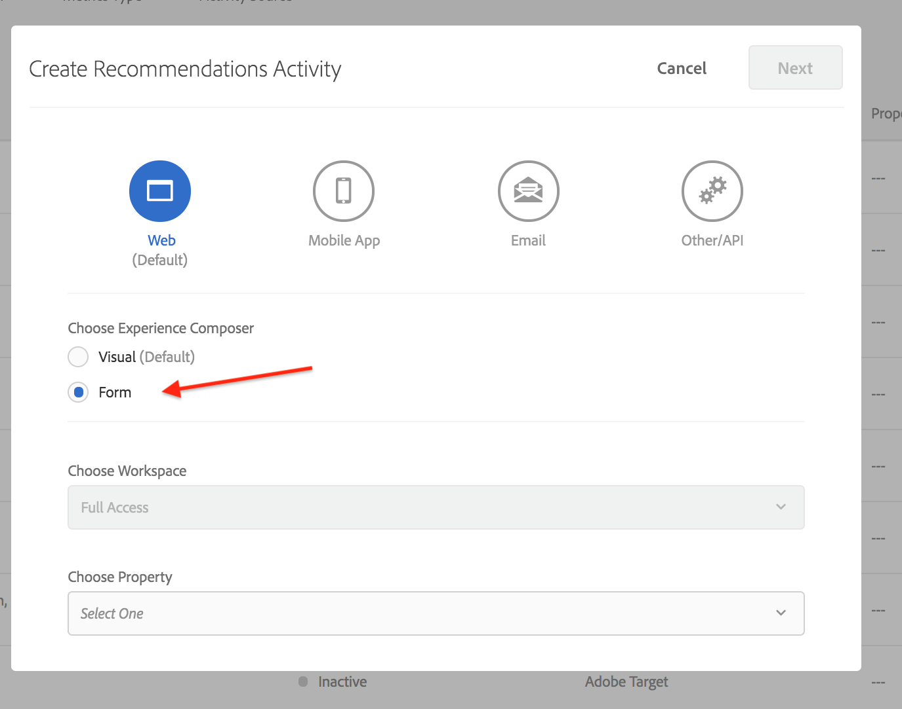
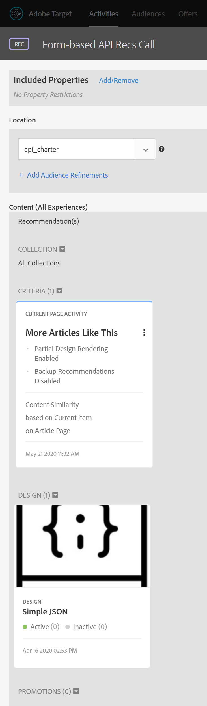
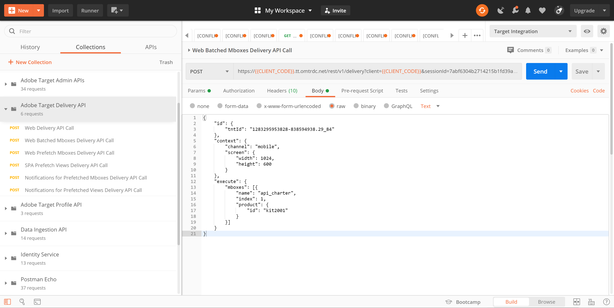

# Recupero di Recommendations con l’API di recapito

Le API per la funzione Consigli di Adobe Target ed Adobe Target possono essere utilizzate per fornire risposte alle pagine web, ma anche in esperienze non basate su HTML, come app, schermi, console, e-mail, chioschi e altri dispositivi di visualizzazione. In altre parole, quando non è possibile utilizzare le librerie di Target e JavaScript, l&#39;[API di consegna di Target](/help/dev/implement/delivery-api/overview.md) consente ancora l&#39;accesso all&#39;intera gamma di funzionalità di Target, per distribuire esperienze personalizzate.

>[!NOTE]
>
>Quando si richiedono contenuti contenenti consigli effettivi (prodotti o elementi consigliati), utilizza l’API di consegna di Target.

Per recuperare i suggerimenti, invia una chiamata API POST di Adobe Target Delivery con le informazioni contestuali appropriate, che possono includere un ID utente (da utilizzare con i suggerimenti specifici del profilo, ad esempio gli elementi visualizzati di recente dall’utente), il nome mbox pertinente, i parametri mbox, i parametri del profilo o altri attributi. La risposta includerà entity.ids consigliati (e potrebbe includere altri dati di entità) in formato JSON o HTML, che possono quindi essere visualizzati nel dispositivo.

L&#39;[API di recapito](/help/dev/implement/delivery-api/overview.md) per Adobe Target espone tutte le funzionalità esistenti fornite da una richiesta Target standard.

API di recapito:

* Consente di recuperare esperienze o offerte per una località e un pubblico in modo RESTful.
* Non richiede autenticazione.
* Solo POST.
* Non elabora cookie o chiamate di reindirizzamento.
* Non richiede o riconosce &quot;ruoli utente&quot;. Recupera semplicemente i contenuti o segnala gli eventi ai server edge di Target.

Per utilizzare l’API di consegna per fornire esperienze Target, inclusi i consigli, segui questi passaggi:

1. Crea un’attività Target (A/B, XT, AP o Consigli) utilizzando il Compositore basato su moduli (non il Compositore esperienza visivo).
1. Utilizza l’API di consegna per ottenere una risposta per le richieste generate dall’attività Target appena creata.

&lt;!— D: Perché sono entrambe le fasi necessarie a questo scopo? Se hai definito un consiglio basato su moduli per una mbox, qual è il vantaggio di avere ANCHE il passaggio API di consegna in per recuperare i risultati? Perché non puoi semplicemente far sì che la registrazione basata su moduli distribuisca i risultati nel dispositivo di destinazione? ?? R: Vedi il caso d’uso seguente... è il momento in cui desideri &quot;intercettare&quot; i risultati in sospeso per fare più cose prima di visualizzarli. Confronti in tempo reale con i livelli di inventario. —>

## Creare un consiglio utilizzando il Compositore esperienza basato su moduli

Per creare suggerimenti che possono essere utilizzati con l&#39;API di recapito, utilizzare [Modulo di composizione basato su modulo](https://experienceleague.adobe.com/docs/target/using/experiences/form-experience-composer.html).

1. Per prima cosa, crea e salva una progettazione basata su JSON da utilizzare nei consigli. Per il codice JSON di esempio e informazioni di base su come restituire le risposte JSON durante la configurazione di un&#39;attività basata su modulo, vedere la documentazione relativa a [Creazione di schemi di suggerimenti](https://experienceleague.adobe.com/docs/target/using/recommendations/recommendations-design/create-design.html). In questo esempio, la progettazione è denominata *Simple JSON.*
   

1. In Target, seleziona **[!UICONTROL Activities]** > **[!UICONTROL Create Activity]** > **[!UICONTROL Recommendations]**, quindi **[!UICONTROL Form]**.

   

1. Selezionare una proprietà e fare clic su **[!UICONTROL Next]**.
1. Definisci il percorso in cui desideri che gli utenti ricevano la risposta del consiglio. Nell&#39;esempio seguente viene utilizzata una posizione denominata *api_charter*. Seleziona la progettazione basata su JSON, creata in precedenza, denominata *JSON semplice.*
   
1. Salva e attiva il consiglio. Genera risultati. [Una volta che i risultati sono pronti](https://experienceleague.adobe.com/docs/target/using/recommendations/recommendations-activity/previewing-and-launching-your-recommendations-activity.html), puoi utilizzare l&#39;API di consegna per recuperarli.

## Utilizzare l’API di consegna

La sintassi per l&#39;[API di consegna](/help/dev/implement/delivery-api/overview.md) è:

`POST https://{{CLIENT_CODE}}.tt.omtrdc.net/rest/v1/delivery`

1. Nota che il codice client è obbligatorio. Come promemoria, il tuo codice cliente si trova in Adobe Target passando a **[!UICONTROL Recommendations]** > **[!UICONTROL Settings]**. Nota il valore **Codice client** nella sezione **Token API per i consigli**.
   
1. Una volta ottenuto il codice client, crea la chiamata API di recapito. L&#39;esempio seguente inizia con **[!UICONTROL Web Batched Mboxes Delivery API Call]** fornito nella [raccolta di Postman API di recapito](../../implement/delivery-api/overview.md#section/Getting-Started/Postman-Collection), apportando le modifiche necessarie. Ad esempio:
   * gli oggetti **browser** e **address** sono stati rimossi dal **corpo**, poiché non sono necessari per casi d&#39;uso non HTML
   * *api_charter* è elencato come nome della posizione in questo esempio
   * viene specificato entity.id, in quanto questo suggerimento si basa su Content Similarity, che richiede il passaggio di una chiave dell&#39;elemento corrente a Target.
     
Ricordarsi di configurare correttamente i parametri della query. Ad esempio, assicurarsi di specificare `{{CLIENT_CODE}}` come necessario. <!-- Q: In the updated call syntax, entity.id is listed as a profileParameter instead of an mboxParameter as in older versions. Q: Old image  Old accompanying text: "Note this recommendation is based on Content Similar products based on the entity.id sent via mboxParameters." -->
     
1. Invia la richiesta. Questa operazione viene eseguita sulla posizione *api_charter*, su cui è in esecuzione un consiglio attivo, definita con la progettazione JSON che genererà un elenco di entità consigliate.
1. Ricevi una risposta basata sulla progettazione JSON.
   
La risposta include l&#39;ID chiave e gli ID entità delle entità consigliate.

L’utilizzo dell’API di recapito con Recommendations consente di eseguire ulteriori operazioni prima di visualizzare i suggerimenti per il visitatore su un dispositivo non HTML. Ad esempio, è possibile utilizzare la risposta dell&#39;API di recapito per eseguire una ricerca aggiuntiva in tempo reale dei dettagli degli attributi dell&#39;entità (inventario, prezzo, valutazione e così via) da un altro sistema (ad esempio una piattaforma CMS, PIM o e-commerce) prima di visualizzare i risultati finali.

Utilizzando l&#39;approccio descritto in questa guida, è possibile fare in modo che qualsiasi applicazione utilizzi la risposta di Target per fornire consigli personalizzati.

## Implementazioni di esempio

Le risorse seguenti forniscono esempi di varie implementazioni non incentrate sulle HTML. Tenete presente che ogni implementazione sarà unica, a causa del sistema e dei dispositivi coinvolti.

| Risorsa | Dettagli |
| --- | --- |
| [Configurazione dell&#39;estensione Target nel Experience Platform Launch e implementazione delle API Target](https://developer.adobe.com/client-sdks/documentation/adobe-target/) | Passaggi per configurare l’estensione Target nel Experience Platform Launch, aggiungere l’estensione Target all’app e implementare le API Target per richiedere attività, eseguire il preetch delle offerte e attivare la modalità di anteprima visiva. |
| [Client nodo Adobe Target](https://www.npmjs.com/package/@adobe/target-nodejs-sdk) | SDK di destinazione open-source v1.0 |
| [Panoramica sul lato server](../../implement/server-side/server-side-overview.md) | Informazioni sulle API di Adobe Target Server Side Delivery, sulle API di Server Side Batch Delivery, su Node.js SDK e sulle API di Adobe Target Recommendations. |
| [Consigli sul contenuto di Adobe Campaign in e-mail](https://medium.com/adobetech/adobe-campaign-content-recommendations-in-email-b51ced771d7f) | Blog che descrive come sfruttare i consigli sui contenuti nelle e-mail tramite Adobe Target e Adobe I/O Runtime in Adobe Campaign. |

## Gestione della configurazione di Recommendations con le API

Nella maggior parte dei casi, i suggerimenti vengono configurati nell’interfaccia utente di Adobe Target, quindi utilizzati o a cui si accede tramite le API di destinazione, per motivi come quelli menzionati nelle sezioni precedenti. Questo coordinamento UI-API è comune. Tuttavia, a volte gli utenti possono voler eseguire tutte le azioni tramite le API, sia per la configurazione che per l’utilizzo dei risultati. Anche se molto meno comuni, gli utenti possono assolutamente configurare, eseguire, *e* sfruttare i risultati dei suggerimenti interamente utilizzando le API.

Nella [sezione precedente](manage-catalog.md) abbiamo appreso come gestire le entità Adobe Target Recommendations e distribuirle sul lato server. Analogamente, la [Adobe Developer Console](https://developer.adobe.com/console/home) consente di gestire criteri, promozioni, raccolte e modelli di progettazione senza dover accedere ad Adobe Target. È possibile trovare un elenco completo di tutte le API di Recommendations [qui](https://developer.adobe.com/target/administer/recommendations-api/), ma ecco un riepilogo di riferimento.

| Risorsa | Dettagli |
| --- | --- |
| [Raccolte](https://developer.adobe.com/target/administer/recommendations-api/#tag/Collections) | Elenca, crea, ottieni, modifica ed elimina raccolte. |
| [Criteri](https://developer.adobe.com/target/administer/recommendations-api/#tag/Criteria) | Elencare e ottenere i criteri. |
| [Progettazioni](https://developer.adobe.com/target/administer/recommendations-api/#tag/Designs) | Elencare, creare, ottenere, modificare, eliminare e convalidare le progettazioni. |
| [Entità](https://developer.adobe.com/target/administer/recommendations-api/#tag/Entities) | Salvare, eliminare e ottenere le entità. |
| [Promozioni](https://developer.adobe.com/target/administer/recommendations-api/#tag/Promotions) | Elenca, crea, ottieni, modifica ed elimina promozioni. |
| [Criteri categoria](https://developer.adobe.com/target/administer/recommendations-api/#tag/Category-Criteria) | Elencare, creare, ottenere, modificare ed eliminare i criteri di categoria. |
| [Criteri personalizzati](https://developer.adobe.com/target/administer/recommendations-api/#tag/Custom-Criteria) | Elencare, creare, ottenere, modificare ed eliminare criteri personalizzati. |
| [Criteri elemento](https://developer.adobe.com/target/administer/recommendations-api/#tag/Item-Criteria) | Elenca, crea, ottieni, modifica ed elimina i criteri degli elementi. |
| [Criteri di popolarità](https://developer.adobe.com/target/administer/recommendations-api/#tag/Popularity-Criteria) | Elencare, creare, ottenere, modificare ed eliminare criteri di popolarità. |
| [Criteri attributo profilo](https://developer.adobe.com/target/administer/recommendations-api/#tag/Profile-Attribute-Criteria) | Elenca, crea, ottieni, modifica ed elimina i criteri degli attributi di profilo. |
| [Criteri recenti](https://developer.adobe.com/target/administer/recommendations-api/#tag/Recent-Criteria) | Elenca, crea, ottieni, modifica ed elimina criteri recenti. |
| [Criteri di sequenza](https://developer.adobe.com/target/administer/recommendations-api/#tag/Sequence-Criteria) | Elencare, creare, ottenere, modificare ed eliminare criteri di sequenza. |

## Documentazione di riferimento

* [Documentazione API di consegna di Adobe Target](/help/dev/implement/delivery-api/overview.md)
* [Integrare i consigli con e-mail](https://experienceleague.adobe.com/docs/target/using/recommendations/recommendations-faq/integrating-recs-email.html)

## Riepilogo e revisione

Congratulazioni! Completando questa guida, hai imparato a:
* [Gestire il catalogo con l’API di Recommendations](manage-catalog.md)
* [Gestire i criteri personalizzati utilizzando l’API di Recommendations](manage-custom-criteria.md)
* [Utilizzare l’API di recapito con Recommendations](fetch-recs-server-side-delivery-api.md)
