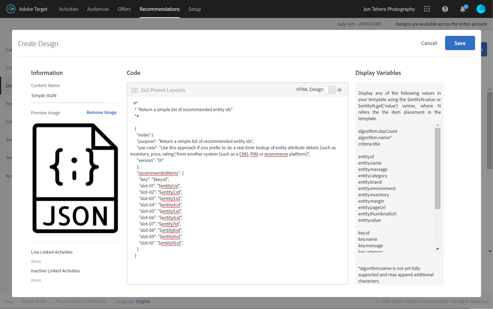

# Recupero di Recommendations con l’API di consegna

Le API Recommendations di Adobe Target e Adobe Target possono essere utilizzate per fornire risposte alle pagine web, ma possono anche essere utilizzate in esperienze non basate su HTML, tra cui app, schermi, console, e-mail, chioschi e altri dispositivi di visualizzazione. In altre parole, quando non è possibile utilizzare le librerie di Target e JavaScript, l&#39;[API di consegna di Target](/help/dev/implement/delivery-api/overview.md) consente ancora l&#39;accesso all&#39;intera gamma di funzionalità di Target, per distribuire esperienze personalizzate.

>[!NOTE]
>
>Quando si richiedono contenuti contenenti consigli effettivi (prodotti o elementi consigliati), utilizza l’API di consegna di Target.

Per recuperare i consigli, invia una chiamata POST API di consegna Adobe Target con le informazioni contestuali appropriate, che possono includere un ID utente (da utilizzare con i consigli specifici del profilo, come gli elementi visualizzati di recente dall’utente), il nome mbox pertinente, i parametri mbox, i parametri del profilo o altri attributi. La risposta includerà il file entity.ids consigliato (e potrebbe includere altri dati di entità) in formato JSON o HTML, che potrà quindi essere visualizzato nel dispositivo.

L&#39;[API di consegna](/help/dev/implement/delivery-api/overview.md) per Adobe Target espone tutte le funzionalità esistenti fornite da una richiesta Target standard.

L’API di consegna:

* Consente di recuperare esperienze o offerte per una posizione e un pubblico in modo RESTful.
* Non richiede alcuna autenticazione.
* Solo POST.
* Non elabora cookie o chiamate di reindirizzamento.
* Non richiede o riconosce &quot;ruoli utente&quot;. Recupera semplicemente i contenuti o segnala gli eventi ai server edge di Target.

Per utilizzare l’API di consegna per fornire esperienze Target, inclusi i consigli, segui questi passaggi:

1. Crea un’attività Target (A/B, XT, AP o Recommendations) utilizzando il Compositore basato su moduli (non il Compositore esperienza visivo).
1. Utilizza l’API di consegna per ottenere una risposta per le richieste generate dall’attività Target appena creata.

&lt;!— D: Perché sono entrambe le fasi necessarie a questo scopo? Se hai definito un consiglio basato su moduli per una mbox, qual è il vantaggio di avere ANCHE il passaggio API di consegna in per recuperare i risultati? Perché non puoi semplicemente far sì che la registrazione basata su moduli distribuisca i risultati nel dispositivo di destinazione? ?? R: Vedi il caso d’uso seguente... è il momento in cui desideri &quot;intercettare&quot; i risultati in sospeso per fare più cose prima di visualizzarli. Confronti in tempo reale con i livelli di inventario. —>

## Creare un consiglio utilizzando il Compositore esperienza basato su moduli

Per creare consigli che possono essere utilizzati con l&#39;API di consegna, utilizza il [Compositore basato su modulo](https://experienceleague.adobe.com/docs/target/using/experiences/form-experience-composer.html).

1. Innanzitutto, crea e salva una progettazione basata su JSON da utilizzare nei consigli. Per un esempio di JSON e informazioni generali su come restituire le risposte JSON durante la configurazione di un&#39;attività basata su modulo, consulta la documentazione su [Creazione di progettazioni per consigli](https://experienceleague.adobe.com/docs/target/using/recommendations/recommendations-design/create-design.html). In questo esempio, la progettazione è denominata *JSON semplice.*
   

1. In Target, passa a **[!UICONTROL Activities]** > **[!UICONTROL Create Activity]** > **[!UICONTROL Recommendations]**, quindi seleziona **[!UICONTROL Form]**.

   

1. Selezionare una proprietà e fare clic su **[!UICONTROL Next]**.
1. Definisci il percorso in cui desideri che gli utenti ricevano la risposta del consiglio. Nell&#39;esempio seguente viene utilizzata una posizione denominata *api_charter*. Seleziona la progettazione basata su JSON, creata in precedenza, denominata *JSON semplice.*
   
1. Salva e attiva il consiglio. Genera risultati. [Una volta che i risultati sono pronti](https://experienceleague.adobe.com/docs/target/using/recommendations/recommendations-activity/previewing-and-launching-your-recommendations-activity.html), puoi utilizzare l&#39;API di consegna per recuperarli.

## Utilizzare l’API di consegna

La sintassi per l&#39;[API di consegna](/help/dev/implement/delivery-api/overview.md) è:

`POST https://{{CLIENT_CODE}}.tt.omtrdc.net/rest/v1/delivery`

1. Nota che il codice client è obbligatorio. Come promemoria, il tuo codice cliente si trova in Adobe Target passando a **[!UICONTROL Recommendations]** > **[!UICONTROL Settings]**. Nota il valore **Codice client** nella sezione **Token API per i consigli**.
   
1. Una volta ottenuto il codice client, crea la chiamata API di consegna. L&#39;esempio seguente inizia con **[!UICONTROL Web Batched Mboxes Delivery API Call]** fornito nella [raccolta Postman API Delivery](../../implement/delivery-api/overview.md/#section/Getting-Started/Postman-Collection), apportando le modifiche necessarie. Ad esempio:
   * gli oggetti **browser** e **address** sono stati rimossi da **Body**, poiché non sono necessari per casi di utilizzo non HTML
   * *api_charter* è elencato come nome della posizione in questo esempio
   * viene specificato entity.id, in quanto questo consiglio si basa sulla somiglianza dei contenuti, che richiede la trasmissione di una chiave dell&#39;elemento corrente a Target.
     
Ricorda di configurare correttamente i parametri di query. Ad esempio, assicurarsi di specificare `{{CLIENT_CODE}}` come necessario. &lt;!— Q: nella sintassi di chiamata aggiornata, entity.id è elencato come profileParameter invece di mboxParameter come nelle versioni precedenti. —> &lt;!— D: Immagine precedente  Testo di accompagnamento precedente: &quot;Nota: questo consiglio si basa su prodotti simili di contenuto basati sul file entity.id inviato tramite mboxParameters.&quot; —>
     
1. Invia la richiesta. Questa operazione viene eseguita sulla posizione *api_charter*, su cui è in esecuzione un consiglio attivo, definita con la progettazione JSON che restituirà un elenco di entità consigliate.
1. Ricevi una risposta in base alla progettazione JSON.
   
La risposta include l’ID della chiave e gli ID delle entità consigliate.

Questo utilizzo dell’API di consegna con Recommendations consente di eseguire passaggi aggiuntivi prima di visualizzare i consigli al visitatore sul dispositivo non HTML. Ad esempio, puoi prendere la risposta dall’API di consegna per eseguire una ricerca aggiuntiva e in tempo reale dei dettagli degli attributi di entità (inventario, prezzo, valutazione e così via) da un altro sistema (come una piattaforma CMS, PIM o e-commerce), prima di visualizzare i risultati finali.

Utilizzando l’approccio descritto in questa guida, puoi ottenere da qualsiasi applicazione di sfruttare la risposta di Target per fornire consigli personalizzati.

## Implementazioni di esempio

Le risorse seguenti forniscono esempi di varie implementazioni non incentrate su HTML. Tieni presente che ogni implementazione sarà unica, a causa del sistema e dei dispositivi coinvolti.

| Risorsa | Dettagli |
| --- | --- |
| [Adobe Target Everywhere - Implementa lato server o nell&#39;IoT](https://expleague.azureedge.net/labs/L733/index.html) | Adobe Summit 2019 Lab offre un’esperienza pratica per un’applicazione React che sfrutta le API lato server di Adobe Target. |
| [Adobe Target in un&#39;app mobile senza l&#39;SDK Adobe](https://community.tealiumiq.com/t5/Universal-Data-Hub/Adobe-Target-in-a-Mobile-App-Without-the-Adobe-SDK/ta-p/26753) | Questa guida illustra come configurare Adobe Target nell’app mobile senza installare l’SDK di Adobe. Questa soluzione utilizza la visualizzazione web dell’SDK Tealium e il modulo Remote Commands per inviare e ricevere richieste all’API visitatore Adobe (Experience Cloud) e all’API Adobe Target. |
| [Configurazione dell&#39;estensione Target nel Experience Platform Launch e implementazione delle API di Target](https://developer.adobe.com/client-sdks/documentation/adobe-target/) | Passaggi per configurare l’estensione Target in Experienci Platform Launch, aggiungere l’estensione Target all’app e implementare le API Target per richiedere attività, preacquisire offerte e attivare la modalità di anteprima visiva. |
| [Client nodo Adobe Target](https://www.npmjs.com/package/@adobe/target-nodejs-sdk) | SDK Node.js v1.0 di Target open-source |
| [Panoramica lato server](../../implement/server-side/server-side-overview.md) | Informazioni su API di distribuzione lato server di Adobe Target, API di distribuzione in batch lato server, SDK di Node.js e API di Adobe Target Recommendations. |
| [Recommendations dei contenuti di Adobe Campaign nel messaggio e-mail](https://medium.com/adobetech/adobe-campaign-content-recommendations-in-email-b51ced771d7f) | Blog che descrive come sfruttare i consigli sui contenuti nelle e-mail tramite Adobe Target e Adobe I/O Runtime in Adobe Campaign. |

## Gestione delle installazioni di Recommendations con le API

Nella maggior parte dei casi, i consigli sono configurati nell’interfaccia utente di Adobe Target e quindi utilizzati o accessibili tramite le API di Target, per motivi come quelli menzionati nelle sezioni precedenti. Questo coordinamento UI-API è comune. Tuttavia, a volte gli utenti possono voler eseguire tutte le azioni tramite API, sia la configurazione che l’utilizzo dei risultati. Anche se molto meno comune, gli utenti possono assolutamente configurare, eseguire, *e* sfruttare i risultati dei consigli interamente utilizzando le API.

In una [sezione precedente](manage-catalog.md) abbiamo imparato a gestire le entità Recommendations di Adobe Target e a distribuirle lato server. Analogamente, [Adobe Developer Console](https://developer.adobe.com/console/home) consente di gestire criteri, promozioni, raccolte e modelli di progettazione senza dover accedere ad Adobe Target. Un elenco completo di tutte le API di Recommendations è disponibile [qui](https://developer.adobe.com/target/administer/recommendations-api/), ma qui trovi un riepilogo a titolo di riferimento.

| Risorsa | Dettagli |
| --- | --- |
| [Raccolte](https://developer.adobe.com/target/administer/recommendations-api/#tag/Collections) | Elenca, crea, ottieni, modifica ed elimina raccolte. |
| [Criteri](https://developer.adobe.com/target/administer/recommendations-api/#tag/Criteria) | Elencare e ottenere i criteri. |
| [Progettazioni](https://developer.adobe.com/target/administer/recommendations-api/#tag/Designs) | Elencare, creare, ottenere, modificare, eliminare e convalidare le progettazioni. |
| [Entità](https://developer.adobe.com/target/administer/recommendations-api/#tag/Entities) | Salvare, eliminare e ottenere le entità. |
| [Promozioni](https://developer.adobe.com/target/administer/recommendations-api/#tag/Promotions) | Elenca, crea, ottieni, modifica ed elimina promozioni. |
| [Criteri categoria](https://developer.adobe.com/target/administer/recommendations-api/#tag/Category-Criteria) | Elenca, crea, ottieni, modifica ed elimina criteri di categoria. |
| [Criteri personalizzati](https://developer.adobe.com/target/administer/recommendations-api/#tag/Custom-Criteria) | Elenca, crea, ottieni, modifica ed elimina criteri personalizzati. |
| [Criteri elemento](https://developer.adobe.com/target/administer/recommendations-api/#tag/Item-Criteria) | Elenca, crea, ottieni, modifica ed elimina i criteri degli elementi. |
| [Criteri di popolarità](https://developer.adobe.com/target/administer/recommendations-api/#tag/Popularity-Criteria) | Elencare, creare, ottenere, modificare ed eliminare criteri di popolarità. |
| [Criteri attributo profilo](https://developer.adobe.com/target/administer/recommendations-api/#tag/Profile-Attribute-Criteria) | Elenca, crea, ottieni, modifica ed elimina i criteri degli attributi di profilo. |
| [Criteri recenti](https://developer.adobe.com/target/administer/recommendations-api/#tag/Recent-Criteria) | Elenca, crea, ottieni, modifica ed elimina criteri recenti. |
| [Criteri di sequenza](https://developer.adobe.com/target/administer/recommendations-api/#tag/Sequence-Criteria) | Elencare, creare, ottenere, modificare ed eliminare criteri di sequenza. |

## Documentazione di riferimento

* [Documentazione API di consegna di Adobe Target](/help/dev/implement/delivery-api/overview.md)
* [Integrare i Recommendations con l’e-mail](https://experienceleague.adobe.com/docs/target/using/recommendations/recommendations-faq/integrating-recs-email.html)

## Riepilogo e revisione

Congratulazioni! Completando questa guida, hai imparato a:
* [Gestire il catalogo utilizzando l’API Recommendations](manage-catalog.md)
* [Gestire i criteri personalizzati tramite l’API di Recommendations](manage-custom-criteria.md)
* [Utilizzare l’API di consegna con Recommendations](fetch-recs-server-side-delivery-api.md)
