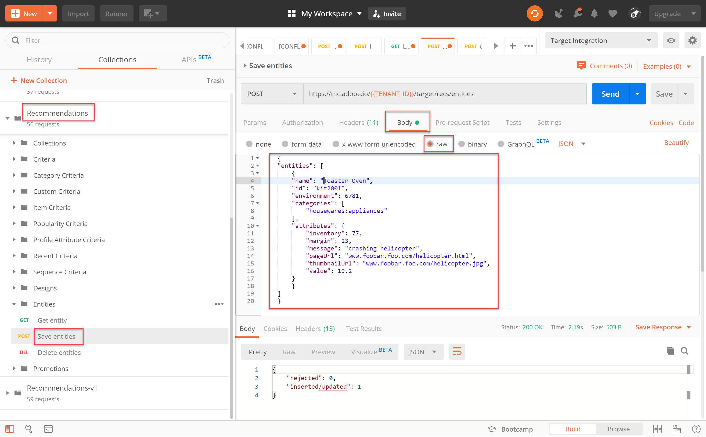
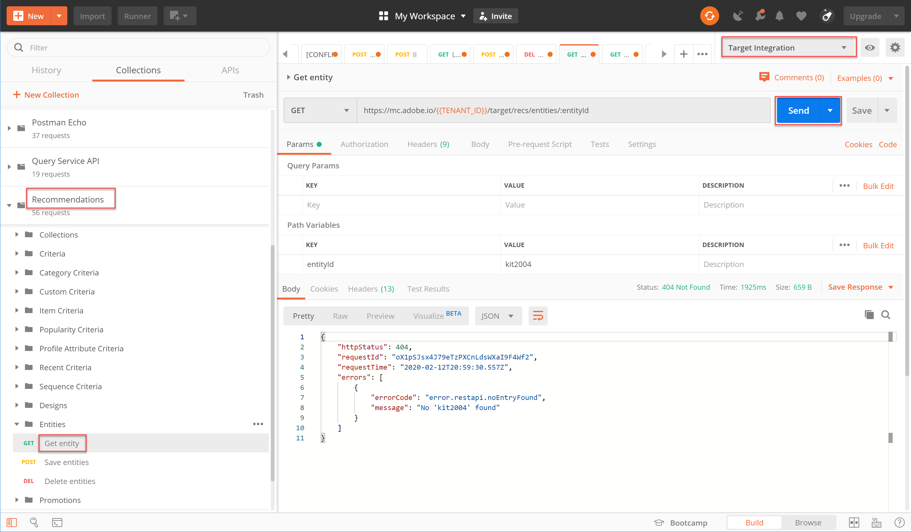
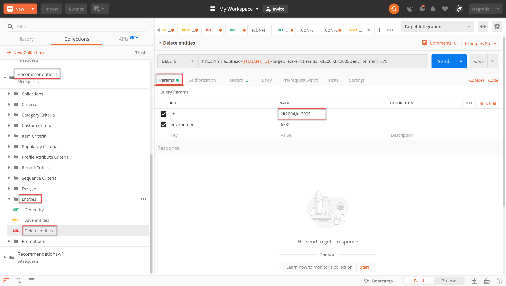

# Gestire il catalogo Recommendations tramite API

Assicurandoti al contempo di soddisfare i [requisiti per utilizzare l’API di Recommendations](/help/dev/before-administer/recs-api/overview.md#prerequisites), hai imparato a [generare un token di accesso](/help/dev/before-administer/configure-authentication.md) utilizzo del flusso di autenticazione JWT per utilizzare [!DNL Adobe Target] API di amministrazione su [Console Adobe Developer](https://developer.adobe.com/console/home).

Ora puoi utilizzare la [API di Recommendations](https://developers.adobetarget.com/api/recommendations/) per aggiungere, aggiornare o eliminare elementi nel catalogo dei consigli. Come per le altre API amministratore di Adobe Target, le API Recommendations richiedono l’autenticazione.

>[!NOTE]
>
>Invia il **[!UICONTROL IMS: JWT Generate + Auth tramite token utente]** richiede ogni volta che devi aggiornare il token di accesso per l’autenticazione, poiché scade dopo 24 ore. Consulta [Configurare l’autenticazione API Adobe](../configure-authentication.md) per istruzioni.


Prima di procedere, ottenere [Raccolta Postman di Recommendations](https://developers.adobetarget.com/api/recommendations/#section/Postman).

## Creazione e aggiornamento di elementi con l’API Save Entities

Per popolare il database di prodotti Recommendations utilizzando l’API anziché un feed di prodotto CSV o richieste Target che vengono attivate sulle pagine dei prodotti, utilizza [Salva API entità](https://developers.adobetarget.com/api/recommendations/#operation/saveEntities). Questa richiesta aggiunge o aggiorna un elemento in un singolo ambiente Target. La sintassi è:

```
POST https://mc.adobe.io/{{TENANT_ID}}/target/recs/entities
```

Ad esempio, Salva entità può essere utilizzato per aggiornare gli articoli ogni volta che vengono raggiunte determinate soglie, ad esempio soglie di inventario o di prezzo, per contrassegnare tali articoli ed evitare che vengano consigliati.

1. Accedi a **[!UICONTROL Target]** > **[!UICONTROL Configurazione]** > **[!UICONTROL Host]** > **[!UICONTROL Ambienti DI CONTROLLO]** per ottenere l’ID ambiente di Target in cui desideri aggiungere o aggiornare un elemento.

   

1. Verifica `TENANT_ID` e `API_KEY` fai riferimento alle variabili di ambiente Postman stabilite in precedenza. Utilizza l’immagine seguente per il confronto. Se necessario, modifica le intestazioni e il percorso nella richiesta API in modo che corrispondano a quelli nell’immagine seguente.

   

1. Immetti JSON come **raw** codice in **Corpo**. Non dimenticare di specificare l&#39;ID ambiente utilizzando `environment` variabile. Nell’esempio seguente, l’ID ambiente è 6781.

   

   Di seguito è riportato un esempio di JSON che aggiunge entity.id kit2001 con valori di entità associati per un prodotto Toaster Oven nell’ambiente 6781.

   ```
       {
       "entities": [{
               "name": "Toaster Oven",
               "id": "kit2001",
               "environment": 6781,
               "categories": [
                   "housewares:appliances"
               ],
               "attributes": {
                   "inventory": 77,
                   "margin": 23,
                   "message": "crashing helicopter",
                   "pageUrl": "www.foobar.foo.com/helicopter.html",
                   "thumbnailUrl": "www.foobar.foo.com/helicopter.jpg",
                  "value": 19.2
               }
           }]
       }
   ```

1. Fai clic su **[!UICONTROL Send]** (Invia). Dovresti ricevere la seguente risposta.

   

   L’oggetto JSON può essere ridimensionato per inviare più prodotti. Ad esempio, questo JSON specifica due entità.

   ```
       {
           "entities": [{
                   "name": "Toaster Oven",
                   "id": "kit2001",
                   "environment": 6781,
                   "categories": [
                       "housewares:appliances"
                   ],
                   "attributes": {
                       "inventory": 89,
                       "margin": 11,
                       "message": "Toaster Oven",
                       "pageUrl": "www.foobar.foo.com/helicopter.html",
                       "thumbnailUrl": "www.foobar.foo.com/helicopter.jpg",
                       "value": 102.5
                   }
               },
               {
                   "name": "Blender",
                   "id": "kit2002",
                   "environment": 6781,
                   "categories": [
                       "housewares:appliances"
                   ],
                   "attributes": {
                       "inventory": 36,
                       "margin": 5,
                       "message": "Blender",
                       "pageUrl": "www.foobar.foo.com/helicopter.html",
                       "thumbnailUrl": "www.foobar.foo.com/helicopter.jpg",
                       "value": 54.5
                   }
               }
           ]
       }
   ```

1. Ora tocca a te! Utilizza il **[!UICONTROL Salva entità]** API per aggiungere i seguenti elementi al catalogo. Utilizza il JSON di esempio riportato sopra come punto di partenza. Sarà necessario estendere il JSON per includere altre entità.

   

Sembra che gli ultimi due elementi non appartengano. Ispezioniamoli utilizzando **[!UICONTROL Ottieni entità]** e, se necessario, eliminarli utilizzando **[!UICONTROL Elimina entità]** API.

## Ottenere i dettagli dell’elemento con l’API Get Entity

Per recuperare i dettagli di un elemento esistente, utilizzare [Ottieni API entità](https://developers.adobetarget.com/api/recommendations/#operation/getEntity). La sintassi è:

```
GET https://mc.adobe.io/{{TENANT_ID}}/target/recs/entities/[entity.id]
```

I dettagli di entità possono essere recuperati solo per una singola entità alla volta. È possibile utilizzare Ottieni entità per confermare gli aggiornamenti apportati nel catalogo come previsto o per controllare in altro modo il contenuto del catalogo.

1. Nella richiesta API, specifica l’ID entità utilizzando la variabile. `entityId`. L’esempio seguente restituisce i dettagli per l’entità il cui entityId=kit2004.

   

1. Verifica `TENANT_ID` e `API_KEY` fai riferimento alle variabili di ambiente Postman stabilite in precedenza. Utilizza l’immagine seguente per il confronto. Se necessario, modifica le intestazioni e il percorso nella richiesta API in modo che corrispondano a quelli nell’immagine seguente.

   

1. Invia la richiesta.

   
Se ricevi un errore che indica che l’entità non è stata trovata, come mostrato nell’esempio precedente, verifica di inviare la richiesta all’ambiente Target corretto.


   >[!NOTE]
   >
   >Se non viene specificato esplicitamente alcun ambiente, Get Entity tenta di ottenere l’entità dal file [ambiente predefinito](https://experienceleague.adobe.com/docs/target/using/administer/environments.html) solo. Se desideri effettuare il pull da un ambiente diverso da quello predefinito, devi specificare l’ID ambiente.

1. Se necessario, aggiungi `environmentId` e invia nuovamente la richiesta.

   

1. Invia un altro **[!UICONTROL Ottieni entità]** questa volta per verificare l’entità il cui entityId=kit2005.

   

Supponiamo di decidere che queste entità devono essere rimosse dal catalogo. Utilizziamo **[!UICONTROL Elimina entità]** API.

## Eliminazione di elementi con l’API Elimina entità

Per rimuovere elementi dal catalogo, utilizzare [Elimina API entità](https://developers.adobetarget.com/api/recommendations/#operation/deleteEntities). La sintassi è:

```
DELETE https://mc.adobe.io/{{TENANT_ID}}/target/recs/entities?ids=[comma-delimited-entity-ids]&environment=[environmentId]
```

>[!WARNING]
>
>L’API Elimina entità elimina le entità a cui si fa riferimento dagli ID specificati. Se non viene fornito alcun ID di entità, vengono eliminate tutte le entità nell’ambiente specificato. Se non viene fornito alcun ID ambiente, le entità verranno eliminate da tutti gli ambienti. Usalo con cautela!

1. Accedi a **[!UICONTROL Target]** > **[!UICONTROL Configurazione]** > **[!UICONTROL Host]** > **[!UICONTROL Ambienti]** per ottenere l’ID ambiente di Target da cui desideri eliminare gli elementi.

   

1. Nella richiesta API, specifica gli ID entità delle entità da eliminare, utilizzando la sintassi `&ids=[comma-delimited-entity-ids]` (un parametro di query). Quando si eliminano più entità, separa gli ID utilizzando le virgole.

   

1. Specifica l’ID ambiente utilizzando la sintassi `&environment=[environmentId]`, altrimenti le entità verranno eliminate in tutti gli ambienti.

   

1. Verifica `TENANT_ID` e `API_KEY` fai riferimento alle variabili di ambiente Postman stabilite in precedenza. Utilizza l’immagine seguente per il confronto. Se necessario, modifica le intestazioni e il percorso nella richiesta API in modo che corrispondano a quelli nell’immagine seguente.

   

1. Invia la richiesta.

   

1. Verifica i risultati utilizzando **[!UICONTROL Ottieni entità]**, che ora dovrebbe indicare che non è possibile trovare le entità eliminate.

   

   

Congratulazioni! Ora puoi utilizzare le API di Recommendations per creare, aggiornare, eliminare e ottenere dettagli sulle entità nel catalogo. Nella sezione successiva verrà illustrato come gestire i criteri personalizzati.

&lt;!— [Avanti &quot;Gestire i criteri personalizzati&quot; >](manage-custom-criteria.md) —>
