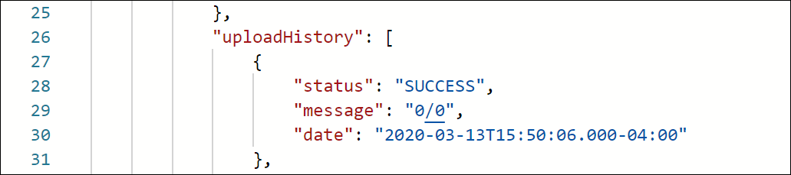

# Gestisci criteri personalizzati

A volte gli algoritmi forniti da Recommendations non sono in grado di individuare elementi particolari che desideri promuovere. In questa situazione, i criteri personalizzati consentono di fornire un set specifico di articoli consigliati per un determinato elemento o categoria chiave.

Per creare criteri personalizzati, definisci e importa la mappatura desiderata tra l’elemento o la categoria chiave e gli elementi consigliati. Questo processo è descritto nel [documentazione sui criteri personalizzati](https://experienceleague.adobe.com/docs/target/using/recommendations/criteria/recommendations-csv.html). Come indicato in tale documentazione, puoi creare, modificare ed eliminare i criteri personalizzati tramite l’interfaccia utente di Target. Tuttavia, Target fornisce anche un set di API di criteri personalizzati che consentono una gestione più dettagliata dei criteri personalizzati.

>[!WARNING]
>
>Per i criteri personalizzati, esegui tutte le azioni (crea, modifica, elimina) per un dato criterio personalizzato utilizzando le API, oppure tutte le azioni (crea, modifica, elimina) utilizzando l’interfaccia utente. La gestione dei criteri personalizzati tramite una combinazione di interfaccia utente e API può causare conflitti tra le informazioni o risultati imprevisti. Ad esempio, la creazione di un criterio personalizzato nell’interfaccia utente ma la successiva modifica tramite API non rifletterà gli aggiornamenti nell’interfaccia utente, anche se verrà aggiornato nel back-end, come visibile tramite l’API.

## Creare criteri personalizzati

Per creare criteri personalizzati utilizzando [Creare un’API di criteri personalizzati](https://developer.adobe.com/target/administer/recommendations-api/#operation/createCriteriaCustom), la sintassi è:

`POST https://mc.adobe.io/{{TENANT_ID}}/target/recs/criteria/custom`

>[!WARNING]
>
>I criteri personalizzati creati utilizzando l’API Crea criteri personalizzati, come descritto in questo esercizio, verranno visualizzati nell’interfaccia utente e persisteranno. Non potrai modificarli o eliminarli dall’interfaccia utente. Puoi modificarli o eliminarli **tramite API**, ma in entrambi i casi continueranno a essere visualizzati nell’interfaccia utente di Target. Per mantenere l’opzione di modifica o eliminazione dall’interfaccia utente, crea i criteri personalizzati utilizzando l’interfaccia utente per [la documentazione](https://experienceleague.adobe.com/docs/target/using/recommendations/criteria/recommendations-csv.html), anziché utilizzare l’API Create Custom Criteria.

Procedi solo con i seguenti passaggi dopo aver letto l’avviso precedente e hai familiarità con la creazione di nuovi criteri personalizzati che non possono essere successivamente eliminati dall’interfaccia utente.

1. Verifica `TENANT_ID` e `API_KEY` per **[!UICONTROL Creare criteri personalizzati]** fai riferimento alle variabili di ambiente Postman stabilite in precedenza. Utilizza l’immagine seguente per il confronto.

   

1. Aggiungi il **Corpo** as **raw** JSON che definisce la posizione del file CSV dei criteri personalizzati. Utilizza l’esempio fornito in [Creare un’API di criteri personalizzati](https://developer.adobe.com/target/administer/recommendations-api/#operation/getAllCriteriaCustom) come modello, fornendo il tuo `environmentId` e altri valori, se necessario. In questo esempio viene utilizzato LAST_PURCHASED come chiave.

   

1. Invia la richiesta e osserva la risposta, che contiene i dettagli dei criteri personalizzati appena creati.

   

1. Per verificare che i criteri personalizzati siano stati creati, passa ad Adobe Target per **[!UICONTROL Recommendations > Criteri]** e cercare i criteri per nome, oppure utilizzare il **[!UICONTROL Elencare API di criteri personalizzati]** nel passaggio successivo.

   

In questo caso, abbiamo un errore. Esaminiamo l’errore esaminando più da vicino i criteri personalizzati, utilizzando **[!UICONTROL Elencare API di criteri personalizzati]**.

## Elencare criteri personalizzati

Per recuperare un elenco di tutti i criteri personalizzati con i relativi dettagli, utilizza [Elencare API di criteri personalizzati](https://developer.adobe.com/target/administer/recommendations-api/#operation/getAllCriteriaCustom). La sintassi è:

`GET https://mc.adobe.io/{{TENANT_ID}}/target/recs/criteria/custom`

1. Verifica `TENANT_ID` e `API_KEY` come prima, e invia la richiesta. Nella risposta, prendi nota dell’ID del criterio personalizzato, nonché dei dettagli relativi al messaggio di errore annotato in precedenza.
   

In questo caso, l’errore si è verificato perché le informazioni sul server non sono corrette, il che significa che Target non è in grado di accedere al file CSV contenente la definizione dei criteri personalizzati. Modifichiamo i criteri personalizzati per correggere questo problema.

## Modifica criteri personalizzati

Per modificare i dettagli di una definizione di criteri personalizzati, utilizza [Modifica API di criteri personalizzati](https://developer.adobe.com/target/administer/recommendations-api/#operation/updateCriteriaCustom). La sintassi è:

`POST https://mc.adobe.io/{{TENANT_ID}}/target/recs/criteria/custom/:criteriaId`

1. Verifica `TENANT_ID` e `API_KEY`, come prima.
   

1. Specifica l’ID del criterio personalizzato (singolo) che desideri modificare.
   

1. Nel corpo, fornisci il JSON aggiornato con le informazioni corrette sul server. Per questo passaggio, specifica l’accesso FTP a un server a cui puoi accedere.
   

1. Invia la richiesta e annota la risposta.
   

Verifichiamo il successo dei criteri personalizzati aggiornati, utilizzando **[!UICONTROL Ottieni API criteri personalizzati]**.

## Ottieni criteri personalizzati

Per visualizzare i dettagli dei criteri personalizzati per un criterio personalizzato specifico, utilizza [Ottieni API criteri personalizzati](https://developer.adobe.com/target/administer/recommendations-api/#operation/getCriteriaCustom). La sintassi è:

`GET https://mc.adobe.io/{{TENANT_ID}}/target/recs/criteria/custom/:criteriaId`

1. Specifica l’ID del criterio personalizzato di cui desideri ottenere i dettagli. Invia la richiesta e rivedi la risposta.
   
1. Verifica il completamento. Nel nostro caso, verifica che non vi siano altri errori FTP.
   
1. (Facoltativo) Verifica che l’aggiornamento rifletta accuratamente l’interfaccia utente.
   

## Elimina criteri personalizzati

Utilizzando l’ID del criterio indicato in precedenza, elimina il criterio personalizzato utilizzando [Elimina API di criteri personalizzati](https://developer.adobe.com/target/administer/recommendations-api/#operation/deleteCriteriaCustom). La sintassi è:

`DELETE https://mc.adobe.io/{{TENANT_ID}}/target/recs/criteria/custom/:criteriaId`

1. Specifica l’ID del criterio personalizzato (singolo) da eliminare. Fai clic su **[!UICONTROL Send]** (Invia).
   

1. Verifica che i criteri siano stati eliminati utilizzando Ottieni criteri personalizzati.
   
In questo caso, l’errore 404 previsto indica che non è possibile trovare i criteri eliminati.

>[!NOTE]
>
>Come promemoria, i criteri non verranno rimossi dall’interfaccia utente di Target anche se sono stati eliminati, perché sono stati creati utilizzando l’API Create Custom Criteria.

Congratulazioni! Ora puoi creare, elencare, modificare, eliminare e ottenere dettagli sui criteri personalizzati, utilizzando l’API Recommendations. Nella sezione successiva, utilizzerai l’API di consegna di Target per recuperare i consigli.

&lt;!— [Avanti &quot;Recuperare Recommendations con l’API di distribuzione lato server&quot; >](fetch-recs-server-side-delivery-api.md) —>
