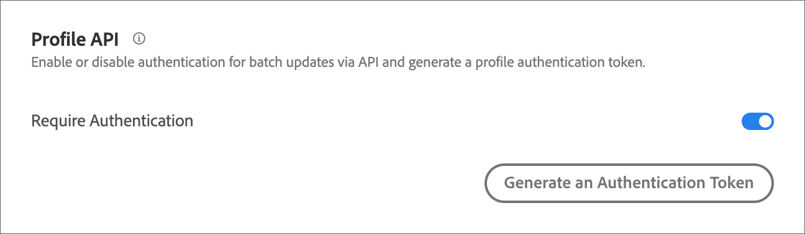

# Impostazioni API del profilo

Attivare o disattivare l&#39;autenticazione per gli aggiornamenti batch tramite API [!DNL Adobe Target] e generare un token di autenticazione profilo.

[!DNL Adobe Target] crea e gestisce un profilo per ogni singolo utente. Questo profilo è archiviato nel cluster Edge [!DNL Target] e viene aggiornato in tempo reale dopo ogni visita. Puoi anche aggiornare un profilo singolarmente o in blocco tramite API.

Per una maggiore sicurezza, puoi richiedere che la chiamata API di aggiornamento in blocco richieda il passaggio di un token di accesso valido nell’intestazione della richiesta.

**Per richiedere l&#39;autenticazione e generare un token di accesso tramite l&#39;interfaccia utente [!DNL Target]:**

1. Fare clic su **[!UICONTROL Administration]** > **[!UICONTROL Implementation]**.
1. Nella diapositiva **[!UICONTROL Profile API]**, **[!UICONTROL Require Authentication]** passa alla posizione abilitata o disabilitata.

   

1. (Condizionale) Se hai abilitato il requisito di autenticazione, fai clic su **[!UICONTROL Generate New Profile Authentication Token]**.

   

   La scadenza del token è indicata nella casella Scade tra.

   Per generare un token di autenticazione, è necessario disporre di una delle seguenti autorizzazioni utente:

   * Ruolo amministratore o almeno con diritti approvatore

     Per ulteriori informazioni per i clienti Target Standard, vedere [Specificare ruoli e autorizzazioni](https://experienceleague.adobe.com/docs/target/using/administer/manage-users/users/user-management.html?lang=it#roles-permissions) in *Utenti*. Per ulteriori informazioni per i clienti [!DNL Target Premium], consulta [Configurare le autorizzazioni aziendali](https://experienceleague.adobe.com/docs/target/using/administer/manage-users/enterprise/properties-overview.html?lang=it).

   * Ruolo amministratore a livello di area di lavoro/profilo di prodotto

     Le aree di lavoro sono disponibili solo per i clienti [!DNL Target Premium]. Per ulteriori informazioni, consulta [Configurare le autorizzazioni aziendali](https://experienceleague.adobe.com/docs/target/using/administer/manage-users/enterprise/properties-overview.html?lang=it).

   * Diritti di amministrazione (autorizzazione Sysadmin) a livello di prodotto [!DNL Adobe Target]

Puoi anche generare un token di autenticazione profilo tramite API. Per ulteriori informazioni, vedere &quot;Profiles&quot; nella [Guida dell&#39;amministratore Adobe Target e dell&#39;API dei profili](../../administer/admin-api/admin-api-overview-new.md).

1. Copia il token e includilo nell’intestazione della richiesta nel formato: &quot;Authorization&quot; : &quot;Bearer&quot;.

1. Fare clic su **[!UICONTROL Generate New Profile Authentication Token]** per rigenerare il token in base alle esigenze.

>[!WARNING]
>
>Se si reimposta il token, le chiamate API che utilizzano il token attuale non riusciranno. Sarà necessario aggiornare tutti gli script o le applicazioni che utilizzano tale token.
