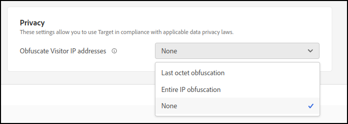

# Privacy

In [!DNL Adobe Target] sono stati inclusi processi e impostazioni che ti consentono di utilizzare [!DNL Target] in conformità con le leggi sulla privacy dei dati.

## Raccolta di indirizzi IP e informazioni personali (PII, Personally Identifiable Information)

L&#39;indirizzo IP di un visitatore del tuo sito Web viene trasmesso a un DPC (Adobe Data Processing Center). A seconda della configurazione di rete per il visitatore, l’indirizzo IP non rappresenta necessariamente l’indirizzo IP del computer del visitatore. Potrebbe essere ad esempio l’indirizzo IP esterno di un firewall con traduzione degli indirizzi di rete (Network Address Translation, NAT), di un proxy HTTP o di un gateway Internet.

>[!IMPORTANT]
>
>[!DNL Target] non memorizza alcun indirizzo IP dell&#39;utente o alcuna informazione personale identificabile (PII). Gli indirizzi IP vengono utilizzati solo da [!DNL Target] durante la sessione (in memoria, senza persistenza).

## Sostituzione dell’ultimo ottetto di indirizzi IP

Adobe ha sviluppato un&#39;impostazione &quot;privacy by design&quot; che gli utenti possono abilitare, ad Adobe [!DNL Target]. Se attivato, l&#39;Adobe [!DNL Target] offusca immediatamente l&#39;ultimo ottetto (l&#39;ultima parte) dell&#39;indirizzo IP al momento della raccolta dell&#39;indirizzo IP. Questa forma di anonimizzazione viene eseguita prima di qualsiasi elaborazione dell’indirizzo IP, inclusa l’operazione di lookup geografico.

Quando questa funzione è abilitata, l’indirizzo IP è reso sufficientemente anonimo da non essere più identificabile come dato personale. Di conseguenza, [!DNL Target] può essere utilizzato in conformità con le leggi sulla privacy dei dati nei paesi che non consentono la raccolta di informazioni personali. L’ottenimento di informazioni a livello di città sarà probabilmente influenzato in modo significativo dall’oscuramento dell’indirizzo IP. L’ottenimento di informazioni a livello di area e nazionale dovrebbe essere influenzato solo leggermente.

Nell&#39;interfaccia utente di [!DNL Target] sono disponibili le impostazioni seguenti passando a **[!UICONTROL Administration]** > **[!UICONTROL Implementation]**:

* [!UICONTROL Last octet obfuscation]: [!DNL Target] nasconde l&#39;ultimo ottetto dell&#39;indirizzo IP.
* [!UICONTROL Entire IP obfuscation]: [!DNL Target] nasconde l&#39;intero indirizzo IP.
* [!UICONTROL None]: [!DNL Target] non nasconde alcuna parte dell&#39;indirizzo IP.

  

[!DNL Target] riceve l&#39;indirizzo IP completo e lo offusca (se impostato su Last octet o Entire IP) come specificato. [!DNL Target] mantiene quindi in memoria l&#39;indirizzo IP offuscato solo durante la sessione corrente.

### Offuscamento IP a livello di stream di dati quando si utilizza [!DNL Adobe Experience Platform Web SDK] {#aep}

Quando si utilizza [!DNL Platform Web SDK] (versione 23.4 o successiva), l&#39;impostazione di offuscamento dell&#39;IP a livello di flusso di dati ha la precedenza su qualsiasi opzione di offuscamento dell&#39;IP impostata in [!DNL Target]. Ad esempio, se l&#39;opzione di offuscamento dell&#39;IP a livello di flusso di dati è impostata su [!UICONTROL Full] e l&#39;opzione di offuscamento dell&#39;IP [!DNL Target] è impostata su [!UICONTROL Last octet obfuscation], [!DNL Target] riceve un IP completamente offuscato.

Per ulteriori informazioni, vedere [!UICONTROL IP Obfuscation] in [Configurare uno stream di dati](https://experienceleague.adobe.com/docs/experience-platform/datastreams/configure.html?lang=it){target=_blank} nella *[!DNL Adobe Experience Platfrom]Guida allo stream di dati*.

## Geosegmentazione

Se si abilita la sostituzione dell&#39;ultimo ottetto dell&#39;indirizzo IP, i valori rimanenti dell&#39;indirizzo IP potranno essere analizzati utilizzando i report in [!DNL Target]. Se l&#39;ultimo ottetto dell&#39;indirizzo IP non è stato offuscato, è possibile analizzare l&#39;indirizzo IP completo in [!DNL Target]. Puoi utilizzare la funzione di geosegmentazione per mappare la posizione dei visitatori per area geografica. I dati di geosegmentazione sono granulari solo a livello di città o di codice postale, e non a livello individuale.

Se gli indirizzi IP sono completamente offuscati, GeoSegmentation e il target geografico non sono disponibili.

## Collegamento per la rinuncia

Puoi aggiungere un collegamento di rinuncia ai siti per consentire ai visitatori di rinunciare a tutte le operazioni di conteggio e di distribuzione dei contenuti.

1. Aggiungi al sito il seguente collegamento:

   `<a href="https://clientcode.tt.omtrdc.net/optout"> Your Opt Out Language Here</a>`

1. (Condizionale) Se utilizzi CNAME, il collegamento deve contenere il parametro &quot;client=`clientcode`&quot;, ad esempio:
   `https://my.cname.domain/optout?client=clientcode`.

1. Sostituisci `clientcode` con il tuo codice cliente e aggiungi il testo o l’immagine da collegare all’URL di rinuncia.

Il visitatore che fa clic sul collegamento sarà escluso da qualsiasi richiesta mbox richiamata dalle relative sessioni di navigazione fino all’eliminazione dei cookie o per due anni (a seconda di quale dei due eventi si verifica prima). Questo funziona impostando un cookie per il visitatore denominato `disableClient` nel dominio `clientcode.tt.omtrdc.net`.

Anche se utilizzi un’implementazione di cookie di prima parte, la rinuncia viene impostata tramite un cookie di terze parti. Se il client utilizza solo un cookie di prime parti, [!DNL Target] controlla se è impostato un cookie di rinuncia.

## Normative sulla privacy e la protezione dei dati

Consulta [Normative sulla privacy e la protezione dei dati](/help/dev/before-implement/privacy/cmp-privacy-and-general-data-protection-regulation.md) per informazioni sul Regolamento generale sulla protezione dei dati (RGPD) dell&#39;Unione Europea, sul California Consumer Privacy Act (CCPA) e su altri requisiti internazionali riguardanti la privacy e come questi regolamenti influiscono sulla tua organizzazione e su [!DNL Target].

## Raccolta di dati sull’utilizzo delle funzioni

I dati di utilizzo delle singole funzionalità vengono raccolti per Adobi interni per stabilire se [!DNL Target] funzionalità vengono eseguite come previsto o per identificare le funzionalità utilizzate poco. Vengono raccolte varie misurazioni della latenza per contribuire a risolvere i problemi legati alle prestazioni. I dati personali non vengono raccolti.

Puoi rinunciare al reporting dei dati di utilizzo nei nostri SDK impostando `telemetryEnabled` su false nelle opzioni di inizializzazione del client. Per ulteriori informazioni, consulta [telemetryEnabled in targetGlobalSettings](/help/dev/implement/client-side/atjs/atjs-functions/targetglobalsettings.md#telemetryenabled).
