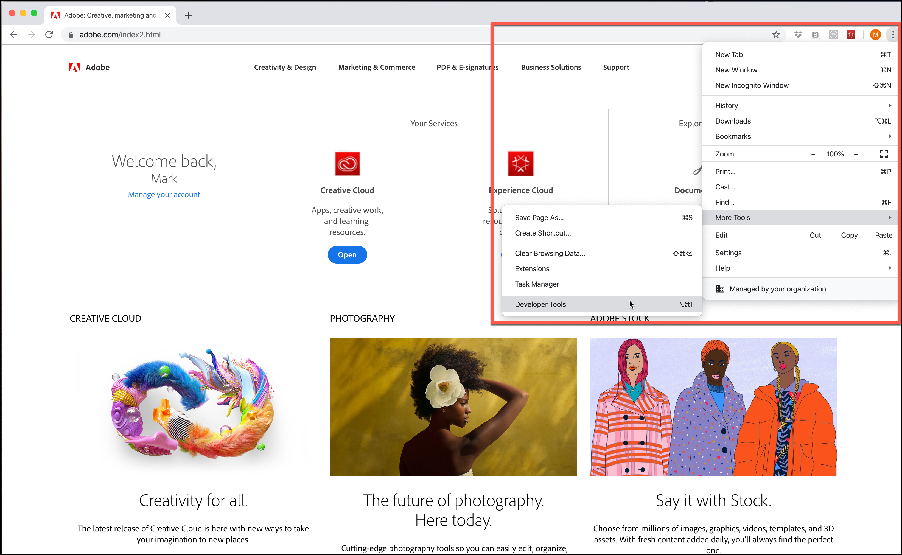

# Modifiche alla crittografia di TLS (Transport Layer Security)

Informazioni sulle modifiche apportate a come [!DNL Adobe] e [!DNL Adobe Target] utilizzano TLS (Transport Layer Security) per mantenere standard di sicurezza elevati e promuovere la sicurezza dei dati dei clienti.

Transport Layer Security (TLS) è tra i protocolli di sicurezza distribuiti più ampiamente ed è oggi utilizzato per i browser web e per altre applicazioni dove i dati devono essere scambiati in modo sicuro all’interno di una rete. Adobe possiede degli standard di sicurezza e conformità che richiedono la dismissione dei protocolli più vecchi e l’utilizzo di TLS 1.2 per poter avere la versione in uso più aggiornata e più sicura.

>[!WARNING]
>
>A partire dal 1° marzo 2020, [!DNL Target] non supporta più la crittografia TLS 1.1 per il Compositore esperienza visivo, il Compositore esperienza avanzato, la distribuzione delle attività, le API e così via. Esegui l’aggiornamento a TLS 1.2 per evitare problemi.

Non è previsto un impatto significativo di tale cambiamento sui dati dei clienti o sulla creazione di rapporti.

## Compositore esperienza visivo (VEC) con Compositore esperienza avanzato (EEC) abilitato

TLS 1.2 è il valore predefinito dal 1° marzo 2020 e TLS 1.1 non sarà più supportato.

Adobe sposterà i clienti a TLS 1.2 in modo graduale. Per quanto riguarda coloro che sono in possesso di domini già conformi alla versione 1.2, verranno spostati a TLS 1.2 senza la necessità di apportare delle modifiche. La maggior parte dei domini dei clienti supporta già TLS 1.2; tuttavia, se il tuo dominio non supporta TLS 1.2, manterremo tali domini su TLS 1.1 come oggi (fino a marzo 2020).

Non dovresti riscontrare alcun problema durante questa fase di migrazione. Se il Compositore esperienza visivo ha smesso di caricare un sito che prima funzionava, [apri un ticket dell&#39;assistenza clienti](https://experienceleague.adobe.com/docs/target/using/cmp-resources-and-contact-information.html?lang=it&#reference_ACA3391A00EF467B87930A450050077C) citando questa migrazione come possibile causa.

Se, tuttavia, sei uno dei clienti che utilizzano TLS 1.1 e i tuoi domini/infrastrutture non supportano TLS 1.2, allora dovresti pianificare lo spostamento di questi a TLS 1.2. Continueremo a supportare il protocollo TLS 1.1 fino al lunedì 1 marzo 2020. A partire dal 1° marzo 2020, [!DNL Target] non supporterà il protocollo TLS 1.1 da utilizzare per il Compositore esperienza visivo tramite la funzionalità Compositore esperienza avanzato.

Anche se consigliamo vivamente a tutti di utilizzare fin da ora TLS 1.2, se sei un nuovo cliente ma *NON* supporti questo protocollo, contatta l’Assistenza clienti informandola che hai bisogno di TLS 1.1 per il Compositore esperienza avanzato. Tuttavia, ti invitiamo a pianificare lo spostamento a TLS 1.2, dato che la versione 1.0 non verrà più supportata oltre il lunedì 1 marzo 2020.

## Consegna delle attività

A partire dal 1° marzo 2020, i server [!DNL Target] non supporteranno più TLS 1.1. Con questa modifica, i server [!DNL Target] non accetteranno più le richieste dei visitatori con dispositivi o browser Web meno recenti che non supportano TLS 1.2 (o versione successiva). Di conseguenza, i dispositivi e i browser più vecchi che supportano solo TLS 1.1 (o supportano TLS 1.1 per impostazione predefinita) non riceveranno più il contenuto dell&#39;attività da Adobe Target. Il contenuto predefinito del sito viene eseguito.

Tra i dispositivi e i browser più vecchi che saranno interessati sono compresi:

* Google Chrome (Chrome for Android) versioni 29 e precedenti
* Opera Browser (Opera Mobile) versioni 12.17 e precedenti
* Mozilla Firefox (Firefox per dispositivi mobili) versioni 26 e precedenti
* Android 4.3 e versioni precedenti
* Internet Explorer 8-10 su Windows 7 e versioni precedenti
* Internet Explorer 10 su Windows Phone 8.0
* Safari 6.0.4/OS X10.8.4 e versioni precedenti

Mentre pianifichi questa modifica, considera quanto segue (tieni presente che la scadenza del lunedì 1 marzo 2020 interessa tutti questi elementi):

* Devi assicurarti che il tuo sito predefinito sia pronto per essere riprodotto sui dispositivi e sui browser conformi.
* Tieni presente che il numero di visitatori nei rapporti di [!DNL Target] può potenzialmente notare un calo insignificante nel numero di visitatori.
* Potrebbe essere necessario modificare i tipi di pubblico creati appositamente per rivolgersi a dispositivi o browser meno recenti che non supportano TLS 1.2. La consegna a tali dispositivi e browser non funzionerà più.

Per ulteriori dettagli sui browser supportati e sulle relative versioni, vedere [Browser supportati](supported-browsers.md).

## API di [!DNL Adobe Target]

A partire dal 1° marzo 2020, le API [!DNL Target] non supporteranno più la crittografia TLS 1.1. I clienti che accedono all’API devono assicurarsi che questo cambiamento non produca effetti negativi.

* I clienti che utilizzano l’API con Java 7 applicando le impostazioni predefinite dovranno configurare il supporto per TLS 1.2. Per ulteriori informazioni, vedere &quot; [Modifica della versione del protocollo TLS predefinito per gli endpoint del client: da TLS 1.0 a TLS 1.2](https://www.java.com/en/configure_crypto.html)&quot; nel sito Web Java.
* I clienti API che utilizzano Java 8 non dovrebbero essere interessati, perché l’impostazione predefinita è TLS 1.2.
* Per i clienti che utilizzano l’API con altri framework, occorre contattare il fornitore per ottenere informazioni sul supporto per TLS 1.2.

## Accesso alle interfacce Experience Cloud Solutions

Poiché l&#39;interfaccia di [!DNL Target] Standard/Premium richiede già un [browser Web moderno](supported-browsers.md), non sono previsti problemi. Se non riesci più a connetterti a Target, devi aggiornare il browser all’ultima versione.

## Controllare quale versione di TLS utilizza il browser

Per verificare la versione di TLS sul sito web utilizzando Google Chrome:

1. Apri il sito web interessato in Chrome.
1. Dal menu Chrome (i tre puntini di sospensione verticali), fai clic su Altri strumenti > Strumenti per sviluppatori.

   

1. Apri la scheda Sicurezza, quindi esamina le informazioni sulla versione di TLS in Connessione:

   

>[!NOTE]
>
>Queste istruzioni sono aggiornate alla data di pubblicazione e sono soggette a modifiche. Se queste istruzioni dovessero cambiare, è utile eseguire una ricerca rapida su Internet. Altri browser hanno passaggi simili.

## Comportamento previsto con browser che supportano le versioni TLS inferiori alla 1.2

Questa sezione descrive cosa aspettarsi dai browser che supportano le versioni TLS inferiori a 1.2 solo quando si utilizza un’implementazione at.js. A scopo di confronto, questa sezione descrive anche cosa aspettarsi dai browser che supportano TLS 1.2.

### Endpoint centrali

| Implementazione di [!DNL Target] JavaScript | Dettagli |
|--- |--- |
| at.js | Con TLS 1.0 o TLS 1.1 abilitato:<ul><li>Utilizzando gli strumenti di sviluppo del browser, nella scheda Rete, vedrai “200 OK”. Ciò significa che la richiesta è riuscita.</li><li>L&#39;utente visualizza un messaggio “Impossibile connettersi in modo sicuro a questa pagina”. Il messaggio spiega che ciò potrebbe essere causato perché il sito utilizza impostazioni di protezione TLS obsolete o non sicure.</li><li>Non vengono visualizzati errori di console.</li></ul>Con TLS 1.2 abilitato:<ul><li>Il file at.js viene scaricato.</li></ul> |

### Endpoint di Edge

| Implementazione di [!DNL Target] JavaScript | Dettagli |
|--- |--- |
| Adobe Experience Platform Web SDK | Con TLS 1.0 o TLS 1.1 abilitato:<ul><li>Utilizzando gli strumenti di sviluppo del browser, nella scheda Rete, vedrai “200 OK”. Ciò significa che la richiesta è riuscita.</li><li>L&#39;utente visualizza un messaggio “Impossibile connettersi in modo sicuro a questa pagina”. Il messaggio spiega che ciò potrebbe essere causato perché il sito utilizza impostazioni di protezione TLS obsolete o non sicure.</li><li>Non vengono visualizzati errori di console.</li><li>Viene servito il contenuto predefinito.</li></ul>Con TLS 1.2 abilitato:<ul><li>Viene servito il contenuto dell’offerta.</li></ul> |
| at.js | Con TLS 1.0 o TLS 1.1 abilitato:<ul><li>Utilizzando gli strumenti di sviluppo del browser, nella scheda Rete, vedrai “200 OK”. Ciò significa che la richiesta è riuscita.</li><li>L&#39;utente visualizza un messaggio “Impossibile connettersi in modo sicuro a questa pagina”. Il messaggio spiega che ciò potrebbe essere causato perché il sito utilizza impostazioni di protezione TLS obsolete o non sicure.</li><li>Non vengono visualizzati errori di console.</li><li>Viene servito il contenuto predefinito.</li></ul>Con TLS 1.2 abilitato:<ul><li>Viene servito il contenuto dell’offerta.</li></ul> |

### Attività con targeting per il pubblico della versione del browser (Internet Explorer, versioni 6, 7 o 8)

I tipi di pubblico cessano di funzionare.

| Implementazione di [!DNL Target] JavaScript | Dettagli |
|--- |--- |
| Adobe Experience Platform Web SDK | Platform SDK non è supportato nelle versioni di Internet Explorer precedenti alla versione 10. |
| at.js | at.js non è supportato nelle versioni di Internet Explorer precedenti alla versione 10. |
