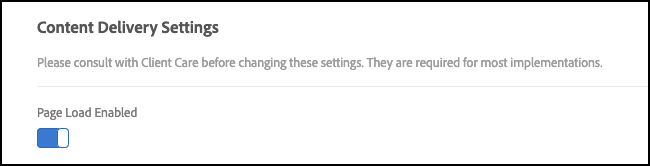

# [!UICONTROL targetGlobalSettings()]

È possibile modificare le impostazioni nella libreria at.js utilizzando `[!UICONTROL targetGlobalSettings()]`, anziché configurarle nell&#39;interfaccia utente di [!DNL Target] o utilizzando le API REST.

## Impostazioni

È possibile modificare le seguenti impostazioni:

### aepSandboxId

* **Tipo**: String
* **Valore predefinito**: null
* **Descrizione**: parametro facoltativo utilizzato per inviare l&#39;ID sandbox [!DNL Adobe Experience Platform] alla condivisione di [!DNL Adobe Experience Platform] destinazioni create nella sandbox non predefinita con [!DNL Target]. Se `aepSandboxId` non è Null, è necessario specificare anche `aepSandboxName`.

### aepSandboxName

* **Tipo**: String
* **Valore predefinito**: null
* **Descrizione**: parametro facoltativo utilizzato per inviare il nome della sandbox [!DNL Adobe Experience Platform] alla condivisione di [!DNL Adobe Experience Platform] destinazioni create nella sandbox non predefinita con [!DNL Target]. Se `aepSandboxName` non è Null, è necessario specificare anche `aepSandboxId`.

### artifactLocation

* **Tipo**: String
* **Valore predefinito**: nessuno
* **Descrizione**: URL completo dell&#39;artefatto [della regola di decisioning sul dispositivo](../../../server-side/sdk-guides/on-device-decisioning/rule-artifact-overview.md)

### bodyHiddenStyle

* **Tipo**: String
* **Valore predefinito**: body { opacity: 0 }
* **Descrizione**: utilizzato solo quando `globalMboxAutocreate === true` per minimizzare il rischio di sfarfallio.

  Per ulteriori informazioni, consulta [Gestione at.js della visualizzazione momentanea di altri contenuti](/help/dev/implement/client-side/atjs/how-atjs-works/manage-flicker-with-atjs.md).

### bodyHidingEnabled

* **Tipo**: booleano
* **Valore predefinito**: true
* **Descrizione**: utilizzato per controllare lo sfarfallio quando `target-global-mbox` viene utilizzato per fornire le offerte create nel Compositore esperienza visivo (offerte visive).

### clientCode

* **Tipo**: String
* **Valore predefinito**: valore impostato tramite l’interfaccia utente.
* **Descrizione**: rappresenta il codice client.

### cookieDomain

* **Tipo**: String
* **Valore predefinito**: se possibile, imposta il dominio di primo livello.
* **Descrizione**: rappresenta il dominio utilizzato quando si salvano i cookie.

### crossDomain

* **Tipo**: String
* **Valore predefinito**: valore impostato tramite l’interfaccia utente.
* **Descrizione**: indica se il tracciamento tra domini diversi è abilitato o meno. I valori consentiti dipendono dalla versione at.js in uso. Per at.js v1.*x*, specifica se le funzionalità tra domini diversi sono `disabled` (i browser impostano i cookie solo nel tuo dominio (cookie di prime parti), `x only` (i browser impostano i cookie solo nel dominio di [!DNL Target]) o entrambi, selezionando `enabled` (i browser impostano sia i cookie di prima parte che quelli di terze parti). Per at.js v2.10 e versioni successive, specifica se le funzionalità tra domini diversi sono `enabled` (i browser impostano sia cookie di prima parte che di terze parti) o `disabled` (i browser non impostano cookie di terze parti).

### cspScriptNonce

* **Tipo**: consulta [Criteri di sicurezza dei contenuti](#content-security-policy) di seguito.
* **Valore predefinito**: consulta [Criteri di sicurezza dei contenuti](#content-security-policy) di seguito.
* **Descrizione**: consulta [Criteri di sicurezza dei contenuti](#content-security-policy) di seguito.

### cspStyleNonce

* **Tipo**: consulta [Criteri di sicurezza dei contenuti](#content-security-policy) di seguito.
* **Valore predefinito**: consulta [Criteri di sicurezza dei contenuti](#content-security-policy) di seguito.
* **Descrizione**: consulta [Criteri di sicurezza dei contenuti](#content-security-policy) di seguito.

### dataProviders

* **Tipo**: consulta [Fornitori di dati](#data-providers) di seguito.
* **Valore predefinito**: consulta [Fornitori di dati](#data-providers) di seguito.
* **Descrizione**: consulta [Fornitori di dati](#data-providers) di seguito.

### decisioningMethod

* **Tipo**: String
* **Valore predefinito**: lato server
* **Altri valori**: su dispositivo, ibrido
* **Descrizione**: consulta Metodi di decisione di seguito.

  **Metodi di decisione**

  Con le decisioni sul dispositivo, [!DNL Target] introduce una nuova impostazione denominata Metodo di decisione che determina il modo in cui at.js distribuisce le esperienze. `decisioningMethod` ha tre valori: solo lato server, solo su dispositivo e ibrido. Quando `decisioningMethod` viene impostato in `targetGlobalSettings()`, agisce come metodo di decisione predefinito per tutte le decisioni di [!DNL Target].

  **Solo lato server**:

  Solo lato server è il metodo decisionale predefinito impostato automaticamente quando at.js 2.5+ viene implementato e distribuito sulle proprietà web.

  Se si utilizza solo lato server come configurazione predefinita, tutte le decisioni vengono prese sulla rete Edge [!DNL Target], il che comporta una chiamata di blocco al server. Questo approccio può introdurre una latenza incrementale, ma offre anche vantaggi significativi, come la possibilità di applicare le funzionalità di machine learning di [!DNL Target], che includono [attività Recommendations](https://experienceleague.adobe.com/docs/target/using/recommendations/recommendations.html?lang=it), [Automated Personalization](https://experienceleague.adobe.com/docs/target/using/activities/automated-personalization/automated-personalization.html?lang=it) (AP) e [Targeting automatico](https://experienceleague.adobe.com/docs/target/using/activities/auto-target/auto-target-to-optimize.html?lang=it).

  Inoltre, migliorare le tue esperienze personalizzate utilizzando il profilo utente di [!DNL Target], che viene mantenuto tra sessioni e canali diversi, può fornire risultati potenti per la tua azienda.

  Infine, solo lato server consente di utilizzare Adobe Experience Cloud e di perfezionare i tipi di pubblico a cui rivolgersi tramite i segmenti Audience Manager e Adobe Analytics.

  **Solo su dispositivo**:

  Solo su dispositivo è il metodo decisionale che deve essere impostato in at.js 2.5+ quando le decisioni su dispositivo devono essere utilizzate solo in tutte le pagine web.

  Le decisioni sul dispositivo possono fornire esperienze e attività di personalizzazione a una velocità sorprendente, perché derivano da un artefatto di regole memorizzate nella cache che contiene tutte le attività che si qualificano per le decisioni sul dispositivo.

  Per ulteriori informazioni sulle attività che si qualificano per le decisioni su dispositivo, consulta la sezione sulle funzionalità supportate.

  Questo metodo decisionale deve essere utilizzato solo se le prestazioni sono altamente critiche in tutte le pagine che richiedono decisioni da [!DNL Target]. Inoltre, ricorda che quando viene selezionato questo metodo decisionale, le attività [!DNL Target] che non possono avvalersi delle decisioni su dispositivo non verranno consegnate o eseguite. La libreria at.js 2.5+ è configurata per cercare solo l’artefatto delle regole memorizzate nella cache per prendere decisioni.

  **Ibrido**:

  Ibrido è il metodo decisionale che deve essere impostato in at.js 2.5+ quando è necessario eseguire sia le decisioni su dispositivo che le attività che richiedono una chiamata alla rete Edge [!DNL Adobe Target].

  Quando gestisci sia le attività di decisione su dispositivo che quelle lato server, può essere un po’ complicato e noioso pensare a come distribuire ed eseguire il provisioning di [!DNL Target] sulle pagine. Con il metodo decisionale ibrido, [!DNL Target] sa quando deve effettuare una chiamata al server alla rete Edge [!DNL Adobe Target] per le attività che richiedono l&#39;esecuzione lato server e anche quando eseguire solo le decisioni su dispositivo.

  L’artefatto delle regole JSON include i metadati che informano at.js se una mbox ha un’attività lato server in esecuzione o un’attività decisionale su dispositivo. Questo metodo decisionale assicura che le attività che intendi consegnare rapidamente vengano eseguite tramite le decisioni su dispositivo e che quelle che richiedono una personalizzazione basata su ML più potente vengano eseguite tramite la rete Edge [!DNL Adobe Target].

### defaultContentHiddenStyle

* **Tipo**: String
* **Valore predefinito**: visibilità: nascosto
* **Descrizione**: utilizzato solo per il wrapping di mbox che utilizzano DIV con il nome di classe “mboxDefault” e vengono eseguiti tramite `mboxCreate()`, `mboxUpdate()`, o `mboxDefine()` per nascondere il contenuto predefinito.

### defaultContentVisibleStyle

* **Tipo**: String
* **Valore predefinito**: visibilità: visibile
* **Descrizione**: utilizzato solo per il wrapping di mbox che utilizzano DIV con il nome di classe “mboxDefault” e vengono eseguiti tramite `mboxCreate()`, `mboxUpdate()` o `mboxDefine()` per rivelare l’offerta applicata, se presente, o il contenuto predefinito.

### deviceIdLifetime

* **Tipo**: numero
* **Valore predefinito**: 63244800000 ms = 2 anni
* **Descrizione**: quantità di tempo in cui `deviceId` viene mantenuto nei cookie.

>[!NOTE]
>
>L’impostazione deviceIdLifetime è sovrascrivibile in at.js versione 2.3.1 o successiva.

### abilitato

* **Tipo**: booleano
* **Valore predefinito**: true
* **Descrizione**: quando questa opzione è abilitata, viene eseguita automaticamente una richiesta [!DNL Target] di recupero esperienze e di manipolazione DOM per il rendering delle esperienze. Inoltre, le chiamate di [!DNL Target] possono essere eseguite manualmente tramite `getOffer(s)` / `applyOffer(s)`.

  Se è disabilitata, le richieste di [!DNL Target] non vengono eseguite automaticamente o manualmente.

### globalMboxAutoCreate

* **Tipo**: numero
* **Valore predefinito**: valore impostato tramite l’interfaccia utente.
* **Descrizione**: indica se la richiesta mbox globale deve essere attivata o meno.

### imsOrgId

* **Tipo**: String
* **Valore predefinito**: true
* **Descrizione**: rappresenta l&#39;ID ORG di IMS.

### optinEnabled

* **Tipo**: booleano
* **Valore predefinito**: false
* **Descrizione**: [!DNL Target] fornisce supporto per la funzionalità opt-in tramite Adobe Experience Platform per supportare la strategia di gestione dei consensi. La funzionalità opt-in consente ai clienti di controllare come e quando viene attivato il tag di [!DNL Target]. È inoltre disponibile un&#39;opzione tramite Adobe Experience Platform per pre-approvare il tag [!DNL Target]. Per abilitare la capacità di utilizzare la funzione di opt-in nella libreria at.js di [!DNL Target], aggiungi l’impostazione `optinEnabled=true`. In Adobe Experience Platform, è necessario selezionare &quot;abilita&quot; dall’elenco a discesa Opt-in RGPD nella visualizzazione di installazione dell’estensione. Per ulteriori informazioni, consulta la [documentazione di Adobe Experience Platform](/help/dev/implement/client-side/atjs/how-to-deployatjs/implement-target-using-adobe-launch.md). Per ulteriori informazioni su questa impostazione in relazione alle normative sulla privacy e la protezione dei dati, tra cui il Regolamento generale sulla protezione dei dati (RGPD) dell&#39;Unione Europea e il California Consumer Privacy Act (CCPA), consulta [Normative sulla privacy e la protezione dei dati](/help/dev/before-implement/privacy/cmp-privacy-and-general-data-protection-regulation.md).

### optoutEnabled

* **Tipo**: booleano
* **Valore predefinito**: false
* **Descrizione**: indica se [!DNL Target] deve chiamare la funzione `isOptedOut()` dell&#39;API visitatore. Ciò fa parte dell&#39;abilitazione di Device Graph.

### overrideMboxEdgeServer

* **Tipo**: booleano
* **Valore predefinito**: true (true a partire dalla versione 1.6.2 di at.js)
* **Descrizione**: indica se è necessario utilizzare il dominio `<clientCode>.tt.omtrdc.net` o `mboxedge<clusterNumber>.tt.omtrdc.net`.

  Se questo valore è true, il dominio `mboxedge<clusterNumber>.tt.omtrdc.net` verrà salvato in un cookie. Attualmente non funziona con [CNAME](/help/dev/before-implement/implement-cname-support-in-target.md) quando utilizzi versioni di at.js precedenti ad at.js 1.8.2 e at.js 2.3.1. Se questo è un problema, valuta l’[aggiornamento di at.js](/help/dev/implement/client-side/atjs/target-atjs-versions.md) a una versione più recente e supportata.

### overrideMboxEdgeServerTimeout

* **Tipo**: numero
* **Valore predefinito**: 1860000 => 31 minuti
* **Descrizione**: indica il periodo di vita del cookie contenente il valore `mboxedge<clusterNumber>.tt.omtrdc.net`.

### pageLoadEnabled

* **Tipo**: booleano
* **Valore predefinito**: true
* **Descrizione**: quando questa opzione è abilitata, recupera automaticamente le esperienze che devono essere restituite al caricamento della pagina.

### pollingInterval

* **Tipo**: numero
* **Valore predefinito**: 300000 (cinque minuti in millisecondi)
* **Descrizione**: intervallo che at.js recupera una nuova versione di un artefatto di decisioning sul dispositivo e aggiorna la cache. 300000 valore minimo consentito per `pollingInterval`.

### secureOnly

* **Tipo**: booleano
* **Valore predefinito**: false
* **Descrizione**: indica se at.js deve utilizzare solo HTTPS o può passare da HTTP a HTTPS in base al protocollo della pagina. Se è impostato su true, secureOnly imposta anche gli attributi Secure e SameSite sul cookie mbox.

### selectorsPollingTimeout

* **Tipo**: numero
* **Valore predefinito**: 5000 ms = 5 s
* **Descrizione**: in at.js 0.9.6, [!DNL Target] ha introdotto questa nuova impostazione che può essere sovrascritta tramite `targetGlobalSettings`.

  L’impostazione `selectorsPollingTimeout` rappresenta il tempo in cui il client è disposto ad attendere che tutti gli elementi identificati dai selettori vengano visualizzati nella pagina.

  Le attività create tramite il Compositore esperienza visivo hanno offerte che contengono selettori.

### serverDomain

* **Tipo**: String
* **Valore predefinito**: valore impostato tramite l’interfaccia utente.
* **Descrizione**: rappresenta il server Edge [!DNL Target].

### serverState

* **Tipo**: consulta [Personalizzazione ibrida](#hybrid-personalization) di seguito.
* **Valore predefinito**: consulta [Personalizzazione ibrida](#hybrid-personalization) di seguito.
* **Descrizione**: consulta [Personalizzazione ibrida](#hybrid-personalization) di seguito.

### telemetryEnabled

* **Tipo**: booleano
* **Valore predefinito**: true
* **Descrizione**: se abilitata, Adobe raccoglie dati di telemetria relativi all&#39;utilizzo delle funzionalità SDK e alle prestazioni. I dati personali non vengono raccolti.

### timeout

* **Tipo**: numero
* **Valore predefinito**: valore impostato tramite l’interfaccia utente.
* **Descrizione**: rappresenta il timeout della richiesta Edge di [!DNL Target].

### viewsEnabled {#viewsenabled}

* **Tipo**: booleano
* **Valore predefinito**: true
* **Descrizione**: se abilitata, le visualizzazioni vengono recuperate automaticamente al caricamento della pagina. Quando viene chiamato `triggerView`, le visualizzazioni applicabili vengono visualizzate nel browser. Se questa opzione è disabilitata, le visualizzazioni non vengono recuperate al momento del caricamento della pagina e `triggerView` non esegue alcuna operazione. Le visualizzazioni sono supportate in at.js 2.*x.*

### visitorApiTimeout

* **Type**: numero
* **Valore predefinito**: 2000 ms = 2 s
* **Descrizione**: rappresenta il timeout della richiesta API visitatore.

## Utilizzo

Questa funzione può essere definita prima che at.js sia caricato oppure in **Amministrazione** > **Implementazione** > **Modifica impostazioni at.js** > **Impostazioni codice** > **Intestazione libreria**.

Il campo di intestazione della libreria consente di entrare in JavaScript in formato libero. Il codice di personalizzazione deve avere un aspetto simile all&#39;esempio seguente:

```javascript {line-numbers="true"}
window.targetGlobalSettings = {
   timeout: 200, // using custom timeout
   visitorApiTimeout: 500, // using custom API timeout
   enabled: document.location.href.indexOf('https://www.adobe.com') >= 0 // enabled ONLY on adobe.com
};
```

## Fornitori dati  {#data-providers}

Questa impostazione consente ai clienti di raccogliere dati da provider di dati di terze parti, come Demandbase, BlueKai e servizi personalizzati, e di passare i dati a [!DNL Target] come parametri mbox nella richiesta mbox globale. Supporta la raccolta di dati da più provider tramite richieste sincrone e asincrone. L&#39;utilizzo di questo approccio semplifica la gestione della visualizzazione momentanea del contenuto della pagina predefinito, inclusi i timeout indipendenti per ogni provider per limitare l&#39;impatto sulle prestazioni della pagina.

>[!NOTE]
>
>Fornitori di dati richiede at.js 1.3 o versione successiva.

I video che seguono contengono ulteriori informazioni:

| Video | Descrizione |
|--- |--- |
| [Utilizzo di Fornitori di dati in Adobe Target](https://experienceleague.adobe.com/docs/target-learn/tutorials/integrations/use-data-providers-to-integrate-third-party-data.html?lang=it) | Fornitori di dati è una funzionalità che ti permette di trasmettere facilmente dati da terze parti a Target. Un esempio di terza parte potrebbe essere un servizio meteo, un DMP o persino il tuo servizio web. Puoi utilizzare questi dati per generare tipi di pubblico e contenuti mirati e per arricchire il profilo del visitatore. |
| [Implementazione di Fornitori di dati in Adobe Target](https://experienceleague.adobe.com/docs/target-learn/tutorials/integrations/implement-data-providers-to-integrate-third-party-data.html?lang=it) | Dettagli di implementazione ed esempi di utilizzo della funzionalità dataProvider di Adobe [!DNL Target] per recuperare dati da provider di dati di terze parti e trasmetterli nella richiesta [!DNL Target]. |

L’impostazione `window.targetGlobalSettings.dataProviders` è un array dei fornitori di dati.

Ogni provider di dati dispone della struttura seguente:

| Chiave | Tipo | Descrizione |
|--- |--- |--- |
| name | Stringa | Nome del provider. |
| version | Stringa | Versione del fornitore. Questa chiave verrà utilizzata per l&#39;evoluzione del fornitore. |
| timeout | Numero | Rappresenta il timeout del fornitore se si tratta di una richiesta di rete.  Questa chiave è facoltativa. |
| provider | Funzione | La funzione che contiene la logica di recupero dei dati del fornitore.<p>La funzione ha un solo parametro obbligatorio: `callback`. Il parametro di callback è una funzione che deve essere richiamata solo quando i dati sono stati recuperati correttamente o si visualizza un errore.<p>La chiamata di ritorno prevede due parametri:<ul><li>error: indica se si è verificato un errore. Se tutto è OK, questo parametro deve essere impostato su null.</li><li>parametri: un oggetto JSON, che rappresenta i parametri che verranno inviati in una richiesta [!DNL Target].</li></ul> |

Nell&#39;esempio seguente viene illustrato il punto in cui il fornitore di dati utilizza l&#39;esecuzione di sincronizzazione:

```javascript {line-numbers="true"}
var syncDataProvider = {
  name: "simpleDataProvider",
  version: "1.0.0",
  provider: function(callback) {
    callback(null, {t1: 1});
  }
};

window.targetGlobalSettings = {
  dataProviders: [
    syncDataProvider
  ]
};
```

Dopo che at.js elabora `window.targetGlobalSettings.dataProviders`, la richiesta [!DNL Target] conterrà un nuovo parametro: `t1=1`.

Di seguito è riportato un esempio se i parametri che si desidera aggiungere alla richiesta [!DNL Target] vengono recuperati da un servizio di terze parti, ad esempio Bluekai, Demandbase e così via:

```javascript {line-numbers="true"}
var blueKaiDataProvider = {
   name: "blueKai",
   version: "1.0.0",
   provider: function(callback) {
      // simulating network request
     setTimeout(function() {
       callback(null, {t1: 1, t2: 2, t3: 3});
     }, 1000);
   }
}

window.targetGlobalSettings = {
   dataProviders: [
      blueKaiDataProvider
   ]
};
```

Dopo che at.js elabora `window.targetGlobalSettings.dataProviders`, la richiesta [!DNL Target] conterrà parametri aggiuntivi: `t1=1`, `t2=2` e `t3=3`.

Nell&#39;esempio seguente vengono utilizzati i provider di dati per raccogliere i dati dell&#39;API meteo e inviarli come parametri in una richiesta [!DNL Target]. La richiesta [!DNL Target] avrà parametri aggiuntivi, ad esempio `country` e `weatherCondition`.

```javascript {line-numbers="true"}
var weatherProvider = {
      name: "weather-api",
      version: "1.0.0",
      timeout: 2000,
      provider: function(callback) {
        var API_KEY = "caa84fc6f5dc77b6372d2570458b8699";
        var lat = 44.426767399999996;
        var lon = 26.1025384;
        var url = "//api.openweathermap.org/data/2.5/weather?";
        var data = {
          lat: lat,
          lon: lon,
          appId: API_KEY
        }

        $.ajax({
          type: "GET",
                url: url,
          dataType: "json",
          data: data,
          success: function(data) {
            console.log("Weather data", data);
            callback(null, {
              country: data.sys.country,
              weatherCondition: data.weather[0].main
            });
          },
          error: function(err) {
            console.log("Error", err);
            callback(err);
          }
        });
      }
    };

    window.targetGlobalSettings = {
      dataProviders: [weatherProvider]
    };
```

Quando si lavora con l&#39;impostazione `dataProviders`, tieni presente quanto segue:

* Se i fornitori di dati aggiunti a `window.targetGlobalSettings.dataProviders` sono asincroni, verranno eseguiti in parallelo. La richiesta API dei visitatori verrà eseguita in parallelo con le funzioni aggiunte a `window.targetGlobalSettings.dataProviders` per consentire un tempo minimo di attesa.
* at.js non tenterà di memorizzare i dati nella cache. Se il fornitore di dati recupera i dati una sola volta, deve assicurarsi che i dati siano memorizzati nella cache e, quando viene invocata la funzione di fornitore di dati, deve servire i dati della cache per la seconda invocazione.

## Informativa sulla sicurezza dei contenuti

at.js 2.3.0+ supporta l’impostazione dei nonce della policy sulla sicurezza dei contenuti nei tag SCRIPT e STYLE aggiunti al DOM della pagina quando si applicano le offerte [!DNL Target] consegnate.

I nonce SCRIPT e STYLE devono essere impostati rispettivamente in `targetGlobalSettings.cspScriptNonce` e `targetGlobalSettings.cspStyleNonce` prima del caricamento di at.js 2.3.0+. Vedi un esempio qui sotto:

```javascript {line-numbers="true"}
...
<head>
 <script nonce="<script_nonce_value>">
window.targetGlobalSettings = {
  cspScriptNonce: "<csp_script_nonce_value>",
  cspStyleNonce: "<csp_style_nonce_value>"
};
 </script>
 <script nonce="<script_nonce_value>" src="at.js"></script>
...
</head>
...
```

Dopo aver specificato le impostazioni `cspScriptNonce` e `cspStyleNonce`, at.js 2.3.0+ le imposta come attributi nonce in tutti i tag SCRIPT e STYLE che aggiunge al DOM quando si applicano le offerte [!DNL Target].

## Personalizzazione ibrida

`serverState` è un&#39;impostazione disponibile in at.js v2.2+ che può essere utilizzata per ottimizzare le prestazioni della pagina quando viene implementata un&#39;integrazione ibrida di [!DNL Target]. Per integrazione ibrida si intende l&#39;utilizzo sia di at.js v2.2+ sul lato client che dell&#39;API di consegna o di un SDK [!DNL Target] sul lato server per distribuire le esperienze. `serverState` consente a at.js v2.2+ di applicare le esperienze direttamente dal contenuto recuperato sul lato server e restituito al client come parte della pagina trasmessa.

### Prerequisiti

È necessaria un’integrazione ibrida di [!DNL Target].

* **Lato server**: è necessario utilizzare [API di consegna](/help/dev/implement/delivery-api/overview.md) o [SDK di destinazione](/help/dev/implement/server-side/sdk-guides/getting-started/getting-started.md).
* **Lato client**: devi utilizzare [at.js versione 2.2 o successiva](/help/dev/implement/client-side/atjs/target-atjs-versions.md).

### Esempi di codice

Per capire meglio come funziona, vedi di seguito esempi di codice che potresti avere sul server. Il codice presuppone che tu stia utilizzando l’[SDK di Node.js di Target](https://github.com/adobe/target-nodejs-sdk).

```javascript {line-numbers="true"}
// First, we fetch the offers via Target Node.js SDK API, as usual
const targetResponse = await targetClient.getOffers(options);
// A successfull response will contain Target Delivery API request and response objects, which we need to set as serverState
const serverState = {
  request: targetResponse.request,
  response: targetResponse.response
};
// Finally, we should set window.targetGlobalSettings.serverState in the returned page, by replacing it in a page template, for example
const PAGE_TEMPLATE = `
<!doctype html>
<html>
<head>
  ...
  <script>
    window.targetGlobalSettings = {
      overrideMboxEdgeServer: true,
      serverState: ${JSON.stringify(serverState, null, " ")}
    };
  </script>
  <script src="at.js"></script>
</head>
...
</html>
`;
// Return PAGE_TEMPLATE to the client ...
```

Ecco un esempio di oggetto JSON `serverState` per la preacquisizione della visualizzazione:

```javascript {line-numbers="true"}
{
 "request": {
  "requestId": "076ace1cd3624048bae1ced1f9e0c536",
  "id": {
   "tntId": "08210e2d751a44779b8313e2d2692b96.21_27"
  },
  "context": {
   "channel": "web",
   "timeOffsetInMinutes": 0
  },
  "experienceCloud": {
   "analytics": {
    "logging": "server_side",
    "supplementalDataId": "7D3AA246CC99FD7F-1B3DD2E75595498E"
   }
  },
  "prefetch": {
   "views": [
    {
     "address": {
      "url": "my.testsite.com/"
     }
    }
   ]
  }
 },
 "response": {
  "status": 200,
  "requestId": "076ace1cd3624048bae1ced1f9e0c536",
  "id": {
   "tntId": "08210e2d751a44779b8313e2d2692b96.21_27"
  },
  "client": "testclient",
  "edgeHost": "mboxedge21.tt.omtrdc.net",
  "prefetch": {
   "views": [
    {
     "name": "home",
     "key": "home",
     "options": [
      {
       "type": "actions",
       "content": [
        {
         "type": "setHtml",
         "selector": "#app > DIV.app-container:eq(0) > DIV.page-container:eq(0) > DIV:nth-of-type(2) > SECTION.section:eq(0) > DIV.container:eq(1) > DIV.heading:eq(0) > H1.title:eq(0)",
         "cssSelector": "#app > DIV:nth-of-type(1) > DIV:nth-of-type(1) > DIV:nth-of-type(2) > SECTION:nth-of-type(1) > DIV:nth-of-type(2) > DIV:nth-of-type(1) > H1:nth-of-type(1)",
         "content": "<span style=\"color:#FF0000;\">Latest</span> Products for 2020"
        }
       ],
       "eventToken": "t0FRvoWosOqHmYL5G18QCZNWHtnQtQrJfmRrQugEa2qCnQ9Y9OaLL2gsdrWQTvE54PwSz67rmXWmSnkXpSSS2Q==",
       "responseTokens": {
        "profile.memberlevel": "0",
        "geo.city": "dublin",
        "activity.id": "302740",
        "experience.name": "Experience B",
        "geo.country": "ireland"
       }
      }
     ],
     "state": "J+W1Fq18hxliDDJonTPfV0S+mzxapAO3d14M43EsM9f12A6QaqL+E3XKkRFlmq9U"
    }
   ]
  }
 }
}
```

Dopo che la pagina è stata caricata nel browser, at.js applica immediatamente tutte le offerte [!DNL Target] da `serverState` senza attivare alcuna chiamata alla rete Edge di [!DNL Target]. Inoltre, at.js nasconde preventivamente solo gli elementi DOM per i quali sono disponibili delle offerte [!DNL Target] nel contenuto recuperato lato server, con un impatto positivo sulle prestazioni di caricamento delle pagine e sull’esperienza dell’utente finale.

### Note importanti

Quando utilizzi `serverState`, tieni presente quanto segue:

* Al momento, at.js v2.2 supporta solo la distribuzione di esperienze tramite serverState per:

   * Attività create dal Compositore esperienza visivo che vengono eseguite al caricamento della pagina.
   * Visualizzazioni preacquisite.

     Nel caso di SPA che utilizza [!DNL Target] visualizzazioni e `triggerView()` nell&#39;API at.js, at.js v2.2 memorizza nella cache il contenuto di tutte le visualizzazioni preacquisite sul lato server e le applica non appena ogni visualizzazione viene attivata tramite `triggerView()`, di nuovo senza attivare altre chiamate al recupero contenuti per [!DNL Target].

   * **Nota**: attualmente, le mbox recuperate sul lato server non sono supportate in `serverState`.

* Quando si applicano offerte `serverState`, at.js prende in considerazione le impostazioni `pageLoadEnabled` e `viewsEnabled`. Ad esempio, le offerte di caricamento pagina non verranno applicate se l&#39;impostazione `pageLoadEnabled` è false.

  Per attivare queste impostazioni, attivare l&#39;opzione in **Amministrazione > Implementazione > Modifica > Caricamento pagina abilitato**.

  

* Se utilizzi i tag `serverState` e `<script>` nel contenuto restituito, assicurati che il contenuto HTML utilizzi `<\/script>` invece di `</script>`. Se utilizzi `</script>`, il browser interpreta `</script>` come fine di uno SCRIPT in linea e potrebbe interrompere la pagina HTML.

### Risorse aggiuntive

Per ulteriori informazioni sul funzionamento di `serverState`, consulta le risorse seguenti:

* [Codice di esempio](https://github.com/Adobe-Marketing-Cloud/target-node-client-samples/tree/master/advanced-atjs-integration-serverstate).
* [Esempio di applicazione a pagina singola con `serverState`](https://github.com/Adobe-Marketing-Cloud/target-node-client-samples/tree/master/react-shopping-cart-demo).
