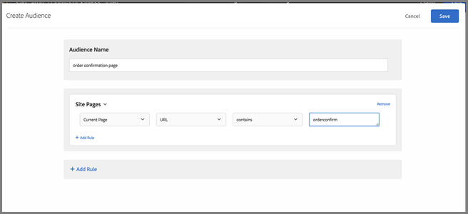

# Domande frequenti sulla mbox globale

Elenco delle domande frequenti sulle mbox globali.

## Posso avere più di una mbox globale se il mio account [!DNL Target] è impostato su più domini?

L&#39;account supporta un&#39;unica mbox globale.

Puoi definire un limite per l&#39;esecuzione delle attività aggiungendo a queste delle regole URL. Per ulteriori informazioni, vedere [Includere la stessa esperienza in pagine simili](https://experienceleague.adobe.com/docs/target/using/experiences/vec/temtest.html?lang=it).

Puoi anche trasmettere un parametro sulla pagina utilizzando [targetPageParams](/help/dev/implement/client-side/atjs/atjs-functions/targetpageparams.md) e quindi selezionare tali parametri nella sezione &quot;Configura URL&quot; nel [!UICONTROL Visual Experience Composer] (VEC) o aggiungendo i parametri come &quot;perfezionamenti&quot; in [!UICONTROL Form-Based Experience Composer].

## Come si trasmettono i dati sui ricavi a una mbox globale [!DNL Target]?

Per raccogliere informazioni sui ricavi e sugli ordini in target-global-mbox, è necessario inviare i &quot;parametri mbox&quot; a [!DNL Target]. Questi parametri sono coppie nome/valore utilizzate per inviare ulteriori informazioni a [!DNL Target]. [!DNL Target] cerca automaticamente questi parametri (nomi riservati) per compilare i dati dei ricavi.

Per `orderConfirmPage`, è necessario passare `orderTotal`, `orderId` e `productPurchasedId`.

Questi parametri devono essere inviati a target-global-mbox tramite `targetPageParams()`. Per ulteriori informazioni, consulta [Trasmissione di parametri a una mbox globale](/help/dev/implement/client-side/atjs/global-mbox/pass-parameters-to-global-mbox.md).

Aggiungere inoltre il targeting alla parte di conversione in modo che [!DNL Target] conteggi le conversioni solo su target-global-mbox quando viene visualizzata la pagina di conferma dell&#39;ordine, come illustrato di seguito:

Nella sezione Pagine del sito sopra illustrata sono incluse le seguenti selezioni: Pagina corrente, URL, contiene, orderconfirm.

Nelle opzioni dell’illustrazione precedente sono incluse le seguenti impostazioni:

* **Cosa desideri misurare con questa attività:** Ricavi.
* **Vista predefinita per rapporti:** Ricavo per visitatore (RPV).
* **Qual è l&#39;azione intrapresa dal pubblico per indicare che l&#39;obiettivo è stato raggiunto?** Visualizzazione di una Mbox, target-global-mbox
