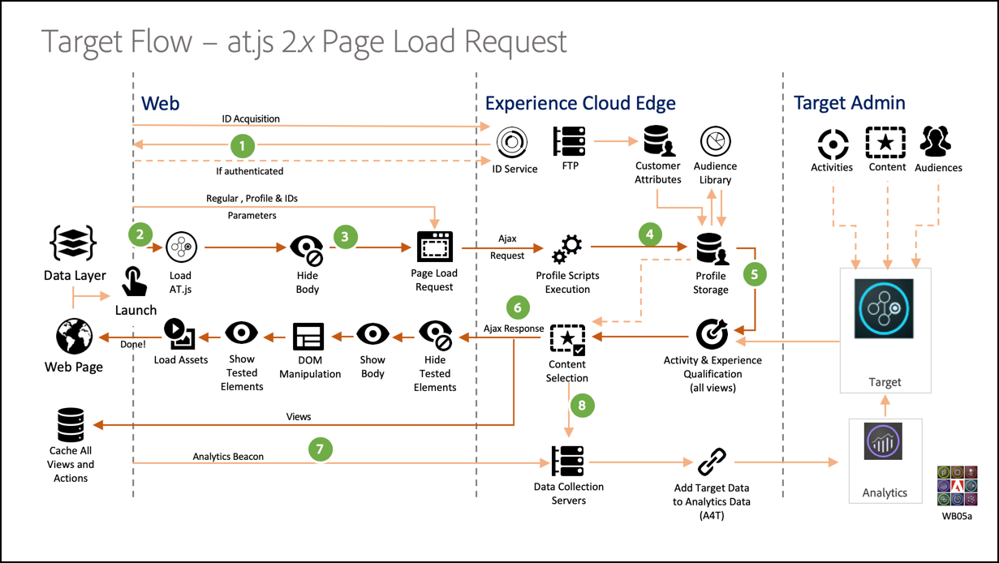
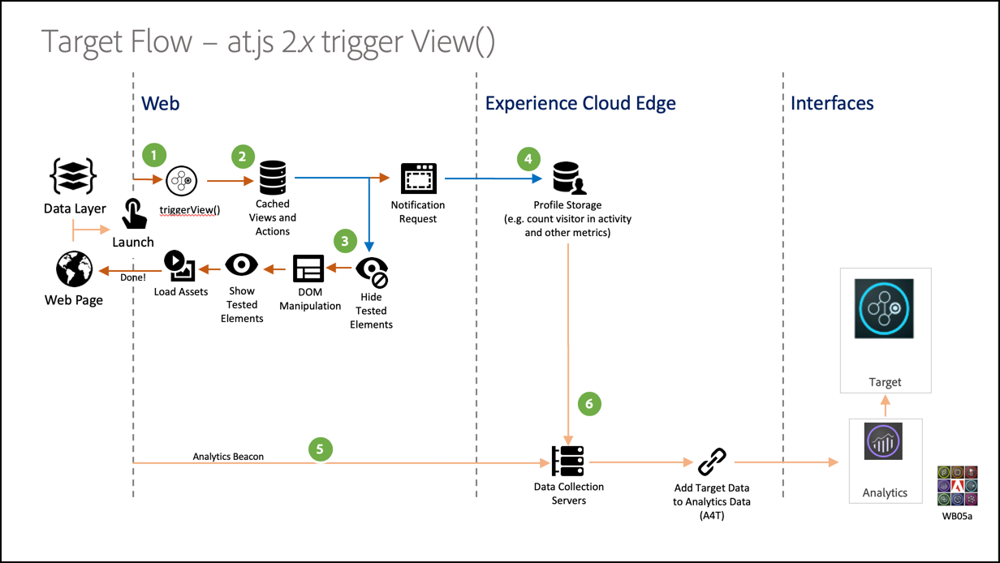

# Implementazione di un’applicazione a pagina singola

I siti web tradizionali funzionavano su modelli di navigazione “da pagina a pagina”, altrimenti noti come Applicazioni a più pagine, in cui le progettazioni del sito web erano strettamente collegate a URL e le transizioni da una pagina web a un’altra richiedevano un caricamento di pagina. Le applicazioni web moderne, come le applicazioni a pagina singola, adottano invece un modello che attiva rapidamente il rendering dell’interfaccia utente del browser, spesso indipendente dalla pagina. Queste esperienze si attivano spesso tramite le interazioni dei clienti, ad esempio lo scorrimento, clic e movimenti del cursore. Con l’evoluzione dei paradigmi del web moderno, la rilevanza degli eventi generici tradizionali, come il caricamento delle pagine, per distribuire personalizzazione e sperimentazione non funziona più.


at.js 2.x offre funzioni avanzate che consentono di eseguire personalizzazioni su tecnologie lato client di nuova generazione. Questa versione si concentra sul miglioramento di at.js per garantire interazioni in sintonia con le applicazioni a pagina singola.

Di seguito sono riportati alcuni vantaggi dell’utilizzo di at.js 2.x che non sono disponibili nelle versioni precedenti:

* Capacità di memorizzare nella cache tutte le offerte al caricamento di pagina per ridurre più chiamate al server a una singola chiamata al server.
* Migliorate enormemente le esperienze degli utenti finali sul sito, in quanto le offerte appaiono immediatamente tramite la cache senza intervalli dovuti alle chiamate al server tradizionali.
* Una semplice riga di codice e una configurazione per sviluppatori una tantum per consentire agli esperti di marketing di creare ed eseguire attività A/B e Targeting esperienza (XT) tramite il Compositore esperienza visivo sull’applicazione a pagina singola.

## [!DNL Adobe Target] Visualizzazioni e applicazioni a pagina singola

Il [!DNL Adobe Target] Il Compositore esperienza visivo per l’SPA sfrutta un nuovo concetto chiamato Visualizzazioni: un gruppo logico di elementi visivi che insieme formano un’esperienza dell’SPA. Un’applicazione a pagina singola può, infatti, essere considerata come transizione attraverso le visualizzazioni (al posto degli URL) basata sulle interazioni dell’utente. In genere, una visualizzazione può rappresentare un intero sito o elementi visivi raggruppati all&#39;interno di un sito.

Per spiegare ulteriormente cosa sono le visualizzazioni, navighiamo in questo ipotetico sito di e-commerce online implementato in React ed esploriamo alcune visualizzazioni di esempio. Fai clic sui collegamenti di seguito per aprire il sito in una nuova scheda del browser.

**Link: [Home page](https://target.enablementadobe.com/react/demo/#/)**


Quando entriamo nella home page, notiamo subito un’immagine protagonista (hero image) che promuove un’offerta di Pasqua e gli ultimi prodotti venduti sul sito. In questo caso, si può definire una visualizzazione come l’intera home page. Questo è utile da sapere, ma torneremo sull’argomento più avanti nell’implementazione di [!DNL Adobe Target] Visualizzazioni di seguito.

**Link: [Sito del prodotto](https://target.enablementadobe.com/react/demo/#/products)**


Interessati ai prodotti venduti dall’azienda, decidiamo di fare clic sul collegamento Prodotti. Come con la home page, l’intero sito dei prodotti può essere definito come visualizzazione. Possiamo denominare questa visualizzazione &quot;products&quot; come nel nome del percorso `https://target.enablementadobe.com/react/demo/#/products)`.


All&#39;inizio di questa sezione, abbiamo definito visualizzazioni come l&#39;intero sito o anche un gruppo di elementi visivi sul sito. Come si vede qui sopra, è possibile raggruppare i quattro prodotti visibili sul sito e considerarli come una visualizzazione. Se vogliamo, possiamo denominare questa visualizzazione “Products”.


Decidiamo di fare clic sul pulsante Carica altro per esplorare altri prodotti sul sito. In questo caso, l’URL del sito web non cambia. Tuttavia, una visualizzazione qui può rappresentare solo la seconda riga di prodotti visibili qui sopra. Possiamo chiamare questa visualizzazione “PRODUCTS-PAGE-2”.

**Link: [Pagamento](https://target.enablementadobe.com/react/demo/#/checkout)**


Visto che ci piacciono alcuni prodotti presenti sul sito, decidiamo di comprarne un paio. Ora, sulla pagina di checkout, sono disponibili alcune opzioni per scegliere la consegna normale o express. Poiché una visualizzazione può essere qualsiasi gruppo di elementi visivi su un sito, questa possiamo chiamarla “Preferenze di consegna”.

Il concetto di visualizzazioni si può estendere ulteriormente. Se gli esperti di marketing desiderano personalizzare il contenuto sul sito a seconda della preferenza di consegna selezionata, è possibile creare una visualizzazione per ogni opzione di consegna. In questo caso, quando selezioniamo Consegna normale, possiamo chiamare la visualizzazione “Consegna normale”. Se selezioniamo l’opzione Consegna Express, la visualizzazione si può chiamare “Consegna express”.

Adesso, gli esperti di marketing potrebbero voler eseguire un test A/B per valutare se cambiare il colore da blu a rosso quando si seleziona l’opzione Consegna express per aumentare le conversioni, invece di mantenere il pulsante blu con entrambe le opzioni di consegna.

## Implementazione [!DNL Adobe Target] Visualizzazioni

Ora che abbiamo capito cosa [!DNL Adobe Target] Visualizzazioni: possiamo sfruttare questo concetto in [!DNL Target] per consentire agli addetti al marketing di eseguire test A/B e XT sull’SPA tramite il Compositore esperienza visivo. Questo richiederà una configurazione per sviluppatori una tantum. Seguiamo i passaggi per configurarlo.

1. Installare at.js 2.*x*.

   Innanzitutto, dobbiamo installare at.js 2.*x*. Questa versione di at.js è stata sviluppata pensando all’SPA. Le versioni precedenti di at.js non supportano [!DNL Adobe Target] Viste e il Compositore esperienza visivo per l’SPA.

   Scarica at.js 2.*x* tramite [!DNL Adobe Target] Interfaccia utente in **[!UICONTROL Amministrazione]** > **[!UICONTROL Implementazione]**. at.js 2.*x* può essere implementato anche tramite tag in [!DNL Adobe Experience Platform].

1. Implementare at.js 2.*x* funzione, `[triggerView()](/help/dev/implement/client-side/atjs/atjs-functions/adobe-target-triggerview-atjs-2.md)` sui tuoi siti.

   Dopo aver definito le visualizzazioni dell’SPA in cui desideri eseguire un test A/B o XT, implementa at.js 2.*x* `triggerView()` con le Viste passate come parametro. Questo consente agli esperti di marketing di utilizzare il Compositore esperienza visivo per progettare ed eseguire i test A/B e XT per queste visualizzazioni definite. Se la funzione `triggerView()` non è definita per tali visualizzazioni, il Compositore esperienza visivo non le rileva e, pertanto, gli addetti al marketing non possono utilizzarlo per progettare ed eseguire test A/B e XT.

   >[!NOTE]
   >
   >Per visualizzare il supporto in at.js, [viewsEnabled](/help/dev/implement/client-side/atjs/atjs-functions/targetglobalsettings.md#viewsenbabled) deve essere impostato su true, altrimenti tutte le funzionalità di visualizzazione sono disabilitate.

   **`adobe.target.triggerView(viewName, options)`**

   | Parametro | Tipo | Obbligatorio | Convalida | Descrizione |
   | --- | --- | --- | --- | --- |
   | viewName | Stringa | Sì | 1. Senza spazi finali.<br />2. Non può essere vuoto.<br />3. Il nome della visualizzazione deve essere univoco per tutte le pagine.<br />4. **Avviso**: il nome della visualizzazione non deve iniziare o finire con &quot;`/`&quot;. Questo perché il cliente in genere estrae il nome della visualizzazione dal percorso URL. Per noi, &quot;home&quot; e &quot;`/home`&quot; sono diversi.<br />5. **Avviso**: non attivare la stessa visualizzazione in sequenza più volte con l&#39;opzione `{page: true}`. | Passa un nome qualsiasi come tipo di stringa che desideri rappresenti la tua visualizzazione. Questo nome della visualizzazione appare nel pannello **[!UICONTROL Modifiche]** del Compositore esperienza visivo per consentire agli addetti al marketing di creare azioni ed eseguire le attività A/B e XT. |
   | options | Oggetto | No |  |  |
   | options > page | Booleano | No |  | **TRUE**: il valore predefinito della pagina è vero. Con `page=true`, si inviano notifiche ai server perimetrali per incrementare il conteggio delle impression.<br />**FALSE**: con `page=false`, non si inviano notifiche per incrementare il conteggio delle impression. Da utilizzare solo per eseguire nuovamente il rendering di un componente su una pagina con un’offerta. |

   Ora vediamo alcuni esempi di casi d’uso su come richiamare l’ `triggerView()` funzione in React per il nostro ipotetico SPA di e-commerce:

   **Link: [Home page](https://target.enablementadobe.com/react/demo/#/)**

   

   In qualità di esperto di marketing, se desideri eseguire test A/B sull’intero sito principale, potrebbe essere utile assegnare alla visualizzazione il nome “home”:

```
 function targetView() {
   var viewName = window.location.hash; // or use window.location.pathName if router works on path and not hash

   viewName = viewName || 'home'; // view name cannot be empty

   // Sanitize viewName to get rid of any trailing symbols derived from URL
   if (viewName.startsWith('#') || viewName.startsWith('/')) {
     viewName = viewName.substr(1);
   }

   // Validate if the Target Libraries are available on your website
   if (typeof adobe != 'undefined' && adobe.target && typeof adobe.target.triggerView === 'function') {
     adobe.target.triggerView(viewName);
   }
 }

 // react router v4
 const history = syncHistoryWithStore(createBrowserHistory(), store);
 history.listen(targetView);

 // react router v3
 <Router history={hashHistory} onUpdate={targetView} >
```

**Link: [Sito prodotti](https://target.enablementadobe.com/react/demo/#/products)**

Ora vediamo un esempio un po&#39; più complicato. Diciamo che, in qualità di esperti di marketing, vogliamo personalizzare la seconda riga dei prodotti cambiando il colore dell’etichetta &quot;Prezzo&quot; in rosso dopo che un utente ha fatto clic sul pulsante Carica altro.


```
 function targetView(viewName) {
   // Validate if the Target Libraries are available on your website
   if (typeof adobe != 'undefined' && adobe.target && typeof adobe.target.triggerView === 'function') {
     adobe.target.triggerView(viewName);
   }
 }

 class Products extends Component {
   render() {
     return (
       <button type="button" onClick={this.handleLoadMoreClicked}>Load more</button>
     );
   }

   handleLoadMoreClicked() {
     var page = this.state.page + 1; // assuming page number is derived from component's state
     this.setState({page: page});
     targetView('PRODUCTS-PAGE-' + page);
   }
 }
```

**Link: [Pagamento](https://target.enablementadobe.com/react/demo/#/checkout)**


Se gli esperti di marketing desiderano personalizzare il contenuto sul sito a seconda della preferenza di consegna selezionata, è possibile creare una visualizzazione per ogni opzione di consegna. In questo caso, quando selezioniamo Consegna normale, possiamo chiamare la visualizzazione “Consegna normale”. Se selezioniamo l’opzione Consegna Express, la visualizzazione si può chiamare “Consegna express”.

Adesso, gli esperti di marketing potrebbero voler eseguire un test A/B per valutare se cambiare il colore da blu a rosso quando si seleziona l’opzione Consegna express per aumentare le conversioni, invece di mantenere il pulsante blu con entrambe le opzioni di consegna.

```
 function targetView(viewName) {
   // Validate if the Target Libraries are available on your website
   if (typeof adobe != 'undefined' && adobe.target && typeof adobe.target.triggerView === 'function') {
     adobe.target.triggerView(viewName);
   }
 }

 class Checkout extends Component {
   render() {
     return (
       <div onChange={this.onDeliveryPreferenceChanged}>
         <label>
           <input type="radio" id="normal" name="deliveryPreference" value={"Normal Delivery"} defaultChecked={true}/>
           <span> Normal Delivery (7-10 business days)</span>
         </label>

         <label>
           <input type="radio" id="express" name="deliveryPreference" value={"Express Delivery"}/>
           <span> Express Delivery* (2-3 business days)</span>
         </label>
       </div>
     );
   }
   onDeliveryPreferenceChanged(evt) {
     var selectedPreferenceValue = evt.target.value;
     targetView(selectedPreferenceValue);
   }
 }
```

## Diagrammi di sistema di at.js 2.x

I seguenti diagrammi ti aiutano a comprendere il flusso di lavoro di at.js 2.x tramite Visualizzazioni e come questo migliori l’integrazione con le applicazioni a pagina singola. Per una migliore introduzione dei concetti utilizzati in at.js 2.x, consulta [Implementazione di un’applicazione a pagina singola](/help/dev/implement/client-side/atjs/how-to-deployatjs/target-atjs-single-page-application.md).



| Passaggio | Dettagli |
| --- | --- |
| 1 | La chiamata restituisce l’ID Experience Cloud se l’utente è autenticato; un’altra chiamata sincronizza l’ID cliente. |
| 2 | La libreria at.js viene caricata in modo sincrono e nasconde il corpo del documento.<br />at.js si carica anche in modo asincrono con un&#39;opzione che nasconde lo snippet implementato sulla pagina. |
| 3 | Si effettua una richiesta di caricamento della pagina, con tutti i parametri configurati (MCID, SDID e ID cliente). |
| 4 | Gli script di profilo vengono eseguiti e quindi inseriti nell’archivio profili. L’archivio richiede un pubblico idoneo dalla libreria Pubblico (ad esempio, pubblico condiviso da Adobe Analytics, Gestione dell&#39;audience, ecc.).<br />Gli attributi del cliente vengono inviati all’archivio profili in un processo batch. |
| 5 | In base ai parametri di richiesta dell’URL e ai dati di profilo, [!DNL Target] determina le attività ed esperienze da restituire al visitatore per la pagina corrente e le visualizzazioni future. |
| 6 | Il contenuto di destinazione viene rinviato alla pagina, includendo facoltativamente i valori di profilo per ulteriore personalizzazione.<br />Il contenuto mirato sulla pagina corrente viene mostrato il più rapidamente possibile senza che venga visualizzato momentaneamente il contenuto predefinito.<br />Contenuto mirato per le viste mostrate come risultato delle azioni dell&#39;utente in un’applicazione a pagina singola memorizzata nella cache del browser, in modo da applicarla immediatamente senza una chiamata al server aggiuntiva quando si attivano le viste tramite `triggerView()`. |
| 7 | I dati Analytics vengono inviati ai server di raccolta dati. |
| 8 | I dati di destinazione corrispondono a [!DNL Analytics] tramite l&#39;identificatore SDID ed è elaborato in [!DNL Analytics] archiviazione dei rapporti.<br />I dati di Analytics possono quindi essere visualizzati in entrambi [!DNL Analytics] e [!DNL Target] tramite [!DNL Analytics] per [!DNL Target] (A4T). |

Ora, ovunque si implementi `triggerView()` nell’applicazione a pagina singola, le visualizzazioni e le azioni vengono recuperate dalla cache e mostrate all’utente senza una chiamata al server. `triggerView()` invia anche una richiesta di notifica al backend [!DNL Target] per incrementare e registrare i conteggi delle impression.



| Passaggio | Dettagli |
| --- | --- |
| 1 | Si richiama `triggerView()` nell’applicazione a pagina singola per eseguire il rendering della visualizzazione e applicare azioni per modificare gli elementi visuali. |
| 2 | Il contenuto mirato per la visualizzazione viene letto dalla cache. |
| 3 | Il contenuto mirato viene mostrato il più rapidamente possibile senza che venga visualizzato momentaneamente il contenuto predefinito. |
| 4 | Si invia la richiesta di notifica all&#39;archivio profili di [!DNL Target] per conteggiare il visitatore nell&#39;attività e nelle metriche incrementali. |
| 5 | Dati di Analytics inviati ai server di raccolta dati. |
| 6 | I dati di Target vengono confrontati con i dati di [!DNL Analytics] tramite SDID e vengono elaborati nell’archivio dei rapporti di [!DNL Analytics]. [!DNL Analytics] I dati possono quindi essere visualizzati in entrambi [!DNL Analytics] e [!DNL Target] tramite i rapporti A4T. |

## Compositore esperienza visivo per app a pagina singola

Dopo aver completato l’installazione di at.js 2.x e aggiunto `triggerView()` al sito, utilizza il Compositore esperienza visivo per eseguire attività A/B e XT. Per ulteriori informazioni, consulta [Compositore esperienza visivo per app a pagina singola](https://experienceleague.adobe.com/docs/target/using/experiences/spa-visual-experience-composer.html).

>[!NOTE]
>
>Il Compositore esperienza visivo per le applicazioni a pagina singola è lo stesso Compositore esperienza visivo utilizzato nelle normali pagine web, ma con alcune funzionalità aggiuntive disponibili quando si apre un&#39;app a pagina singola con `triggerView()` implementato.

## Utilizza TriggerView per garantire che A4T funzioni correttamente con at.js 2.x e le applicazioni a pagina singola

Per fare in modo che [ for ](https://experienceleague.adobe.com/docs/target/using/integrate/a4t/a4t.html) (A4T) funzioni correttamente con at.js 2.x, assicurati di inviare lo stesso codice SDID nella richiesta di Target e nella richiesta di Analytics.[!DNL Target][!DNL Analytics]

Come best practice relative alle applicazioni a pagina singola:

* Utilizza eventi personalizzati per generare una notifica quando nell’applicazione si verifica qualcosa di interessante
* Attiva un evento personalizzato prima che inizi il rendering della visualizzazione
* Attiva un evento personalizzato quando termina il rendering della visualizzazione

at.js 2.x ha aggiunto una nuova funzione API [triggerView()](/help/dev/implement/client-side/atjs/atjs-functions/adobe-target-triggerview-atjs-2.md). Utilizza `triggerView()` per notificare ad at.js quando sta per essere eseguito il rendering di una visualizzazione.

Per vedere come combinare eventi personalizzati, at.js 2.x, e Analytics, vediamo un esempio. Questo esempio presuppone che la pagina HTML contenga l’API del visitatore, seguita da at.js 2.x, seguita da AppMeasurement.

Supponiamo che siano presenti i seguenti eventi personalizzati:

* `at-view-start` - Quando inizia il rendering della visualizzazione
* `at-view-end` - Quando termina il rendering della visualizzazione

Per fare in modo che A4T funzioni con at.js 2.x,

Il gestore di inizio della visualizzazione sarà simile al seguente:

```jsx {line-numbers="true"}
document.addEventListener("at-view-start", function(e) {
  var visitor = Visitor.getInstance("<your Adobe Org ID>");
  
  visitor.resetState();
  adobe.target.triggerView("<view name>");
});
```

Il gestore di fine visualizzazione sarà simile al seguente:

```jsx {line-numbers="true"}
document.addEventListener("at-view-end", function(e) {
  // s - is the AppMeasurement tracker object
  s.t();
});
```

>[!NOTE]
>
>È necessario attivare gli eventi `at-view-start` e `at-view-end`. Questi eventi non fanno parte degli eventi personalizzati di at.js

Anche se questi esempi utilizzano il codice JavaScript, tutto questo può essere semplificato se utilizzi un gestore di tag, come i tag in [Adobe Experience Platform](/help/dev/implement/client-side/atjs/how-to-deployatjs/implement-target-using-adobe-launch.md).

Se segui la procedura precedente, dovresti disporre di una soluzione A4T solida per le applicazioni a pagina singola.

## Best practice di implementazione

Le API di at.js 2.x consentono di personalizzare la [!DNL Target] implementazione in molti modi, ma è importante seguire l&#39;ordine corretto delle operazioni durante questo processo.

Le informazioni seguenti descrivono l&#39;ordine delle operazioni da seguire quando si carica un&#39;applicazione a pagina singola per la prima volta in un browser e per qualsiasi modifica della visualizzazione successiva.

### Ordine delle operazioni per il caricamento della pagina iniziale {#order}

| Passaggio | Azione | Dettagli |
| --- | --- | --- |
| 1 | Carica JS VisitorAPI | Questa libreria è responsabile dell’assegnazione di un ECID al visitatore. Questo ID viene successivamente utilizzato da altre soluzioni Adobe sulla pagina web. |
| 2 | Caricare at.js 2.x | at.js 2.x carica tutte le API necessarie che utilizzi per implementare [!DNL Target] richieste e visualizzazioni. |
| 3 | Esegui [!DNL Target] richiesta | Se disponi di un livello dati, ti consigliamo di caricare i dati critici necessari per l’invio a [!DNL Target] prima di eseguire [!DNL Target] richiesta. Questo ti consente di utilizzare `targetPageParams` per includere tutti i dati da utilizzare per il targeting.<P>Quando `pageLoadEnabled` e `viewsEnabled` sono impostati su true in [targetGlobalSettings](/help/dev/implement/client-side/atjs/atjs-functions/targetglobalsettings.md), at.js richiede automaticamente tutto il Compositore esperienza visivo [!DNL Target] offerte al passaggio 2.<P>Tieni presente che `getOffers` può essere utilizzato anche per ottenere le offerte del Compositore esperienza visivo dopo il caricamento della pagina. A tal fine, assicurati che la richiesta includa `execute>pageLoad` e `prefetch>views` nella chiamata API. |
| 4 | Chiamata `triggerView()` | Perché il [!DNL Target] La richiesta avviata nel passaggio 3 potrebbe restituire esperienze sia per l’esecuzione di Caricamento pagina che per le Visualizzazioni, assicurati che `triggerView()` viene chiamato dopo il [!DNL Target] viene restituita la richiesta e termina l’applicazione delle offerte alla cache. Questo passaggio deve essere eseguito una sola volta per ogni visualizzazione. |
| 5 | Chiama il [!DNL Analytics] beacon di visualizzazione pagina | Questo beacon invia l&#39;SDID associato ai passaggi 3 e 4 a [!DNL Analytics] per l’unione di dati. |
| 6 | Chiamata aggiuntiva `triggerView({"page": false})` | Questo è un passaggio facoltativo per i framework SPA che potrebbero potenzialmente eseguire nuovamente il rendering di determinati componenti sulla pagina senza che si verifichi una modifica della visualizzazione. In tali occasioni, è importante richiamare questa API per garantire che [!DNL Target] le esperienze vengono riapplicate dopo che il framework SPA ha rieseguito il rendering dei componenti. Puoi eseguire questo passaggio quante volte desideri per assicurarti che [!DNL Target] le esperienze persistono nelle visualizzazioni dell’SPA. |

### Ordine delle operazioni per la modifica della visualizzazione SPA (nessun ricaricamento dell&#39;intera pagina)

| Passaggio | Azione | Dettagli |
| --- | --- | --- |
| 1 | Chiamata `visitor.resetState()` | Questa API assicura che l’identificatore SDID venga rigenerato per la nuova visualizzazione durante il caricamento. |
| 2 | Aggiornare la cache chiamando `getOffers()` API | Questo è un passaggio facoltativo da eseguire se la modifica della visualizzazione può qualificare il visitatore corrente per un numero maggiore di [!DNL Target] o escluderli dalle attività. A questo punto, puoi anche scegliere di inviare dati aggiuntivi a [!DNL Target] per abilitare ulteriori funzionalità di targeting. |
| 3 | Chiamata `triggerView()` | Se hai eseguito il passaggio 2, devi attendere che [!DNL Target] richiedi e applica le offerte alla cache prima di eseguire questo passaggio. Questo passaggio deve essere eseguito una sola volta per ogni visualizzazione. |
| 4 | Chiamata `triggerView()` | Se non hai eseguito il passaggio 2, puoi eseguire questo passaggio non appena hai completato il passaggio 1. Se hai eseguito i passaggi 2 e 3, dovresti saltare questo passaggio. Questo passaggio deve essere eseguito una sola volta per ogni visualizzazione. |
| 5 | Chiama il [!DNL Analytics] beacon di visualizzazione pagina | Questo beacon invia l&#39;SDID associato ai passaggi 2, 3 e 4 a [!DNL Analytics] per l’unione di dati. |
| 6 | Chiamata aggiuntiva `triggerView({"page": false})` | Questo è un passaggio facoltativo per i framework SPA che potrebbero potenzialmente eseguire nuovamente il rendering di determinati componenti sulla pagina senza che si verifichi una modifica della visualizzazione. In tali occasioni, è importante richiamare questa API per garantire che [!DNL Target] le esperienze vengono riapplicate dopo che il framework SPA ha rieseguito il rendering dei componenti. Puoi eseguire questo passaggio quante volte desideri per assicurarti che [!DNL Target] le esperienze persistono nelle visualizzazioni dell’SPA. |

## Video di formazione

I video che seguono contengono ulteriori informazioni:

### Come funziona at.js 2.x

>[!VIDEO](https://video.tv.adobe.com/v/26250/?quality=12)

Consulta la pagina relativa al [funzionamento di at.js 2.x](https://experienceleague.adobe.com/docs/target-learn/tutorials/implementation/understanding-how-atjs-20-works.html) per ulteriori informazioni.

### Implementare at.js 2.x in un’applicazione a pagina singola

>[!VIDEO](https://video.tv.adobe.com/v/26248/?quality=12)

Consulta [Implementare at.js 2.x di Adobe Target in un’applicazione a pagina singola (SPA)](https://experienceleague.adobe.com/docs/target-learn/tutorials/experiences/use-the-visual-experience-composer-for-single-page-applications.html) per ulteriori informazioni.

### Utilizzo del Compositore esperienza visivo per SPA in [!DNL Adobe Target]

>[!VIDEO](https://video.tv.adobe.com/v/26249/?quality=12)

Consulta [Utilizzo del Compositore esperienza visivo per le applicazioni a pagina singola (SPA VEC) in Adobe Target](https://experienceleague.adobe.com/docs/target-learn/tutorials/experiences/use-the-visual-experience-composer-for-single-page-applications.html) per ulteriori informazioni.
