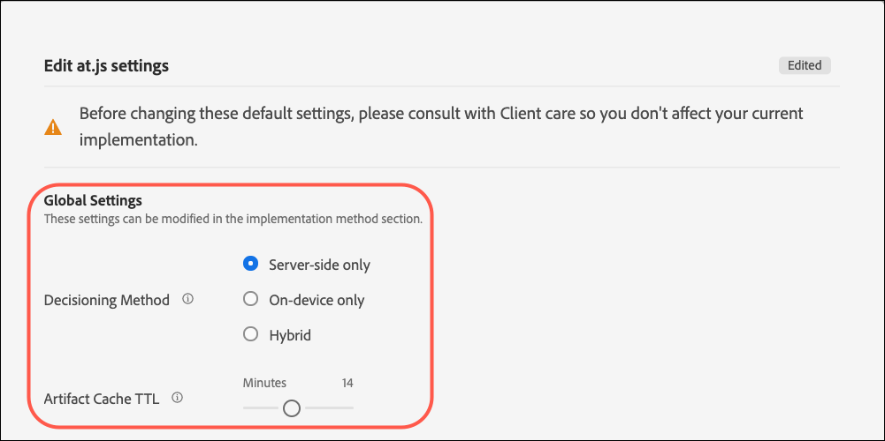

# [!UICONTROL Decisioning sul dispositivo] per at.js

A partire dalla versione 2.5.0, le offerte at.js [!UICONTROL decisioning sul dispositivo]. [!UICONTROL Decisioning sul dispositivo] consente di memorizzare nella cache [Test A/B](https://experienceleague.adobe.com/docs/target/using/activities/abtest/test-ab.html) e [Targeting esperienza](https://experienceleague.adobe.com/docs/target/using/activities/experience-targeting/experience-target.html) (XT) attività sul browser per eseguire decisioni in memoria senza una richiesta di blocco della rete al [!DNL Adobe Target] Rete Edge.

>[!NOTE]
>
>[!UICONTROL Decisioning sul dispositivo] è disponibile sia per le implementazioni lato client che per quelle lato server. Questo articolo descrive [!UICONTROL decisioning sul dispositivo] per lato client. Per informazioni su [!UICONTROL decisioning sul dispositivo] per il lato server, fai riferimento alla documentazione sull&#39;implementazione lato server [qui](../../../server-side/sdk-guides/on-device-decisioning/overview.md).

[!DNL Target] offre anche la flessibilità di fornire l’esperienza più rilevante e aggiornata dalle attività di sperimentazione e personalizzazione basata sull’apprendimento automatico (ML-driven) tramite una chiamata al server live. In altre parole, quando le prestazioni sono più importanti, puoi scegliere di utilizzare [!UICONTROL decisioning sul dispositivo]. Tuttavia, quando è necessaria l’esperienza più rilevante, aggiornata e basata su apprendimento automatico, è possibile effettuare una chiamata al server.

## Quali sono i vantaggi di [!UICONTROL decisioning sul dispositivo]?

I vantaggi di [!UICONTROL decisioning sul dispositivo] include:

* **Offri esperienze e decisioni rapide e sorprendenti.** Il bucket e il decisioning vengono eseguiti in memoria e sul browser per evitare il blocco delle richieste di rete.
* **Miglioramento delle prestazioni delle applicazioni.** Esegui esperimenti e fornisci personalizzazione ai clienti e agli utenti senza compromettere le esperienze degli utenti finali.
* **Migliora il punteggio di qualità del sito Google.** Con le decisioni prese in memoria, migliora il punteggio di qualità del sito Google del tuo business online per renderlo più individuabile dai consumatori.
* **Scopri le funzionalità di analisi in tempo reale.** Ottieni informazioni approfondite dalle prestazioni della tua attività in tempo reale tramite [Analytics for Target](https://experienceleague.adobe.com/docs/target/using/integrate/a4t/a4t.html) (A4T) reportistica. A4T consente di ruotare la strategia nei momenti critici.

## Funzioni supportate

Il [!DNL Adobe Target] L’SDK JS offre ai clienti la flessibilità di scegliere tra prestazioni e aggiornamento dei dati per le decisioni. In altre parole, se la distribuzione dei contenuti personalizzati più rilevanti e coinvolgenti tramite l’apprendimento automatico è la cosa più importante per te, è necessario effettuare una chiamata al server live. Tuttavia, quando le prestazioni sono più importanti, è necessario prendere una decisione su dispositivo e in memoria. Per [!UICONTROL decisioning sul dispositivo] per ulteriori informazioni, consulta l’elenco delle funzioni supportate:

* Tipi di attività
* Targeting del pubblico
* Metodo di allocazione

Per ulteriori informazioni, consulta [Funzioni supportate per [!UICONTROL decisioning sul dispositivo]](/help/dev/implement/client-side/atjs/on-device-decisioning/supported-features.md).

## In che modo [!UICONTROL decisioning sul dispositivo] lavoro?

Quando distribuisci e inizializzi at.js con [!UICONTROL decisioning sul dispositivo] abilitato, un [artefatto regola](/help/dev/implement/client-side/atjs/on-device-decisioning/rule-artifact.md) che include [!UICONTROL decisioning sul dispositivo] per attività A/B e XT, i tipi di pubblico e le risorse vengono scaricati dalla rete CDN Akamai più vicina al visitatore e memorizzati nella cache locale nel browser del visitatore. Quando si effettua una richiesta da at.js per recuperare un’esperienza, la decisione relativa all’esperienza da restituire viene presa in memoria, in base ai metadati codificati nell’artefatto della regola memorizzata nella cache.

## Metodo di decisione

Con [!UICONTROL decisioning sul dispositivo], [!DNL Target] In viene introdotta una nuova impostazione denominata Metodo di decisione. L’impostazione del metodo Decisioning determina il modo in cui at.js distribuisce le esperienze. Il metodo Decisioning ha tre valori:

* Solo lato server
* Solo su dispositivo
* Ibrido

### Solo lato server

Solo lato server è il metodo decisionale predefinito impostato automaticamente quando at.js 2.5.0+ viene implementato e distribuito sulle proprietà web.

Se si utilizza Solo lato server come configurazione predefinita, tutte le decisioni vengono prese sulla rete Edge di [!DNL Target], il che comporta una chiamata di blocco al server. Questo approccio può introdurre una latenza incrementale, ma offre anche vantaggi significativi, come la possibilità di applicare [!DNL Target]Le funzionalità di apprendimento automatico di includono [Recommendations](https://experienceleague.adobe.com/docs/target/using/recommendations/recommendations.html), [Automated Personalization](https://experienceleague.adobe.com/docs/target/using/activities/automated-personalization/automated-personalization.html) (AP), e [Targeting automatico](https://experienceleague.adobe.com/docs/target/using/activities/auto-target/auto-target-to-optimize.html) attività.

Inoltre, migliorare le esperienze personalizzate utilizzando [!DNL Target]Il profilo utente di, che viene mantenuto tra sessioni e canali, può fornire risultati potenti per la tua azienda.

Infine, Solo lato server consente di utilizzare Adobe Experience Cloud e di perfezionare i tipi di pubblico a cui rivolgersi grazie ai segmenti di Audience Manager e Adobe Analytics.

Il diagramma seguente illustra l’interazione tra il visitatore, il browser, at.js 2.5.0+ e [!DNL Adobe Target] Rete Edge. Questo diagramma di flusso acquisisce nuovi visitatori e visitatori di ritorno.

(Fare clic sull&#39;immagine per espanderla a larghezza intera.)

{zoomable=&quot;yes&quot;}

L&#39;elenco seguente corrisponde ai numeri del diagramma:

| Passaggio | Descrizione |
| --- | --- |
| 1 | L&#39;ID visitatore Experience Cloud viene recuperato da [Servizio Adobe Experience Cloud Identity](https://experienceleague.adobe.com/docs/id-service/using/home.html?). |
| 2 | La libreria at.js viene caricata in modo sincrono e nasconde il corpo del documento.<br />   La libreria at.js può anche essere caricata in modo asincrono con un eventuale snippet prenascosto implementato sulla pagina. |
| 3 | La libreria at.js nasconde il corpo per evitare sfarfallii. |
| 4 | Viene effettuata una richiesta di caricamento della pagina che include tutti i parametri configurati, ad esempio (ECID, ID cliente, parametri personalizzati, profilo utente e così via). |
| 5 | Gli script di profilo vengono eseguiti e quindi inseriti nell’archivio profili.<br />L’archivio profili richiede un pubblico idoneo dalla libreria Pubblico (ad esempio, pubblico condiviso da Adobe Analytics, Adobe Audience Manager e così via).<br />Gli attributi del cliente vengono inviati all’archivio profili in un processo batch. |
| 6 | L’archivio profili viene utilizzato per la qualifica del pubblico e il bucket per filtrare le attività. |
| 7 | Il contenuto risultante viene selezionato dopo che l’esperienza è determinata dalla pubblicazione [!DNL Target] attività. |
| 8 | La libreria at.js nasconde gli elementi corrispondenti sulla pagina che sono associati all’esperienza di cui è necessario eseguire il rendering. |
| 9 | La libreria at.js visualizza il corpo in modo che il resto della pagina possa essere caricato per essere visualizzato dal visitatore. |
| 10 | La libreria at.js manipola il DOM per eseguire il rendering dell’esperienza dalla [!DNL Target] Rete Edge. |
| 11 | L’esperienza viene riprodotta per il visitatore. |
| 12 | Viene caricata l’intera pagina web. |
| 13 | I dati Analytics vengono inviati ai server di raccolta dati. |
| 14 | I dati di Target vengono confrontati con i dati di Analytics tramite SDID ed elaborati nell’archivio dei rapporti di Analytics. I dati di Analytics possono quindi essere visualizzati sia in Analytics che in [!DNL Target] tramite i rapporti [!UICONTROL Analytics for Target] (A4T). |

### Solo su dispositivo

Solo su dispositivo è il metodo decisionale che deve essere impostato in at.js 2.5.0+ quando [!UICONTROL decisioning sul dispositivo] deve essere utilizzato solo in tutte le pagine web.

[!UICONTROL Decisioning sul dispositivo] può fornire le tue esperienze e attività di personalizzazione a una velocità sorprendente, perché le decisioni sono prese da un artefatto di regole memorizzate nella cache che contiene tutte le attività che si qualificano per [!UICONTROL decisioning sul dispositivo].

Per ulteriori informazioni sulle attività idonee [!UICONTROL decisioning sul dispositivo], vedi [Funzioni supportate in [!UICONTROL decisioning sul dispositivo]](/help/dev/implement/client-side/atjs/on-device-decisioning/supported-features.md).

Questo metodo decisionale deve essere utilizzato solo se le prestazioni sono altamente critiche in tutte le pagine che richiedono decisioni da Target. Inoltre, ricorda che quando viene selezionato questo metodo decisionale, le attività [!DNL Target] che non possono avvalersi delle decisioni su dispositivo non verranno consegnate o eseguite.  La libreria at.js 2.5.0+ è configurata per cercare solo l’artefatto delle regole memorizzate nella cache per prendere decisioni.

Il diagramma seguente illustra l’interazione tra il visitatore, il browser, at.js 2.5.0+ e la rete CDN di Akamai. Il CDN di Akamai memorizza in cache l’artefatto delle regole per la prima visita del visitatore. Per la prima visita di pagina di un nuovo visitatore, l’artefatto delle regole JSON deve essere scaricato dalla rete CDN Akamai per essere memorizzato nella cache locale nel browser del visitatore. Una volta scaricato l’artefatto delle regole JSON, la decisione viene presa immediatamente senza una chiamata di rete di blocco. Il seguente diagramma di flusso acquisisce nuovi visitatori.

(Fare clic sull&#39;immagine per espanderla a larghezza intera.)

{zoomable=&quot;yes&quot;}

L&#39;elenco seguente corrisponde ai numeri del diagramma:

>[!NOTE]
>
>[!DNL Adobe Target] I server di amministrazione qualificano tutte le attività idonee per [!UICONTROL decisioning sul dispositivo], genera l’artefatto delle regole JSON e lo propaga alla rete CDN di Akamai. Le attività vengono costantemente monitorate per rilevare aggiornamenti che generano un nuovo artefatto di regole JSON da propagare alla rete CDN di Akamai.

| Passaggio | Descrizione |
| --- | --- |
| 1 | L&#39;ID visitatore Experience Cloud viene recuperato da [Servizio Adobe Experience Cloud Identity](https://experienceleague.adobe.com/docs/id-service/using/home.html). |
| 2 | La libreria at.js viene caricata in modo sincrono e nasconde il corpo del documento.<br />La libreria at.js può anche essere caricata in modo asincrono con un eventuale snippet prenascosto implementato sulla pagina. |
| 3 | La libreria at.js nasconde il corpo per evitare sfarfallii. |
| 4 | La libreria at.js richiede di recuperare l’artefatto della regola JSON dal CDN Akamai più vicino al visitatore. |
| 5 | Il CDN di Akamai risponde con l’artefatto della regola JSON. |
| 6 | L’artefatto della regola JSON viene memorizzato nella cache locale nel browser del visitatore. |
| 7 | La libreria at.js interpreta l’artefatto della regola JSON ed esegue la decisione di recuperare l’esperienza e nasconde gli elementi testati. |
| 8 | La libreria at.js visualizza il corpo in modo che il resto della pagina possa essere caricato per essere visualizzato dal visitatore. |
| 9 | La libreria at.js manipola il DOM per eseguire il rendering dell’esperienza dall’artefatto della regola JSON memorizzato nella cache. |
| 10 | L’esperienza viene riprodotta per il visitatore. |
| 11 | Viene caricata l’intera pagina web. |
| 12 | I dati Analytics vengono inviati ai server di raccolta dati. I dati di Target vengono confrontati con i dati di Analytics tramite SDID ed elaborati nell’archivio dei rapporti di Analytics. I dati di Analytics possono quindi essere visualizzati sia in Analytics che in [!DNL Target] tramite i rapporti [!UICONTROL Analytics for Target] (A4T). |

Il diagramma seguente illustra l’interazione tra il visitatore, il browser, at.js 2.5.0+, e l’artefatto della regola JSON memorizzato nella cache per l’hit pagina o la visita di ritorno del visitatore. Poiché l’artefatto delle regole JSON è già memorizzato nella cache e disponibile sul browser, la decisione viene presa immediatamente senza una chiamata di rete di blocco. Questo diagramma di flusso acquisisce la navigazione successiva della pagina o i visitatori di ritorno.

(Fare clic sull&#39;immagine per espanderla a larghezza intera.)

{zoomable=&quot;yes&quot;}

L&#39;elenco seguente corrisponde ai numeri del diagramma:

>[!NOTE]
>
>[!DNL Adobe Target] I server di amministrazione qualificano tutte le attività idonee per [!UICONTROL decisioning sul dispositivo], genera l’artefatto delle regole JSON e lo propaga alla rete CDN di Akamai. Le attività vengono costantemente monitorate per rilevare aggiornamenti che generano un nuovo artefatto di regole JSON da propagare alla rete CDN di Akamai.

| Passaggio | Descrizione |
| --- | --- |
| 1 | L&#39;ID visitatore Experience Cloud viene recuperato da [Servizio Adobe Experience Cloud Identity](https://experienceleague.adobe.com/docs/id-service/using/home.html). |
| 2 | La libreria at.js viene caricata in modo sincrono e nasconde il corpo del documento.<br />La libreria at.js può anche essere caricata in modo asincrono con un eventuale snippet prenascosto implementato sulla pagina. |
| 3 | La libreria at.js nasconde il corpo per evitare sfarfallii. |
| 4 | La libreria at.js interpreta l’artefatto della regola JSON ed esegue la decisione in memoria per recuperare l’esperienza. |
| 5 | Gli elementi testati sono nascosti. |
| 6 | La libreria at.js visualizza il corpo in modo che il resto della pagina possa essere caricato per essere visualizzato dal visitatore. |
| 7 | La libreria at.js manipola il DOM per eseguire il rendering dell’esperienza dall’artefatto della regola JSON memorizzato nella cache. |
| 8 | L’esperienza viene riprodotta per il visitatore. |
| 9 | Viene caricata l’intera pagina web. |
| 10 | I dati Analytics vengono inviati ai server di raccolta dati. I dati di Target vengono confrontati con i dati di Analytics tramite SDID ed elaborati nell’archivio dei rapporti di Analytics. I dati di Analytics possono quindi essere visualizzati sia in Analytics che in [!DNL Target] tramite i rapporti [!UICONTROL Analytics for Target] (A4T). |

### Ibrido

Ibrido è il metodo decisionale che deve essere impostato in at.js 2.5.0+ quando entrambi [!UICONTROL decisioning sul dispositivo] e attività che richiedono una chiamata alla rete [!DNL Adobe Target] È necessario eseguire la rete Edge.

Quando gestisci entrambi [!UICONTROL decisioning sul dispositivo] attività lato server e attività lato server, può essere un po’ complicato e noioso pensare a come distribuire ed eseguire il provisioning [!DNL Target] sulle pagine. Con il metodo decisionale ibrido, [!DNL Target] sa quando deve effettuare una chiamata al server alla rete Edge di per le attività che richiedono l’esecuzione lato server e anche quando eseguire solo le decisioni su dispositivo.[!DNL Adobe Target]

L’artefatto delle regole JSON include metadati che informano at.js se una mbox ha un’attività lato server in esecuzione o un’attività [!UICONTROL decisioning sul dispositivo] attività. Questo metodo decisionale assicura che le attività che intendi consegnare rapidamente vengano eseguite tramite [!UICONTROL decisioning sul dispositivo] e per le attività che richiedono una personalizzazione basata su apprendimento automatico più potente, queste attività vengono eseguite tramite [!DNL Adobe Target] Rete Edge.

Il diagramma seguente illustra l’interazione tra il visitatore, il browser, at.js 2.5.0+, la rete CDN di Akamai e [!DNL Adobe Target] Edge Network per un nuovo visitatore che visita la pagina per la prima volta. La rimozione da questo diagramma consiste nel fatto che l’artefatto delle regole JSON viene scaricato in modo asincrono mentre le decisioni vengono prese tramite [!DNL Adobe Target] Rete Edge.

Questo approccio assicura che la dimensione dell’artefatto, che può includere molte attività, non influisca negativamente sulla latenza della decisione. Il download dell’artefatto delle regole JSON in modo sincrono e la decisione successiva può avere anche effetti negativi sulla latenza e può essere incoerente. Pertanto, il metodo di decisione ibrido è un consiglio sulle best practice per effettuare sempre una chiamata lato server per la decisione relativa a un nuovo visitatore e poiché l’artefatto delle regole JSON viene memorizzato nella cache in parallelo. Per tutte le visite di pagina e le visite di ritorno successive, le decisioni vengono prese dalla cache e nella memoria tramite l’artefatto delle regole JSON.

(Fare clic sull&#39;immagine per espanderla a larghezza intera.)

{zoomable=&quot;yes&quot;}

L&#39;elenco seguente corrisponde ai numeri del diagramma:

>[!NOTE]
>
>[!DNL Adobe Target] I server di amministrazione qualificano tutte le attività idonee per [!UICONTROL decisioning sul dispositivo], genera l’artefatto delle regole JSON e lo propaga alla rete CDN di Akamai. Le attività vengono costantemente monitorate per rilevare aggiornamenti che generano un nuovo artefatto di regole JSON da propagare alla rete CDN di Akamai.

| Passaggio | Descrizione |
| --- | --- |
| 1 | L&#39;ID visitatore Experience Cloud viene recuperato da [Servizio Adobe Experience Cloud Identity](https://experienceleague.adobe.com/docs/id-service/using/home.html). |
| 2 | La libreria at.js viene caricata in modo sincrono e nasconde il corpo del documento.<br />La libreria at.js può anche essere caricata in modo asincrono con un eventuale snippet prenascosto implementato sulla pagina. |
| 3 | La libreria at.js nasconde il corpo per evitare sfarfallii. |
| 4 | Viene effettuata una richiesta di caricamento della pagina al [!DNL Adobe Target] Edge Network, inclusi tutti i parametri configurati come (ECID, ID cliente, parametri personalizzati, profilo utente e così via). |
| 5 | In parallelo, at.js effettua una richiesta per recuperare l’artefatto della regola JSON dal CDN di Akamai più vicino al visitatore. |
| 6 | ([!DNL Adobe Target] Edge Network) Gli script di profilo vengono eseguiti e quindi inseriti nell’archivio profili. L’archivio profili richiede un pubblico idoneo dalla libreria Pubblico (ad esempio, pubblico condiviso da Adobe Analytics, Adobe Audience Manager e così via). |
| 7 | Il CDN di Akamai risponde con l’artefatto della regola JSON. |
| 8 | L’archivio profili viene utilizzato per la qualifica del pubblico e il bucket per filtrare le attività. |
| 9 | Il contenuto risultante viene selezionato dopo che l’esperienza è determinata dalla pubblicazione [!DNL Target] attività. |
| 10 | La libreria at.js nasconde gli elementi corrispondenti sulla pagina che sono associati all’esperienza di cui è necessario eseguire il rendering. |
| 11 | La libreria at.js visualizza il corpo in modo che il resto della pagina possa essere caricato per essere visualizzato dal visitatore. |
| 12 | La libreria at.js manipola il DOM per eseguire il rendering dell’esperienza dalla [!DNL Target] Rete Edge. |
| 13 | L’esperienza viene riprodotta per il visitatore. |
| 14 | Viene caricata l’intera pagina web. |
| 15 | I dati Analytics vengono inviati ai server di raccolta dati. I dati di Target vengono confrontati con i dati di Analytics tramite SDID ed elaborati nell’archivio dei rapporti di Analytics. I dati di Analytics possono quindi essere visualizzati sia in Analytics che in [!DNL Target] tramite i rapporti [!UICONTROL Analytics for Target] (A4T). |

Il diagramma seguente illustra l’interazione tra il visitatore, il browser, at.js 2.5.0+, e l’artefatto delle regole JSON memorizzate nella cache per una navigazione di pagina successiva o per una visita di ritorno. In questo diagramma, concentra l’attenzione solo sul caso d’uso in cui viene presa una decisione sul dispositivo per la successiva navigazione della pagina o visita di ritorno. Tieni presente che, a seconda delle attività live per determinate pagine, è possibile effettuare una chiamata lato server per eseguire decisioni lato server.

(Fare clic sull&#39;immagine per espanderla a larghezza intera.)

{zoomable=&quot;yes&quot;}

L&#39;elenco seguente corrisponde ai numeri del diagramma:

>[!NOTE]
>
>[!DNL Adobe Target] I server di amministrazione qualificano tutte le attività idonee per [!UICONTROL decisioning sul dispositivo], genera l’artefatto delle regole JSON e lo propaga alla rete CDN di Akamai. Le attività vengono costantemente monitorate per rilevare aggiornamenti che generano un nuovo artefatto di regole JSON da propagare alla rete CDN di Akamai.

| Passaggio | Descrizione |
| --- | --- |
| 1 | L&#39;ID visitatore Experience Cloud viene recuperato da [Servizio Adobe Experience Cloud Identity](https://experienceleague.adobe.com/docs/id-service/using/home.html). |
| 2 | La libreria at.js viene caricata in modo sincrono e nasconde il corpo del documento.<br />La libreria at.js può anche essere caricata in modo asincrono con un eventuale snippet prenascosto implementato sulla pagina. |
| 3 | La libreria at.js nasconde il corpo per evitare sfarfallii. |
| 4 | Viene effettuata una richiesta per recuperare un’esperienza. |
| 5 | La libreria at.js conferma che l’artefatto della regola JSON è già stato memorizzato nella cache ed esegue la decisione in memoria per recuperare l’esperienza. |
| 6 | Gli elementi testati sono nascosti. |
| 7 | La libreria at.js visualizza il corpo in modo che il resto della pagina possa essere caricato per essere visualizzato dal visitatore. |
| 8 | La libreria at.js manipola il DOM per eseguire il rendering dell’esperienza dall’artefatto della regola JSON memorizzato nella cache. |
| 9 | L’esperienza viene riprodotta per il visitatore. |
| 10 | Viene caricata l’intera pagina web. |
| 11 | I dati Analytics vengono inviati ai server di raccolta dati. I dati di Target vengono confrontati con i dati di Analytics tramite SDID ed elaborati nell’archivio dei rapporti di Analytics. I dati di Analytics possono quindi essere visualizzati sia in Analytics che in [!DNL Target] tramite i rapporti [!UICONTROL Analytics for Target] (A4T). |

## Come si abilita [!UICONTROL decisioning sul dispositivo]?

[!UICONTROL Decisioning sul dispositivo] è disponibile per tutti [!DNL Target] clienti che utilizzano at.js 2.5.0+.

Per abilitare [!UICONTROL decisioning sul dispositivo]:

>[!NOTE]
>
>È necessario disporre dell&#39;amministratore o dell&#39;approvatore [ruolo utente](https://experienceleague.adobe.com/docs/target/using/administer/manage-users/user-management.html) per abilitare o disabilitare l’interruttore Decisioning sul dispositivo.

1. Clic **[!UICONTROL Amministrazione]** > **[!UICONTROL Implementazione]** > **[!UICONTROL Dettagli account]**.
1. Sotto **[!UICONTROL Dettagli account]**, scorri il **[!UICONTROL Decisioning sul dispositivo]** attiva.

   ![[!UICONTROL Decisioning sul dispositivo] attivare/disattivare](assets/on-device-decisioning-toggle.png)

   Il pulsante &quot;Includi tutti gli esistenti&quot; [!UICONTROL decisioning sul dispositivo] attività qualificate nell’artefatto&quot; viene visualizzata l’opzione se si abilita [!UICONTROL decisioning sul dispositivo].
1. (Condizionale) Se desideri attivare tutte le attività, fai scorrere l’interruttore su &quot;on&quot; [!DNL Target] attività che soddisfano i requisiti per [!UICONTROL decisioning sul dispositivo] da includere automaticamente nell’artefatto.

   Se si lascia disattivata questa opzione, è necessario ricreare e attivare qualsiasi [!UICONTROL decisioning sul dispositivo] attività da includere nell’artefatto delle regole generato. In altre parole, qualsiasi attività in stato live prima di attivare l’interruttore On-Device Decisioning non è inclusa nell’artefatto delle regole.

Dopo aver attivato l’opzione Decisioning sul dispositivo, [!DNL Target] inizia la generazione e la propagazione [artefatti regola](/help/dev/implement/client-side/atjs/on-device-decisioning/rule-artifact.md) per il tuo cliente.

>[!WARNING]
>
>Assicurati di abilitare l’interruttore prima di inizializzare [!DNL Adobe Target] SDK da utilizzare [!UICONTROL decisioning sul dispositivo]. Gli artefatti della regola devono prima essere generati e propagati alle reti CDN di Akamai per [!UICONTROL decisioning sul dispositivo] al lavoro. La propagazione può richiedere da cinque a dieci minuti affinché il primo artefatto della regola venga generato e propagato alla rete CDN di Akamai.

## Come si configura at.js 2.5.0+ per l’utilizzo [!UICONTROL decisioning sul dispositivo]?

1. Clic **[!UICONTROL Amministrazione]** > **[!UICONTROL Implementazione]** > **[!UICONTROL Dettagli account]**.
1. Sotto **[!UICONTROL Metodi di implementazione]** > **[!UICONTROL Metodo di implementazione principale]**, fai clic su **[!UICONTROL Modifica]** accanto alla versione at.js (deve essere at.js 2.5.0 o successiva).

   

   >[!WARNING]
   >
   >Prima di modificare queste impostazioni predefinite, consulta l’Assistenza clienti per evitare di influenzare l’implementazione corrente.

1. Seleziona il metodo di decisione desiderato:

   * Solo lato server
   * Solo su dispositivo
   * Ibrido

   

### Impostazioni globali

Puoi configurare un metodo decisionale predefinito per tutti [!DNL Target] decisioni. I vari metodi decisionali sono Solo lato server, Solo su dispositivo e Ibrido. Il metodo decisionale selezionato in [!DNL Target] L’interfaccia utente è configurata in `window.targetGlobalSettings` sotto `decisioningMethod` campo. Ulteriori informazioni su `decisioningMethod` in [targetGlobalSettings()](/help/dev/implement/client-side/atjs/atjs-functions/targetglobalsettings.md#decisioningmethod).

```javascript {line-numbers="true"}
<head> 
    <script type="text/javascript">

        window.targetGlobalSettings = { 
            clientCode: "yourClientCodeHere", 
            imsOrgId: "imsOrgId@AdobeOrg", 
            decisioningMethod: "on-device"

        }; 
    </script>

    <script type="text/javascript" src="at.js"></script> 
</head>
```

### Impostazione personalizzata

Se si imposta `decisioningMethod` in `window.targetGlobalSettings`, ma desidera ignorare il `decisioningMethod` per ogni [!DNL Adobe Target] in base al tuo caso d’uso, puoi eseguire questa procedura specificando `decisioningMethod` in at.js2.5.0+ [getOffers()](/help/dev/implement/client-side/atjs/atjs-functions/adobe-target-getoffers-atjs-2.md) chiamare.

```javascript {line-numbers="true"}
adobe.target.getOffers({ 

  decisioningMethod:"on-device", 
  request: { 
    execute: { 
      mboxes: [ 
        { 
          index: 0, 
          name: "homepage" 
        } 
      ] 
    } 
 } 
});
```

>[!NOTE]
>
>Per utilizzare &quot;su dispositivo&quot; o &quot;ibrido&quot; come metodo decisionale nella chiamata getOffers(), assicurati che l’impostazione globale abbia `decisioningMethod` come &quot;su dispositivo&quot; o &quot;ibrido&quot;. La libreria at.js 2.5.0+ deve sapere se scaricare e memorizzare in cache l’artefatto delle regole JSON immediatamente dopo il caricamento sulla pagina. Se il metodo decisionale per l’impostazione globale è impostato su &quot;lato server&quot; e il metodo decisionale &quot;su dispositivo&quot; o &quot;ibrido&quot; viene passato alla chiamata getOffers(), at.js 2.5.0+ non avrà l’artefatto della regola JSON memorizzato nella cache per eseguire le decisioni su dispositivo.

### TTL cache artefatto

Target rappresenta le attività che si qualificano per [!UICONTROL decisioning sul dispositivo] come artefatto costituito da metadati, regole e condizioni. Questo artefatto viene memorizzato nella cache sulla rete CDN Akamai. Durante la prima visita dell’utente, il browser dell’utente scarica e memorizza in cache l’artefatto che rappresenta il [!UICONTROL decisioning sul dispositivo] attività.

Nelle visite successive al sito, il browser controlla automaticamente se deve scaricare una versione più recente dell’artefatto. Questo controllo aggiunge latenza. Il valore TTL della cache degli artefatti definisce il numero di minuti necessari affinché il browser non controlli la presenza di un artefatto aggiornato dall’ultimo download riuscito. Più è lungo l&#39;intervallo di tempo, migliori saranno le prestazioni. Più breve è l’intervallo di tempo, migliore sarà l’aggiornamento dei dati, ma a costo di una latenza aggiuntiva.

## Come posso sapere se un’attività è [!UICONTROL decisioning sul dispositivo] idoneo?

Dopo aver creato un’attività che è [!UICONTROL decisioning sul dispositivo] idonea, un’etichetta che riporta Idonea a Decisioning sul dispositivo è visibile nella pagina Panoramica dell’attività.


Questa etichetta non significa che l’attività verrà sempre consegnata tramite [!UICONTROL decisioning sul dispositivo]. Solo quando at.js 2.5.0+ è configurato per l’utilizzo [!UICONTROL decisioning sul dispositivo] questa attività verrà eseguita su dispositivo. Se at.js 2.5.0+ non è configurato per l’utilizzo su dispositivo, questa attività verrà comunque consegnata tramite una chiamata al server effettuata da at.js.

Puoi filtrare per tutte le attività [!UICONTROL decisioning sul dispositivo] idoneo nella pagina Attività tramite il filtro Idoneo di On-Device Decisioning.


>[!NOTE]
>
>Dopo aver creato e attivato un’attività che è [!UICONTROL decisioning sul dispositivo] idoneo, può richiedere da cinque a dieci minuti prima di essere incluso nell’artefatto delle regole generato e propagato al punto di presenza di Akamai CDN.

## Riepilogo dei passaggi per garantire [!UICONTROL decisioning sul dispositivo] Le attività di sono distribuite tramite At.js 2.5.0+?

1. Accedere a [!DNL Adobe Target] Interfaccia utente e naviga su **[!UICONTROL Amministrazione]** > **[!UICONTROL Implementazione]** > **[!UICONTROL Dettagli account]** per attivare **[!UICONTROL Decisioning sul dispositivo]** attivare/disattivare.
1. Abilita **[!UICONTROL &quot;Includi tutti gli esistenti [!UICONTROL decisioning sul dispositivo] attività qualificate nell’artefatto&quot;]** attivare/disattivare.

   La prima generazione di artefatti con regole JSON può richiedere fino a 10 minuti.

1. Creare e attivare un’ [tipo di attività supportato da [!UICONTROL decisioning sul dispositivo]](/help/dev/implement/client-side/atjs/on-device-decisioning/supported-features.md), e verifica che sia [!UICONTROL decisioning sul dispositivo] idonei.
1. Imposta il **[!UICONTROL Metodo di decisione]** a **[!UICONTROL &quot;Ibrido&quot;]** o **[!UICONTROL &quot;Solo su dispositivo&quot;]** nell’interfaccia utente delle impostazioni di at.js.
1. Scarica e distribuisci at.js 2.5.0+ nelle tue pagine.
