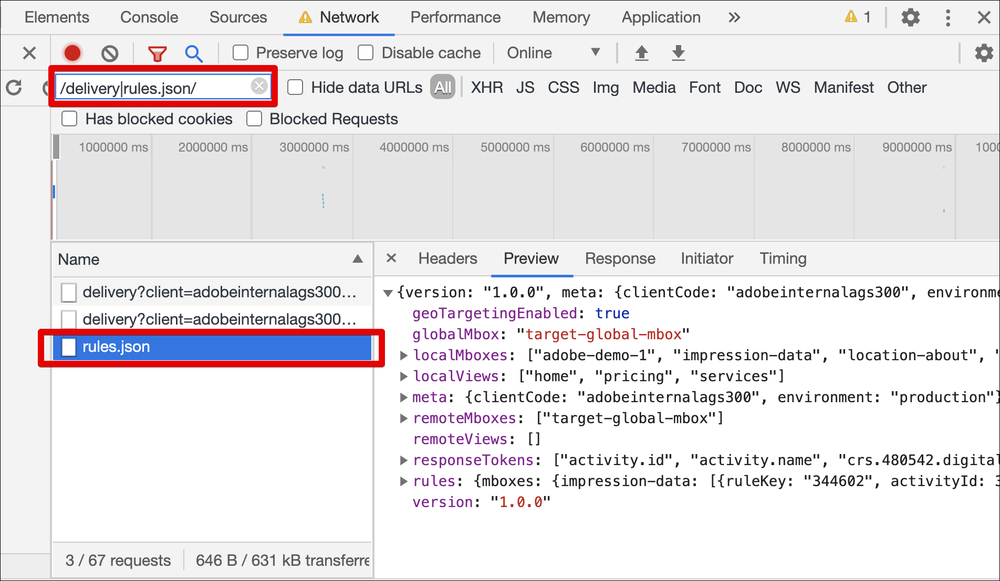

# Risoluzione dei problemi [!UICONTROL decisioning sul dispositivo] per at.js

Completa i seguenti passaggi per risolvere i problemi [!UICONTROL decisioning sul dispositivo] in [!UICONTROL Adobe Target] con la libreria JavaScript at.js:

## Passaggio 1: abilitare il registro della console per at.js

Aggiunta del parametro URL `mboxDebug=1` consente a at.js di stampare i messaggi nella console del browser.

Tutti i messaggi contengono il prefisso &quot;AT:&quot; per una comoda panoramica. Per garantire che un artefatto sia stato caricato correttamente, il registro della console deve contenere messaggi simili ai seguenti:

```
AT: LD.ArtifactProvider fetching artifact - https://assets.adobetarget.com/your-client-cide/production/v1/rules.json
AT: LD.ArtifactProvider artifact received - status=200
```

La figura seguente mostra questi messaggi nel registro della console:

(Fare clic sull&#39;immagine per espanderla a larghezza intera.)

{zoomable=&quot;yes&quot;}

## Passaggio 2: verifica il download dell’artefatto della regola nella scheda Rete del browser

Apri la scheda Rete del browser.

Ad esempio, per aprire DevTools in Google Chrome:

1. Premere Ctrl+Maiusc+J (Windows) o Comando+Opzione+J (Mac).
1. Passare alla scheda Rete.
1. Filtra le chiamate per parola chiave &quot;rules.json&quot; per assicurarti che venga visualizzato solo il file delle regole dell’artefatto.

   Inoltre, puoi filtrare per &quot;/delivery|rules.json/&quot; per visualizzare tutte le chiamate di Target e l’artefatto rules.json.

   

## Passaggio 3: verifica il download dell’artefatto della regola utilizzando gli eventi personalizzati di at.js

La libreria at.js invia due nuovi eventi personalizzati per supportare [!UICONTROL decisioning sul dispositivo].

* `adobe.target.event.ARTIFACT_DOWNLOAD_SUCCEEDED`
* `adobe.target.event.ARTIFACT_DOWNLOAD_FAILED`

Puoi abbonarti per ascoltare questi eventi personalizzati nell’applicazione e intervenire in caso di esito positivo o negativo del download del file delle regole dell’artefatto.

L’esempio seguente mostra un esempio di codice in ascolto degli eventi di esito positivo e negativo del download degli artefatti:

```javascript {line-numbers="true"}
document.addEventListener(adobe.target.event.ARTIFACT_DOWNLOAD_SUCCEEDED, function(e) { 
  console.log("Artifact successfully downloaded", e.detail);
}, false);

document.addEventListener(adobe.target.event.ARTIFACT_DOWNLOAD_FAILED, function(e) { 
  console.log("Artifact failed to download", e.detail);
}, false);
```
