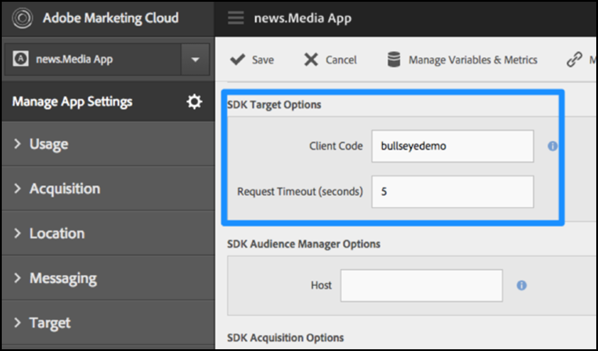
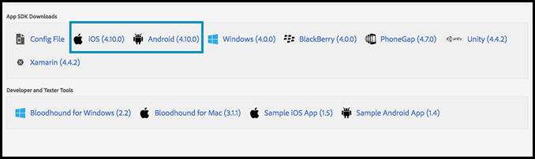

# Abilita [!DNL Target] in SDK

Aggiungi [!UICONTROL Adobe Mobile Services SDK] alla tua app.

>[!IMPORTANT]
>
>Il supporto per gli SDK [!DNL Adobe Mobile] versione 4.*x* è terminato il 31 agosto 2021 e non è più consigliato per gli utenti di dispositivi mobili [!DNL Adobe Target].
>
>[Adobe Experience Platform SDK for Mobile Apps](https://developer.adobe.com/client-sdks/documentation/){target=_blank} è la soluzione consigliata per alimentare le soluzioni e i servizi [!DNL Adobe Experience Cloud] nelle app mobili.

1. Se non hai installato Adobe Mobile Services SDK nell&#39;app, utilizza le credenziali di Analytics o Experience Cloud e scarica SDK dal sito Web di [Adobe Mobile Services](https://mobilemarketing.adobe.com/).

1. Aggiungi [!DNL Adobe Mobile Services SDK] all&#39;app.

   È possibile trovare le istruzioni alla voce [Implementazione principale e Ciclo di durata](https://experienceleague.adobe.com/docs/mobile-services/ios/getting-started-ios/dev-qs.html).

1. Aggiungere il codice client, timeout e abilitare SSL.

   In Experience Cloud, apri Mobile Services, quindi vai su **[!UICONTROL Gestisci impostazioni app]** > **[!UICONTROL Opzioni Target SDK]**.

   Aggiungi il tuo codice client [!DNL Target] e timeout. Il codice client è univoco per il tuo account o azienda. Il timeout è il tempo, in numero di secondi, fino al quale [!DNL Target] attenderà una risposta prima di mostrare il contenuto predefinito. Assicurati che l&#39;opzione **[!UICONTROL Usa HTTPS]** sia selezionata nella pagina Gestisci impostazioni app di Adobe Mobile Services. Se HTTPS non è abilitato, tutte le chiamate in iOS9+ verranno bloccate a meno che non si inserisce nell&#39;elenco Consentiti il server [!DNL Target].

   

1. Dopo aver creato/individuato l&#39;app, individua le impostazioni dell&#39;app e scarica il SDK desiderato.

   

>[!WARNING]
>
> Se non hai accesso all’interfaccia di mobile marketing, puoi apportare modifiche direttamente nel file di configurazione nel codice dell’app. Tuttavia, non sarà sincronizzato con la pagina delle impostazioni nell’interfaccia utente.
