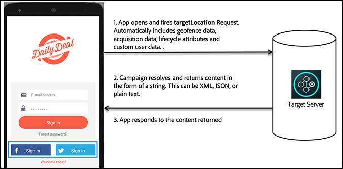

# Funzionamento di [!DNL Target] nelle app per dispositivi mobili

[!DNL Adobe Mobile SDK] contatta il server [!DNL Target] per ottenere il contenuto insieme ad altri punti dati per mostrare l&#39;esperienza giusta all&#39;utente.

>[!IMPORTANT]
>
>Il supporto per gli SDK [!DNL Adobe Mobile] versione 4.*x* è terminato il 31 agosto 2021 e non è più consigliato per gli utenti di dispositivi mobili [!DNL Adobe Target].
>
>[Adobe Experience Platform SDK for Mobile Apps](https://developer.adobe.com/client-sdks/documentation/){target=_blank} è la soluzione consigliata per alimentare le soluzioni e i servizi [!DNL Adobe Experience Cloud] nelle app mobili.

## [!DNL Target] posizioni e metriche di successo

Una posizione *di destinazione* è indicata anche come mbox. È possibile abilitare una posizione identificata nell’app a scopo di testing o personalizzazione (ad esempio, per presentare il messaggio di benvenuto nella schermata iniziale). Queste posizioni vengono identificate durante il processo di creazione del test.

Una *[metrica di successo](https://experienceleague.adobe.com/docs/target/using/activities/success-metrics/success-metrics.html)* è un&#39;azione eseguita dall&#39;utente che identifica l&#39;esito di una specifica attività (ad esempio la registrazione, un acquisto, la prenotazione di un biglietto e così via).

* Percorso **[!DNL Target]:** Il contenuto visualizzato sotto il pulsante di registrazione.

  A questo particolare utente viene offerta la spedizione gratuita fino alle 18:00. Questo percorso può essere riutilizzato in più attività [!DNL Target] per eseguire test A/B e personalizzazione.

* **Metrica di successo:** l&#39;azione eseguita dall&#39;utente quando tocca il pulsante di registrazione.

**Comprendere il funzionamento di [!DNL Target] in SDK**

