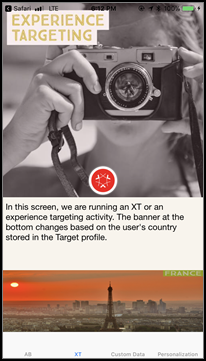

# [!DNL Target] anteprima mobile

Il collegamento di anteprima su dispositivi mobili ti permette di verificare il funzionamento delle attività nell’app mobile e di iscriverti a diverse esperienze direttamente dal tuo dispositivo, senza dover utilizzare particolari dispositivi di prova.

## Panoramica

La funzionalità di anteprima mobile consente di testare completamente le attività dell&#39;app mobile prima di avviarle in diretta.

## Prerequisiti

1. **Utilizza una versione supportata dell’SDK:** La funzione di anteprima mobile richiede che si scarichi e si installi la versione appropriata dell&#39;SDK di Adobe Mobile nelle applicazioni corrispondenti.

   Per istruzioni su come scaricare l’SDK appropriato, consulta [Versioni SDK correnti](https://developer.adobe.com/client-sdks/documentation/current-sdk-versions/){target=_blank} nel *[!DNL Adobe Experience Platform Mobile SDK]* documentazione.

1. **Impostazione di uno schema URL:** il collegamento di anteprima utilizza uno schema URL per aprire l&#39;app. È necessario specificare uno schema URL univoco per l&#39;anteprima.

   Per ulteriori informazioni, consulta [Anteprima visiva](https://developer.adobe.com/client-sdks/documentation/adobe-target/#visual-preview){target=_blank} in *Adobe Target* nel *[!DNL Adobe Experience Platform Mobile SDK]* documentazione.

   I seguenti collegamenti contengono ulteriori informazioni:

   * **iOS**: per ulteriori informazioni sull’impostazione degli schemi URL per iOS, consulta [Definizione di uno schema URL personalizzato per l’app](https://developer.apple.com/documentation/xcode/defining-a-custom-url-scheme-for-your-app){target=_blank} sul sito web Apple Developer.
   * **Android**: per ulteriori informazioni sull’impostazione degli schemi URL per Android, consulta [Creare collegamenti profondi al contenuto dell’app](https://developer.android.com/training/app-links/deep-linking){target=_blank} sul sito web Android Developers.

1. **Configurazione `collectLaunchInfo` API**

   Per ulteriori informazioni, consulta [Anteprima visiva](https://developer.adobe.com/client-sdks/documentation/adobe-target/#visual-preview){target=_blank} in *Adobe Target* nel *[!DNL Adobe Experience Platform Mobile SDK]* documentazione.

## Generazione di un link di anteprima

1. In [!DNL Target] interfaccia utente, fai clic su **[!UICONTROL Altre opzioni]** (puntini di sospensione verticali), quindi seleziona **[!UICONTROL Crea anteprima mobile]**.

   

1. Seleziona le attività da visualizzare in anteprima, quindi fai clic su **[!UICONTROL Genera collegamento di anteprima mobile]**.

   >[!NOTE]
   >
   >Possono essere selezionate solo le attività AB ed XT basate su moduli.

   

1. Specifica lo schema URL dell&#39;app.

   Deve essere lo stesso presente nell&#39;app iOS o Android. Ripeti questo processo separatamente per iOS e Android, se necessario.

   

1. Fai clic su **[!UICONTROL Genera collegamento di anteprima mobile]**, quindi copia il collegamento.

   

## Anteprima sul dispositivo

Apri il link in un browser mobile su un dispositivo in cui hai installato l&#39;app. Questa applicazione può essere l&#39;applicazione di produzione che hai scaricato dall&#39;Apple App Store o dal Google Play Store. Non deve essere una build speciale. Se si dispone di un collegamento di anteprima attivo, sarà possibile visualizzare le esperienze sul dispositivo.

1. Apri il link nel tuo browser mobile.

   Condividi il collegamento copiato nel passaggio precedente da [!DNL Target] L’interfaccia utente del dispositivo mobile può essere usata in modo comodo, ad esempio tramite testo, e-mail o Slack.

   |||

   L’app apre e avvia il [!DNL Target] Modalità Anteprima mobile.

1. Seleziona la combinazione di esperienze da visualizzare, quindi fai clic su **[!UICONTROL Avvia esperienze]**.

   ||||
||||

## Limitazioni 

* La visualizzazione deve caricare nuovamente per il nuovo contenuto da visualizzare dopo aver fatto clic sul pulsante **[!UICONTROL Avvia esperienze]**. Il modo più semplice è quello di passare a una schermata diversa e poi tornare alla schermata in cui si prevede che il cambiamento avvenga.
* L&#39;anteprima mobile non è supportata per le versioni Android prima di API-19 (KitKat).
