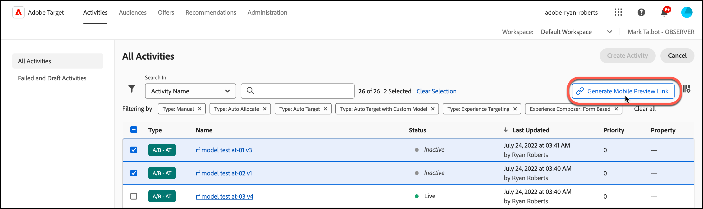
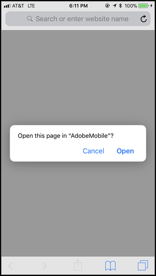

# [!DNL Target] anteprima mobile

Utilizza i collegamenti di anteprima per dispositivi mobili per eseguire facilmente un controllo qualità end-to-end per le attività dell’app mobile e iscriverti a diverse esperienze utilizzando il tuo dispositivo senza dover utilizzare dispositivi di test speciali.

La funzionalità di anteprima mobile consente di testare completamente le attività dell’app mobile prima di avviarle in diretta.

## Prerequisiti

1. **Utilizza una versione supportata dell’SDK:** La funzione di anteprima mobile richiede che si scarichi e si installi la versione appropriata del [!DNL Adobe Mobile SDK] nelle app corrispondenti.

   Per istruzioni su come scaricare l’SDK appropriato, consulta [Versioni SDK correnti](https://developer.adobe.com/client-sdks/documentation/current-sdk-versions/){target=_blank} nel *[!DNL Adobe Experience Platform Mobile SDK]* documentazione.

1. **Impostazione di uno schema URL:** il collegamento di anteprima utilizza uno schema URL per aprire l&#39;app. Specifica uno schema URL univoco per l’anteprima.

   Per ulteriori informazioni, consulta [Anteprima visiva](https://developer.adobe.com/client-sdks/documentation/adobe-target/#visual-preview){target=_blank} in *Configurare l’estensione Target nell’interfaccia utente di Data Connection* nel *[!DNL Mobile SDK]* documentazione.

   I seguenti collegamenti contengono ulteriori informazioni:

   * **iOS**: per ulteriori informazioni sull’impostazione degli schemi URL per iOS, consulta [Definizione di uno schema URL personalizzato per l’app](https://developer.apple.com/documentation/xcode/defining-a-custom-url-scheme-for-your-app){target=_blank} il *Sviluppatore Apple* sito Web.
   * **Android**: per ulteriori informazioni sull’impostazione degli schemi URL per Android, consulta [Creare collegamenti profondi al contenuto dell’app](https://developer.android.com/training/app-links/deep-linking){target=_blank} il *Sviluppatori Android* sito Web.

1. **Configurare `collectLaunchInfo` API (solo i0S)**

   Per ulteriori informazioni, consulta [Anteprima visiva](https://developer.adobe.com/client-sdks/documentation/adobe-target/#visual-preview){target=_blank} in *Configurare l’estensione Target nell’interfaccia utente di Data Connection* nel *[!DNL Mobile SDK]* documentazione.

## Generazione di un link di anteprima

1. In [!DNL Target] interfaccia utente, fai clic su **[!UICONTROL Altre opzioni]** (puntini di sospensione verticali), quindi seleziona **[!UICONTROL Crea collegamento di anteprima mobile]**.

   

1. Seleziona le attività da visualizzare in anteprima, quindi fai clic su **[!UICONTROL Genera collegamento di anteprima mobile]**.

   >[!NOTE]
   >
   >Puoi selezionare solo Basato su modulo [!UICONTROL Test A/B] e [!UICONTROL Targeting esperienza] (XT) attività.

   

1. Specifica lo schema URL dell&#39;app.

   Lo schema URL deve essere uguale a quello presente nell’app iOS o Android. Se necessario, ripeti questa procedura separatamente per iOS e Android.

   

1. Fai clic su **[!UICONTROL Genera collegamento di anteprima mobile]**, quindi copia il collegamento.

   

## Anteprima sul dispositivo

Apri il link in un browser mobile su un dispositivo in cui hai installato l&#39;app. Questa app può essere l&#39;app di produzione che hai scaricato da [!DNL Apple App Store] o [!DNL Google Play Store]. L’app non deve essere una build speciale. Se disponi di un collegamento di anteprima attivo, puoi visualizzare le esperienze sul dispositivo.

1. Apri il link nel tuo browser mobile.

   Condividi il collegamento copiato nella sezione precedente da [!DNL Target] Interfaccia utente per il dispositivo mobile in modo pratico, ad esempio utilizzando testo, e-mail o [!DNL Slack].

   |||

   L’app apre e avvia il [!DNL Target] [!UICONTROL Modalità anteprima mobile].

1. Seleziona la combinazione di esperienze da visualizzare, quindi fai clic su **[!UICONTROL Avvia esperienze]**.

   ||||
||||

## Limitazioni 

* La visualizzazione deve caricare nuovamente per il nuovo contenuto da visualizzare dopo aver fatto clic sul pulsante **[!UICONTROL Avvia esperienze]**. Il modo più semplice è quello di passare a una schermata diversa e poi tornare alla schermata in cui si prevede che il cambiamento avvenga.
* L&#39;anteprima mobile non è supportata per le versioni Android prima di API-19 (KitKat).
