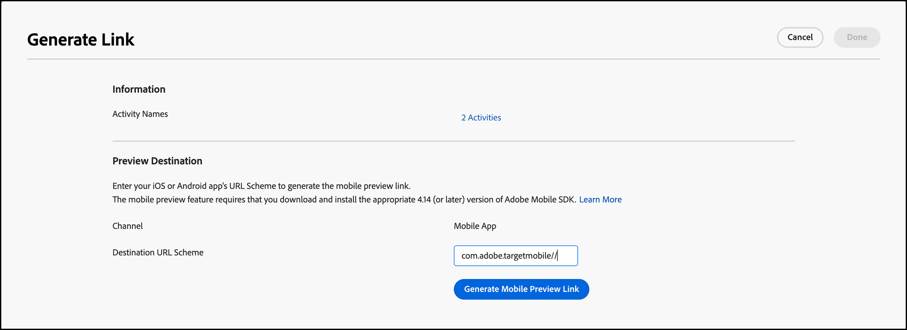

# Anteprima mobile [!DNL Target]

Utilizza i collegamenti di anteprima per dispositivi mobili per eseguire facilmente un controllo qualità end-to-end per le attività dell’app mobile e iscriverti a diverse esperienze utilizzando il tuo dispositivo senza dover utilizzare dispositivi di test speciali.

La funzionalità di anteprima mobile consente di testare completamente le attività dell’app mobile prima di avviarle in diretta.

## Prerequisiti

1. **Utilizza una versione supportata dell&#39;SDK:** La funzionalità di anteprima mobile richiede il download e l&#39;installazione della versione appropriata di [!DNL Adobe Mobile SDK] nelle applicazioni corrispondenti.

   Per istruzioni su come scaricare l&#39;SDK appropriato, vedi [Versioni SDK correnti](https://developer.adobe.com/client-sdks/documentation/current-sdk-versions/){target=_blank} nella documentazione di *[!DNL Adobe Experience Platform Mobile SDK]*.

1. **Impostazione di uno schema URL:** il collegamento di anteprima utilizza uno schema URL per aprire l&#39;app. Specifica uno schema URL univoco per l’anteprima.

   Per ulteriori informazioni, vedere [Anteprima visiva](https://developer.adobe.com/client-sdks/documentation/adobe-target/#visual-preview){target=_blank} in *Configurare l&#39;estensione Target nell&#39;interfaccia utente di Connessione dati* nella documentazione di *[!DNL Mobile SDK]*.

   I seguenti collegamenti contengono ulteriori informazioni:

   * **iOs**: per ulteriori informazioni sull&#39;impostazione degli schemi URL per iOS, vedere [Definizione di uno schema URL personalizzato per l&#39;app](https://developer.apple.com/documentation/xcode/defining-a-custom-url-scheme-for-your-app){target=_blank} nel sito Web *Apple Developer*.
   * **Android**: per ulteriori informazioni sull&#39;impostazione degli schemi URL per Android, consulta [Creare collegamenti profondi al contenuto dell&#39;app](https://developer.android.com/training/app-links/deep-linking){target=_blank} sul sito Web *Android Developers*.

1. **Configura l&#39;API `collectLaunchInfo` (solo i0S)**

   Per ulteriori informazioni, vedere [Anteprima visiva](https://developer.adobe.com/client-sdks/documentation/adobe-target/#visual-preview){target=_blank} in *Configurare l&#39;estensione Target nell&#39;interfaccia utente di Connessione dati* nella documentazione di *[!DNL Mobile SDK]*.

## Generazione di un link di anteprima

1. Nell&#39;interfaccia utente [!DNL Target], fare clic sull&#39;icona **[!UICONTROL More Options]** (puntini di sospensione verticali), quindi selezionare **[!UICONTROL Create Mobile Preview Link]**.

   

1. Selezionare le attività da visualizzare in anteprima, quindi fare clic su **[!UICONTROL Generate Mobile Preview Link]**.

   >[!NOTE]
   >
   >È possibile selezionare solo le attività [!UICONTROL A/B Test] e [!UICONTROL Experience Targeting] basate su moduli.

   

1. Specifica lo schema URL dell&#39;app.

   Lo schema URL deve essere uguale a quello presente nell’app iOS o Android. Se necessario, ripeti questa procedura separatamente per iOS e Android.

   

1. Fai clic su **[!UICONTROL Generate Mobile Preview Link]**, quindi copia il collegamento.

   

## Anteprima sul dispositivo

Apri il link in un browser mobile su un dispositivo in cui hai installato l&#39;app. Questa app può essere l&#39;app di produzione scaricata da [!DNL Apple App Store] o [!DNL Google Play Store]. L’app non deve essere una build speciale. Se disponi di un collegamento di anteprima attivo, puoi visualizzare le esperienze sul dispositivo.

1. Apri il link nel tuo browser mobile.

   Condividi il collegamento copiato nella sezione precedente dall&#39;interfaccia utente di [!DNL Target] sul tuo dispositivo mobile in modo pratico, ad esempio utilizzando testo, e-mail o [!DNL Slack].

   |||

   L&#39;app apre e avvia [!DNL Target] [!UICONTROL Mobile Preview Mode].

1. Selezionare la combinazione di esperienze da visualizzare, quindi fare clic su **[!UICONTROL Launch Experiences]**.

   ||||
||||

## Limitazioni 

* La visualizzazione deve caricare nuovamente per il nuovo contenuto da visualizzare dopo aver fatto clic sul pulsante **[!UICONTROL Launch Experiences]**. Il modo più semplice è quello di passare a una schermata diversa e poi tornare alla schermata in cui si prevede che il cambiamento avvenga.
* L&#39;anteprima mobile non è supportata per le versioni Android prima di API-19 (KitKat).
