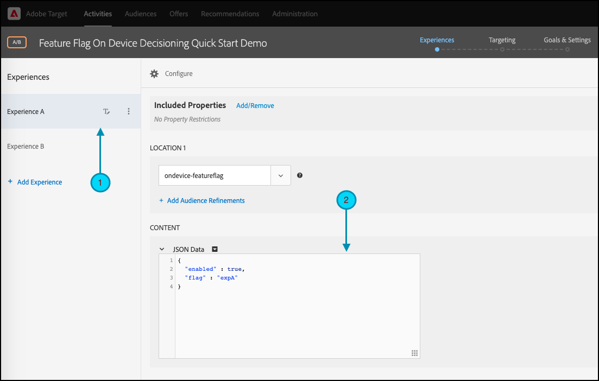

# Guida introduttiva a [!DNL Target] SDK

Per iniziare, ti invitiamo a creare la tua prima attività di flag di funzionalità [decisioning sul dispositivo](../on-device-decisioning/overview.md) nella lingua desiderata:

* Node.js
* Java
* .NET
* Python

## Riepilogo dei passaggi

1. Abilitare il decisioning sul dispositivo per la tua organizzazione
1. Installare SDK
1. Inizializzare SDK
1. Configurare i flag di funzionalità in un&#39;attività [!DNL Adobe Target] [!UICONTROL Test A/B]
1. Implementare ed eseguire il rendering della funzione nell’applicazione
1. Implementa il tracciamento degli eventi nell’applicazione
1. Attiva l&#39;attività [!UICONTROL Test A/B]

## &#x200B;1. Abilitare il decisioning sul dispositivo per la tua organizzazione

L&#39;abilitazione del decisioning sul dispositivo garantisce che un&#39;attività [!UICONTROL Test A/B] venga eseguita con latenza prossima allo zero. Per abilitare questa funzione, passa a **[!UICONTROL Amministrazione]** > **[!UICONTROL Implementazione]** > **[!UICONTROL Dettagli account]** e abilita l&#39;interruttore **[!UICONTROL Decisioning sul dispositivo]**.


>[!NOTE]
>
>Per abilitare o disabilitare l&#39;opzione **[!UICONTROL Decisioning sul dispositivo]**, è necessario avere il ruolo **[!UICONTROL Amministratore]** o **[!UICONTROL Approvatore]** [utente](https://experienceleague.adobe.com/docs/target/using/administer/manage-users/user-management.html).

Dopo aver attivato l&#39;interruttore **[!UICONTROL Decisioning sul dispositivo]**, [!DNL Adobe Target] inizia a generare [artefatti regola](../on-device-decisioning/rule-artifact-overview.md) per il client.

## &#x200B;2. Installare SDK

Per Node.js, Java e Python, esegui il seguente comando nella directory del progetto nel terminale. Per .NET, aggiungerlo come dipendenza [installandolo da NuGet](https://www.nuget.org/packages/Adobe.Target.Client).

>[!BEGINTABS]

>[!TAB Node.js (NPM)]

```js {line-numbers="true"}
npm i @adobe/target-nodejs-sdk -P
```

>[!TAB Java (Maven)]

```javascript {line-numbers="true"}
<dependency>
   <groupId>com.adobe.target</groupId>
   <artifactId>java-sdk</artifactId>
   <version>2.0</version>
</dependency>
```

>[!TAB .NET (Bash)]

```bash {line-numbers="true"}
dotnet add package Adobe.Target.Client
```

>[!TAB Python (pip)]

```python {line-numbers="true"}
pip install target-python-sdk
```

>[!ENDTABS]

## &#x200B;3. Inizializzare SDK

L’artefatto della regola viene scaricato durante il passaggio di inizializzazione di SDK. Puoi personalizzare il passaggio di inizializzazione per determinare come viene scaricato e utilizzato l’artefatto.

>[!BEGINTABS]

>[!TAB Node.js]

```js {line-numbers="true"}
const TargetClient = require("@adobe/target-nodejs-sdk");

const CONFIG = {
   client: "<your target client code>",
   organizationId: "your EC org id",
   decisioningMethod: "on-device",
   events: {
      clientReady: targetClientReady
      }
};

const tClient = TargetClient.create(CONFIG);

function targetClientReady() {
   //Adobe Target SDK has now downloaded the JSON artifact locally, which contains the activity details.
   //We will see how to use the artifact here very soon.
}
```

>[!TAB Java (Maven)]

```javascript {line-numbers="true"}
ClientConfig config = ClientConfig.builder()
   .client("testClient")
   .organizationId("ABCDEF012345677890ABCDEF0@AdobeOrg")
   .build();
TargetClient targetClient = TargetClient.create(config);
```

>[!TAB .NET (C#)]

```csharp {line-numbers="true"}
var targetClientConfig = new TargetClientConfig.Builder("testClient", "ABCDEF012345677890ABCDEF0@AdobeOrg")
   .Build();
this.targetClient.Initialize(targetClientConfig);
```

>[!TAB Python]

```python {line-numbers="true"}
from target_python_sdk import TargetClient

def target_client_ready():
   # Adobe Target SDK has now downloaded the JSON artifact locally, which contains the activity details.
   # We will see how to use the artifact here very soon.

CONFIG = {
   "client": "<your target client code>",
   "organization_id": "your EC org id",
   "decisioning_method": "on-device",
   "events": {
      "client_ready": target_client_ready
   }
}

target_client = TargetClient.create(CONFIG)
```

>[!ENDTABS]

## &#x200B;4. Configurare i flag di funzionalità in un&#39;attività [!DNL Adobe Target] [!UICONTROL Test A/B]

1. In [!DNL Target], passa alla pagina **[!UICONTROL Attività]**, quindi seleziona **[!UICONTROL Crea attività]** > **[!UICONTROL Test A/B]**.

   

1. Nella finestra modale **[!UICONTROL Crea attività test A/B]**, lascia selezionata l&#39;opzione Web predefinita (1), seleziona **[!UICONTROL Modulo]** come Compositore esperienza (2), seleziona **[!UICONTROL Workspace predefinito]** con **[!UICONTROL Nessuna restrizione proprietà]**(3), quindi fai clic su **[!UICONTROL Avanti]** (4).

   

1. Nel passaggio **[!UICONTROL Esperienze]** della creazione dell&#39;attività, fornisci un nome per l&#39;attività (1) e aggiungi una seconda esperienza, Esperienza B, facendo clic su **[!UICONTROL Aggiungi esperienza]** (2). Immettere il nome della posizione desiderata (3). Ad esempio, `ondevice-featureflag` o `homepage-addtocart-featureflag` sono nomi di posizione che indicano le destinazioni per il test dei flag di funzionalità.  Nell&#39;esempio seguente, `ondevice-featureflag` è la posizione definita per l&#39;Esperienza B. Facoltativamente, puoi aggiungere Perfezionamenti del pubblico (4) per limitare la qualifica all&#39;attività.

   

1. Nella sezione **[!UICONTROL CONTENT]** sulla stessa pagina, seleziona **[!UICONTROL Crea offerta JSON]** nel menu a discesa (1) come mostrato.

   

1. Nella casella di testo **[!UICONTROL Dati JSON]** visualizzata, digita le variabili del flag di funzione per ogni esperienza (1), utilizzando un oggetto JSON valido (2).

   Immetti le variabili dei flag di funzione per l’Esperienza A.

   

   **(JSON di esempio per l&#39;esperienza A, superiore)**

   ```json {line-numbers="true"}
   {
      "enabled" : true,
      "flag" : "expA"
   }
   ```

   Immetti le variabili dei flag di funzione per l’Esperienza B.

   

   **(JSON di esempio per l&#39;esperienza B, superiore)**

   ```json {line-numbers="true"}
   {
      "enabled" : true,
      "flag" : "expB"
   }
   ```

1. Fai clic su **[!UICONTROL Avanti]** (1) per passare al passaggio **[!UICONTROL Targeting]** della creazione di attività.

   

1. Nell&#39;esempio del passaggio **[!UICONTROL Targeting]** mostrato di seguito, il Targeting del pubblico (2) rimane sul set predefinito di Tutti i visitatori, per semplicità. Ciò significa che l’attività non è targetizzata. Tuttavia, tieni presente che Adobe consiglia di indirizzare sempre il pubblico alle attività di produzione. Fai clic su **[!UICONTROL Avanti]** (3) per passare al passaggio **[!UICONTROL Obiettivi e impostazioni]** della creazione dell&#39;attività.

   

1. Nel passaggio **[!UICONTROL Obiettivi e impostazioni]**, impostare **[!UICONTROL Reporting Source]** su **[!UICONTROL Adobe Target]** (1). Definisci la **[!UICONTROL metrica obiettivo]** come **[!UICONTROL Conversione]**, specificando i dettagli in base alle metriche di conversione del sito (2). Fai clic su **[!UICONTROL Salva e chiudi]** (3) per salvare l&#39;attività.

   

## &#x200B;5. Implementare ed eseguire il rendering della funzione nell’applicazione

Dopo aver impostato le variabili dei flag di funzionalità in [!DNL Target], modificare il codice dell&#39;applicazione per utilizzarle. Ad esempio, dopo aver ottenuto il flag di funzione nell’applicazione, puoi utilizzarlo per abilitare le funzioni ed eseguire il rendering dell’esperienza per la quale il visitatore si è qualificato.

>[!BEGINTABS]

>[!TAB Node.js]

```js {line-numbers="true"}
//... Code removed for brevity
​
let featureFlags = {};
​
function targetClientReady() {
   tClient.getAttributes(["ondevice-featureflag"]).then(function(response) {
      const featureFlags = response.asObject("ondevice-featureflag");
      if(featureFlags.enabled && featureFlags.flag !== "expA") { //Assuming "expA" is control
         console.log("Render alternate experience" + featureFlags.flag);
      }
      else {
         console.log("Render default experience");
      }
   });
}
```

>[!TAB Java (Maven)]

```javascript {line-numbers="true"}
MboxRequest mbox = new MboxRequest().name("ondevice-featureflag").index(0);
TargetDeliveryRequest request = TargetDeliveryRequest.builder()
   .context(new Context().channel(ChannelType.WEB))
   .execute(new ExecuteRequest().mboxes(Arrays.asList(mbox)))
   .build();
Attributes attributes = targetClient.getAttributes(request, "ondevice-featureflag");
String flag = attributes.getString("ondevice-featureflag", "flag");
```

>[!TAB .NET (C#)]

```csharp {line-numbers="true"}
var mbox = new MboxRequest(index: 0, name: "ondevice-featureflag");
var deliveryRequest = new TargetDeliveryRequest.Builder()
   .SetContext(new Context(ChannelType.Web))
   .SetExecute(new ExecuteRequest(mboxes: new List<MboxRequest> { mbox }))
   .Build();
var attributes = targetClient.GetAttributes(request, "ondevice-featureflag");
var flag = attributes.GetString("ondevice-featureflag", "flag");
```

>[!TAB Python]

```python {line-numbers="true"}
# ... Code removed for brevity

feature_flags = {}

def target_client_ready():
   attribute_provider = target_client.get_attributes(["ondevice-featureflag"])
   feature_flags = attribute_provider.as_object(mbox_name="ondevice-featureflag")
   if feature_flags.get("enabled") and feature_flags.get("flag") != "expA": # Assuming "expA" is control
      print("Render alternate experience {}".format(feature_flags.get("flag")))
   else:
      print("Render default experience")
```

>[!ENDTABS]

## &#x200B;6. Implementa il tracciamento aggiuntivo per gli eventi nell’applicazione

Facoltativamente, puoi inviare eventi aggiuntivi per il tracciamento delle conversioni utilizzando la funzione sendNotification().

>[!BEGINTABS]

>[!TAB Node.js]

```js {line-numbers="true"}
//... Code removed for brevity
​
//When a conversion happens
TargetClient.sendNotifications({
   targetCookie,
   "request" : {
      "notifications" : [
      {
         type: "display",
         timestamp : Date.now(),
         id: "conversion",
         mbox : {
            name : "orderConfirm"
         },
         order : {
            id: "BR9389",
            total : 98.93,
            purchasedProductIds : ["J9393", "3DJJ3"]
         }
      }
      ]
   }
})
```

>[!TAB Java (Maven)]

```javascript {line-numbers="true"}
Notification notification = new Notification();
notification.setId("conversion");
notification.setImpressionId(UUID.randomUUID().toString());
notification.setType(MetricType.DISPLAY);
notification.setTimestamp(System.currentTimeMillis());
Order order = new Order("BR9389");
order.total(98.93);
order.purchasedProductIds(["J9393", "3DJJ3"]);
notification.setOrder(order);

TargetDeliveryRequest notificationRequest =
   TargetDeliveryRequest.builder()
      .context(new Context().channel(ChannelType.WEB))
      .notifications(Collections.singletonList(notification))
      .build();

NotificationDeliveryService notificationDeliveryService = new NotificationDeliveryService();
notificationDeliveryService.sendNotification(notificationRequest);
```

>[!TAB .NET (C#)]

```csharp {line-numbers="true"}
var order = new Order
{
   Id = "BR9389",
   Total = 98.93M,
   PurchasedProductIds = new List<string> { "J9393", "3DJJ3" },
};
​
var notification = new Notification
{
   Id = "conversion",
   ImpressionId = Guid.NewGuid().ToString(),
   Type = MetricType.Display,
   Timestamp = DateTimeOffset.UtcNow.ToUnixTimeMilliseconds(),
   Order = order,
};
​
var notificationRequest = new TargetDeliveryRequest.Builder()
   .SetContext(new Context(ChannelType.Web))
   .SetNotifications(new List<Notification> {notification})
   .Build();
​
targetClient.SendNotifications(notificationRequest);
```

>[!TAB Python]

```python {line-numbers="true"}
# ... Code removed for brevity

# When a conversion happens
notification_mbox = NotificationMbox(name="orderConfirm")
order = Order(id="BR9389, total=98.93, purchased_product_ids=["J9393", "3DJJ3"])
notification = Notification(
   id="conversion",
   type=MetricType.DISPLAY,
   timestamp=1621530726000,  # Epoch time in milliseconds
   mbox=notification_mbox,
   order=order
)
notification_request = DeliveryRequest(notifications=[notification])


target_client.send_notifications({
   "target_cookie": target_cookie,
   "request" : notification_request
})
```

>[!ENDTABS]

## &#x200B;7. Attiva l&#39;attività [!UICONTROL Test A/B]

1. Fai clic su **[!UICONTROL Attiva]** (1) per attivare l&#39;attività [!UICONTROL Test A/B].

   >[!NOTE]
   >
   >Per eseguire questo passaggio, è necessario disporre del ruolo **[!UICONTROL Approvatore]** o **[!UICONTROL Editore]** [utente](https://experienceleague.adobe.com/docs/target/using/administer/manage-users/user-management.html).

   
