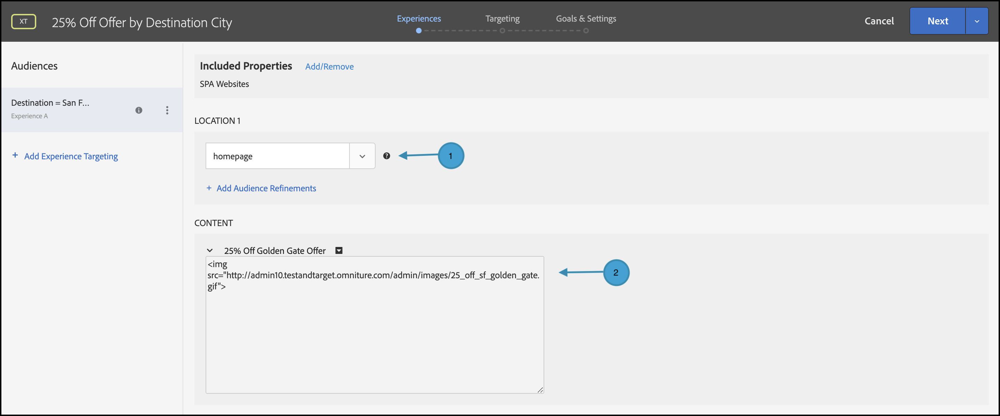

# Distribuire la personalizzazione

## Riepilogo dei passaggi

1. Abilita [!UICONTROL on-device decisioning] per la tua organizzazione
1. Crea un&#39;attività [!UICONTROL Experience Targeting] (XT)
1. Definire un’esperienza personalizzata per pubblico
1. Verificare l’esperienza personalizzata per pubblico
1. Configurare la generazione di rapporti
1. Aggiungere metriche per il tracciamento dei KPI
1. Implementare offerte personalizzate nella tua applicazione
1. Implementare il codice per tenere traccia degli eventi di conversione
1. Attiva l&#39;attività di personalizzazione [!UICONTROL Experience Targeting] (XT)

Supponiamo di essere un&#39;azienda itinerante. Desideri offrire un’offerta personalizzata del 25% di sconto su alcuni pacchetti di viaggio. Affinché l’offerta possa risuonare con i tuoi utenti, decidi di mostrare un punto di riferimento della città di destinazione. Desideri inoltre garantire che la consegna delle offerte personalizzate venga eseguita con latenza vicina a zero, in modo che non influisca negativamente sulle esperienze utente e non distorca i risultati.

## 1. Abilita [!UICONTROL on-device decisioning] per la tua organizzazione

1. L’abilitazione del decisioning sul dispositivo garantisce che un’attività A/B venga eseguita con latenza vicina allo zero. Per abilitare questa funzione, passare a **[!UICONTROL Administration]** > **[!UICONTROL Implementation]** > **[!UICONTROL Account details]** in [!DNL Adobe Target] e attivare/disattivare **[!UICONTROL On-Device Decisioning]**.

   

   >[!NOTE]
   >
   >Per abilitare o disabilitare l&#39;attivazione/disattivazione di [!UICONTROL On-Device Decisioning], è necessario disporre del ruolo utente [amministratore o approvatore](https://experienceleague.adobe.com/docs/target/using/administer/manage-users/user-management.html).

   Dopo aver attivato l&#39;interruttore **[!UICONTROL On-Device Decisioning]**, [!DNL Adobe Target] inizia a generare *artefatti regola* per il client.

## 2. Creare un&#39;attività [!UICONTROL Experience Targeting] (XT)

1. In [!DNL Adobe Target], passare alla pagina **[!UICONTROL Activities]**, quindi selezionare **[!UICONTROL Create Activity]** > **[!UICONTROL Experience Targeting]**.

   

1. Nel modale **[!UICONTROL Create Experience Targeting Activity]**, lascia selezionata l&#39;opzione predefinita **[!UICONTROL Web]** (1), seleziona **[!UICONTROL Form]** come compositore esperienza (2), seleziona un&#39;area di lavoro e una proprietà (3), quindi fai clic su **[!UICONTROL Next]** (4).

   

## 3. Definire un’esperienza personalizzata per pubblico

1. Nel passaggio **[!UICONTROL Experiences]** della creazione dell&#39;attività, fai clic su **[!UICONTROL Change Audience]** per creare un pubblico di visitatori che desiderano viaggiare a San Francisco, California.

   

1. Nel modale **[!UICONTROL Create Audience]**, definisci una regola personalizzata in cui `destinationCity = San Francisco`. Questo definisce il gruppo di utenti che desiderano viaggiare a San Francisco.

   

1. Sempre nel passaggio **[!UICONTROL Experiences]**, inserisci il nome della posizione (1) all&#39;interno dell&#39;applicazione in cui desideri eseguire il rendering di un&#39;offerta speciale relativa al Golden Gate Bridge, ma solo per quelli diretti a San Francisco. Nell&#39;esempio mostrato qui, homepage è la posizione selezionata per l&#39;offerta HTML (2), che è definita nell&#39;area **[!UICONTROL Content]**.

   

1. Aggiungere un altro pubblico di destinazione facendo clic su **[!UICONTROL Add Experience Targeting]**. Questa volta, rivolgiti a un pubblico che desidera recarsi a New York definendo una regola per il pubblico in cui `destinationCity = New York`. Definisci la posizione all’interno dell’applicazione in cui desideri eseguire il rendering di un’offerta speciale relativa all’Empire State Building. Nell&#39;esempio seguente, `homepage` è la posizione selezionata per l&#39;offerta HTML (2), definita nell&#39;area **[!UICONTROL Content]**.

   

## 4. Verificare l’esperienza personalizzata per pubblico

Nel passaggio **[!UICONTROL Targeting]**, verifica di aver configurato l&#39;esperienza personalizzata desiderata per pubblico.


## 5. Impostare la generazione rapporti

Nel passaggio **[!UICONTROL Goals & Settings]**, scegli **[!UICONTROL Adobe Target]** come **[!UICONTROL Reporting Source]** per visualizzare i risultati dell&#39;attività nell&#39;interfaccia utente [!DNL Adobe Target] oppure scegli **[!UICONTROL Adobe Analytics]** per visualizzarli nell&#39;interfaccia utente di Adobe Analytics.


## 6. Aggiungere metriche per il tracciamento dei KPI

Scegli un **[!UICONTROL Goal Metric]** per misurare il successo dell&#39;attività. In questo esempio, una conversione corretta dipende dal fatto che l’utente faccia clic sull’offerta di destinazione personalizzata.

## 7. Implementa le offerte personalizzate nella tua applicazione

>[!BEGINTABS]

>[!TAB Node.js]

```js {line-numbers="true"}
const TargetClient = require("@adobe/target-nodejs-sdk");

const CONFIG = {
  client: "acmeclient",
  organizationId: "1234567890@AdobeOrg"
};

const targetClient = TargetClient.create(CONFIG);

targetClient.getOffers({
  request: {      
    execute: {
      pageLoad: {
        parameters: {
          destinationCity: "San Francisco"
        }
      }
    }       
  }
})
.then(console.log)
.catch(console.error);
```

>[!TAB Java]

```java {line-numbers="true"}
ClientConfig config = ClientConfig.builder()
  .client("acmeclient")
  .organizationId("1234567890@AdobeOrg")
  .build();
TargetClient targetClient = TargetClient.create(config);

Context context = new Context().channel(ChannelType.WEB);

ExecuteRequest executeRequest = new ExecuteRequest();

RequestDetails pageLoad = new RequestDetails();
pageLoad.setParameters(
    new HashMap<String, String>() {
      {
        put("destinationCity", "San Francisco");
      }
    });

executeRequest.setPageLoad(pageLoad);

TargetDeliveryRequest request = TargetDeliveryRequest.builder()
  .context(context)
  .execute(executeRequest)
  .build();

TargetDeliveryResponse offers = targetClient.getOffers(request);
```

>[!ENDTABS]

## 8. Implementa il codice per tenere traccia degli eventi di conversione

>[!BEGINTABS]

>[!TAB Node.js]

```js {line-numbers="true"}
//... Code removed for brevity

//When a conversion happens
TargetClient.sendNotifications({
    targetCookie,
    "request" : {
      "notifications" : [
        {
          type: "click",
          timestamp : Date.now(),
          id: "conversion",
          mbox : {
            name : "destinationOffer"
          }
        }
      ]
    }
})
```

>[!TAB Java]

```java {line-numbers="true"
ClientConfig config = ClientConfig.builder()
  .client("acmeclient")
  .organizationId("1234567890@AdobeOrg")
  .build();
TargetClient targetClient = TargetClient.create(config);

Context context = new Context().channel(ChannelType.WEB);

ExecuteRequest executeRequest = new ExecuteRequest();

RequestDetails pageLoad = new RequestDetails();
pageLoad.setParameters(
    new HashMap<String, String>() {
      {
        put("destinationCity", "San Francisco");
      }
    });

executeRequest.setPageLoad(pageLoad);
NotificationDeliveryService notificationDeliveryService = new NotificationDeliveryService();

Notification notification = new Notification();
notification.setId("conversion");
notification.setImpressionId(UUID.randomUUID().toString());
notification.setType(MetricType.CLICK);
notification.setTimestamp(System.currentTimeMillis());
notification.setTokens(
    Collections.singletonList(
        "IbG2Jz2xmHaqX7Ml/YRxRGqipfsIHvVzTQxHolz2IpSCnQ9Y9OaLL2gsdrWQTvE54PwSz67rmXWmSnkXpSSS2Q=="));

TargetDeliveryRequest targetDeliveryRequest =
    TargetDeliveryRequest.builder()
        .context(context)
        .execute(executeRequest)
        .notifications(Collections.singletonList(notification))
        .build();

TargetDeliveryResponse offers = targetClient.getOffers(request);
notificationDeliveryService.sendNotification(request);
```

>[!ENDTABS]

## 9. Attiva l’attività Targeting esperienze (XT)


