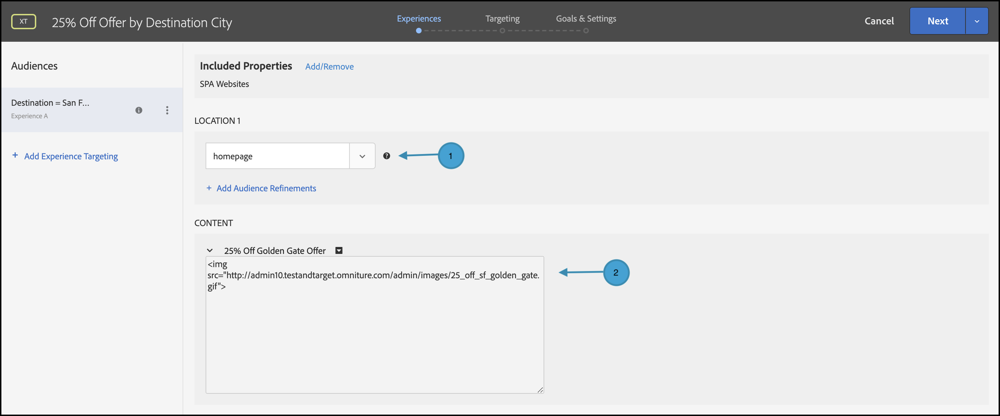

# Distribuire la personalizzazione

## Riepilogo dei passaggi

1. Abilita [!UICONTROL decisioning sul dispositivo] per la tua organizzazione
1. Crea un&#39;attività [!UICONTROL Targeting esperienze] (XT)
1. Definire un’esperienza personalizzata per pubblico
1. Verificare l’esperienza personalizzata per pubblico
1. Configurare la generazione di rapporti
1. Aggiungere metriche per il tracciamento dei KPI
1. Implementare offerte personalizzate nella tua applicazione
1. Implementare il codice per tenere traccia degli eventi di conversione
1. Attiva l&#39;[!UICONTROL attività di personalizzazione Targeting esperienza] (XT)

Supponiamo di essere un&#39;azienda itinerante. Desideri offrire un’offerta personalizzata del 25% di sconto su alcuni pacchetti di viaggio. Affinché l’offerta possa risuonare con i tuoi utenti, decidi di mostrare un punto di riferimento della città di destinazione. Desideri inoltre garantire che la consegna delle offerte personalizzate venga eseguita con latenza vicina a zero, in modo che non influisca negativamente sulle esperienze utente e non distorca i risultati.

## &#x200B;1. Abilita [!UICONTROL decisioning sul dispositivo] per la tua organizzazione

1. L’abilitazione del decisioning sul dispositivo garantisce che un’attività A/B venga eseguita con latenza vicina allo zero. Per abilitare questa funzione, passa a **[!UICONTROL Amministrazione]** > **[!UICONTROL Implementazione]** > **[!UICONTROL Dettagli account]** in [!DNL Adobe Target] e abilita l&#39;opzione **[!UICONTROL Decisioning sul dispositivo]**.

   

   >[!NOTE]
   >
   >Per abilitare o disabilitare l&#39;opzione [!UICONTROL Decisioning sul dispositivo], è necessario disporre del ruolo utente [utente](https://experienceleague.adobe.com/docs/target/using/administer/manage-users/user-management.html) amministratore o approvatore.

   Dopo aver attivato l&#39;interruttore **[!UICONTROL Decisioning sul dispositivo]**, [!DNL Adobe Target] inizia a generare *artefatti regola* per il client.

## &#x200B;2. Crea un&#39;attività [!UICONTROL Targeting esperienze] (XT)

1. In [!DNL Adobe Target], passa alla pagina **[!UICONTROL Attività]**, quindi seleziona **[!UICONTROL Crea attività]** > **[!UICONTROL Targeting esperienza]**.

   

1. Nella finestra modale **[!UICONTROL Crea attività di targeting esperienza]**, lascia selezionata l&#39;opzione predefinita **[!UICONTROL Web]** (1), seleziona **[!UICONTROL Modulo]** come compositore esperienza (2), seleziona un&#39;area di lavoro e una proprietà (3), quindi fai clic su **[!UICONTROL Avanti]** (4).

   

## &#x200B;3. Definire un’esperienza personalizzata per pubblico

1. Nel passaggio **[!UICONTROL Esperienze]** della creazione dell&#39;attività, fai clic su **[!UICONTROL Cambia pubblico]** per creare un pubblico di visitatori che desiderano viaggiare a San Francisco, California.

   

1. Nella finestra modale **[!UICONTROL Crea pubblico]**, definisci una regola personalizzata in cui `destinationCity = San Francisco`. Questo definisce il gruppo di utenti che desiderano viaggiare a San Francisco.

   

1. Sempre nel passaggio **[!UICONTROL Esperienze]**, inserisci il nome della posizione (1) all&#39;interno dell&#39;applicazione in cui desideri eseguire il rendering di un&#39;offerta speciale relativa al Golden Gate Bridge, ma solo per quelli diretti a San Francisco. Nell&#39;esempio riportato di seguito, homepage è la posizione selezionata per l&#39;offerta HTML (2), definita nell&#39;area **[!UICONTROL Contenuto]**.

   

1. Aggiungere un altro pubblico di destinazione facendo clic su **[!UICONTROL Aggiungi targeting esperienza]**. Questa volta, rivolgiti a un pubblico che desidera recarsi a New York definendo una regola per il pubblico in cui `destinationCity = New York`. Definisci la posizione all’interno dell’applicazione in cui desideri eseguire il rendering di un’offerta speciale relativa all’Empire State Building. Nell&#39;esempio seguente, `homepage` è la posizione selezionata per l&#39;offerta HTML (2), definita nell&#39;area **[!UICONTROL Contenuto]**.

   

## &#x200B;4. Verificare l’esperienza personalizzata per pubblico

Nel passaggio **[!UICONTROL Targeting]**, verifica di aver configurato l&#39;esperienza personalizzata desiderata per pubblico.


## &#x200B;5. Configurare la generazione di rapporti

Nel passaggio **[!UICONTROL Obiettivi e impostazioni]**, scegli **[!UICONTROL Adobe Target]** come **[!UICONTROL Reporting Source]** per visualizzare i risultati dell&#39;attività nell&#39;interfaccia utente [!DNL Adobe Target] oppure scegli **[!UICONTROL Adobe Analytics]** per visualizzarli nell&#39;interfaccia utente di Adobe Analytics.


## &#x200B;6. Aggiungere metriche per il tracciamento dei KPI

Scegli una **[!UICONTROL metrica obiettivo]** per misurare il successo dell&#39;attività. In questo esempio, una conversione corretta dipende dal fatto che l’utente faccia clic sull’offerta di destinazione personalizzata.

## &#x200B;7. Implementare le offerte personalizzate nella tua applicazione

>[!BEGINTABS]

>[!TAB Node.js]

```js {line-numbers="true"}
const TargetClient = require("@adobe/target-nodejs-sdk");

const CONFIG = {
  client: "acmeclient",
  organizationId: "1234567890@AdobeOrg"
};

const targetClient = TargetClient.create(CONFIG);

targetClient.getOffers({
  request: {      
    execute: {
      pageLoad: {
        parameters: {
          destinationCity: "San Francisco"
        }
      }
    }       
  }
})
.then(console.log)
.catch(console.error);
```

>[!TAB Java]

```java {line-numbers="true"}
ClientConfig config = ClientConfig.builder()
  .client("acmeclient")
  .organizationId("1234567890@AdobeOrg")
  .build();
TargetClient targetClient = TargetClient.create(config);

Context context = new Context().channel(ChannelType.WEB);

ExecuteRequest executeRequest = new ExecuteRequest();

RequestDetails pageLoad = new RequestDetails();
pageLoad.setParameters(
    new HashMap<String, String>() {
      {
        put("destinationCity", "San Francisco");
      }
    });

executeRequest.setPageLoad(pageLoad);

TargetDeliveryRequest request = TargetDeliveryRequest.builder()
  .context(context)
  .execute(executeRequest)
  .build();

TargetDeliveryResponse offers = targetClient.getOffers(request);
```

>[!ENDTABS]

## &#x200B;8. Implementare il codice per tenere traccia degli eventi di conversione

>[!BEGINTABS]

>[!TAB Node.js]

```js {line-numbers="true"}
//... Code removed for brevity

//When a conversion happens
TargetClient.sendNotifications({
    targetCookie,
    "request" : {
      "notifications" : [
        {
          type: "click",
          timestamp : Date.now(),
          id: "conversion",
          mbox : {
            name : "destinationOffer"
          }
        }
      ]
    }
})
```

>[!TAB Java]

```java {line-numbers="true"
ClientConfig config = ClientConfig.builder()
  .client("acmeclient")
  .organizationId("1234567890@AdobeOrg")
  .build();
TargetClient targetClient = TargetClient.create(config);

Context context = new Context().channel(ChannelType.WEB);

ExecuteRequest executeRequest = new ExecuteRequest();

RequestDetails pageLoad = new RequestDetails();
pageLoad.setParameters(
    new HashMap<String, String>() {
      {
        put("destinationCity", "San Francisco");
      }
    });

executeRequest.setPageLoad(pageLoad);
NotificationDeliveryService notificationDeliveryService = new NotificationDeliveryService();

Notification notification = new Notification();
notification.setId("conversion");
notification.setImpressionId(UUID.randomUUID().toString());
notification.setType(MetricType.CLICK);
notification.setTimestamp(System.currentTimeMillis());
notification.setTokens(
    Collections.singletonList(
        "IbG2Jz2xmHaqX7Ml/YRxRGqipfsIHvVzTQxHolz2IpSCnQ9Y9OaLL2gsdrWQTvE54PwSz67rmXWmSnkXpSSS2Q=="));

TargetDeliveryRequest targetDeliveryRequest =
    TargetDeliveryRequest.builder()
        .context(context)
        .execute(executeRequest)
        .notifications(Collections.singletonList(notification))
        .build();

TargetDeliveryResponse offers = targetClient.getOffers(request);
notificationDeliveryService.sendNotification(request);
```

>[!ENDTABS]

## &#x200B;9. Attivare l’attività Targeting esperienza (XT)


