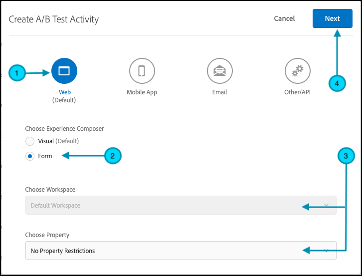

# Eseguire test A/B con flag di funzione

## Riepilogo dei passaggi

1. Abilita [!UICONTROL on-device decisioning] per la tua organizzazione
1. Crea un&#39;attività [!UICONTROL A/B Test]
1. Definire A e B
1. Aggiungere un pubblico
1. Imposta allocazione traffico
1. Impostare la distribuzione del traffico sulle varianti
1. Configurare la generazione di rapporti
1. Aggiungere metriche per il tracciamento dei KPI
1. Implementare il codice per eseguire test A/B con flag di funzione
1. Attivare il test A/B con i flag delle funzioni

>[!NOTE]
>
>Supponiamo di voler determinare se la riprogettazione a tema autunno della tua pagina home verrà ricevuta bene dagli utenti. Decidi di testarlo eseguendo un esperimento A/B in [!DNL Adobe Target]. Inoltre, è importante assicurarsi che l’esperimento venga fornito con prestazioni eccellenti, in modo che un’esperienza utente negativa o lenta non alteri i risultati.

## 1. Abilita [!UICONTROL on-device decisioning] per la tua organizzazione

L’abilitazione del decisioning sul dispositivo garantisce che un’attività A/B venga eseguita con latenza vicina allo zero. Per abilitare questa funzione, passare a **[!UICONTROL Administration]** > **[!UICONTROL Implementation]** > **[!UICONTROL Account details]** in [!DNL Adobe Target] e attivare/disattivare **[!UICONTROL On-Device Decisioning]**.

&lt;!— Inserisci immagine-dispari4.png —>


>[!NOTE]
>
>Per abilitare o disabilitare l&#39;attivazione/disattivazione di Decisioning sul dispositivo, è necessario disporre del ruolo utente [amministratore o approvatore](https://experienceleague.adobe.com/docs/target/using/administer/manage-users/user-management.html?lang=it).

Dopo aver attivato l&#39;interruttore **[!UICONTROL On-Device Decisioning]**, [!DNL Adobe Target] inizia a generare gli artefatti della regola per il client.

## 2. Creare un&#39;attività [!UICONTROL A/B Test]

In [!DNL Adobe Target], passare alla pagina **[!UICONTROL Activities]**, quindi selezionare **[!UICONTROL Create Activity]** > **[!UICONTROL A/B test]**.


Nella finestra modale **[!UICONTROL Create A/B Test Activity]**, lascia selezionata l&#39;opzione predefinita **[!UICONTROL Web]** (1), seleziona **[!UICONTROL Form]** come compositore esperienza (2), seleziona **[!UICONTROL Default Workspace]** senza **[!UICONTROL Property Restrictions]** (3), quindi fai clic su **[!UICONTROL Next]** (4).



## 3. Definire A e B

1. Nel passaggio **[!UICONTROL Experiences]** della creazione di attività, fornisci un nome per l&#39;attività (1) e aggiungi una seconda esperienza, Esperienza B, facendo clic sul pulsante **[!UICONTROL Add Experience]** (2). Immetti il nome della posizione (3) all’interno dell’applicazione in cui desideri eseguire il test A/B. Nell’esempio riportato di seguito, homepage è la posizione definita per l’Esperienza A. (È anche la posizione definita per l’Esperienza B.)

   L’Esperienza A definisce il controllo, che è la progettazione della pagina home corrente.

   

   L&#39;esperienza B definisce lo sfidante, che rappresenterà una homepage riprogettata. Fai clic su per modificare il contenuto predefinito (1).

   

1. Nell&#39;Esperienza B, fare clic per modificare il contenuto da **[!UICONTROL Default Content]** al contenuto riprogettato selezionando **[!UICONTROL Create JSON Offer]** come mostrato di seguito (1).

   

1. Definisci il JSON con gli attributi che verranno utilizzati come flag per consentire alla logica di business di eseguire il rendering della home page appena riprogettata, anziché della home page corrente in produzione.


   >[!NOTE]
   >
   >Quando [!DNL Adobe Target] inserisce un bucket in un utente per visualizzare l&#39;Esperienza B (la home page riprogettata), verrà restituito il JSON con gli attributi definiti nell&#39;esempio. Nel codice, dovrai controllare i valori degli attributi per decidere se eseguire la logica di business per eseguire il rendering della home page riprogettata. Puoi definire i nomi, i valori e il numero di attributi in questa risposta JSON.

   

## 4. Aggiungere un pubblico

Supponiamo di voler testare innanzitutto la riprogettazione per i clienti fedeli, che puoi identificare in base al fatto che abbiano effettuato o meno l’accesso.

1. Nel passaggio **[!UICONTROL Targeting]**, fai clic su per sostituire il pubblico **[!UICONTROL All Visitors]**, come mostrato.

   

1. Nel modale **[!UICONTROL Create Audience]**, definisci una regola personalizzata in cui `logged-in = true`. Definisce il gruppo di utenti che hanno effettuato l’accesso. Utilizza questo pubblico nella tua attività.

   

## 5. Impostare l’allocazione del traffico

Definisci la percentuale di utenti connessi rispetto alla quale desideri testare la nuova progettazione della pagina home. In altre parole, a quale percentuale degli utenti desideri eseguire il test? In questo esempio, per distribuire il test a tutti gli utenti connessi, mantieni l’allocazione del traffico al 100%.


## 6. Impostare la distribuzione del traffico sulle varianti

Definisci la percentuale di utenti connessi che vedranno la progettazione corrente della pagina home o la riprogettazione completamente nuova. In questo esempio, mantieni la distribuzione del traffico come suddivisione 50/50 tra le esperienze A e B.


## 7. Impostare la generazione rapporti

Nel passaggio **[!UICONTROL Goals & Settings]**, scegli **[!UICONTROL Adobe Target]** come **[!UICONTROL Reporting Source]** per visualizzare i risultati dell&#39;attività nell&#39;interfaccia utente [!DNL Adobe Target] oppure scegli **[!UICONTROL Adobe Analytics]** per visualizzarli nell&#39;interfaccia utente di Adobe Analytics.


## 8. Aggiungere metriche per il tracciamento dei KPI

Scegliere **[!UICONTROL Goal Metric]** per misurare il test A/B. In questo esempio, una conversione corretta si basa sul fatto che l’utente raggiunga la parte inferiore della pagina, indicando il coinvolgimento. Pertanto, **[!UICONTROL Conversion]** viene determinato in base al fatto che l&#39;utente abbia visualizzato la posizione denominata in fondo alla pagina.

## 9. Implementa il codice per eseguire test A/B con i flag di funzione nell’applicazione

>[!BEGINTABS]

>[!TAB Node.js]

```js {line-numbers="true"}
const TargetClient = require("@adobe/target-nodejs-sdk");
const options = {
  client: "testClient",
  organizationId: "ABCDEF012345677890ABCDEF0@AdobeOrg",
  decisioningMethod: "on-device",
  events: {
    clientReady: targetClientReady
  }
};
const targetClient = TargetClient.create(options);

function targetClientReady() {
  return targetClient.getAttributes(["homepage"]).then(function(attributes) {
    const flag = attributes.getValue("homepage", "feature-flag");
    // ...
  });
}
```

>[!TAB Java]

```java {line-numbers="true"}
import com.adobe.target.edge.client.ClientConfig;
import com.adobe.target.edge.client.TargetClient;
import com.adobe.target.delivery.v1.model.ChannelType;
import com.adobe.target.delivery.v1.model.Context;
import com.adobe.target.delivery.v1.model.ExecuteRequest;
import com.adobe.target.delivery.v1.model.MboxRequest;
import com.adobe.target.edge.client.entities.TargetDeliveryRequest;
import com.adobe.target.edge.client.model.TargetDeliveryResponse;

ClientConfig config = ClientConfig.builder()
    .client("testClient")
    .organizationId("ABCDEF012345677890ABCDEF0@AdobeOrg")
    .build();
TargetClient targetClient = TargetClient.create(config);
MboxRequest mbox = new MboxRequest().name("homepage").index(0);
TargetDeliveryRequest request = TargetDeliveryRequest.builder()
    .context(new Context().channel(ChannelType.WEB))
    .execute(new ExecuteRequest().mboxes(Arrays.asList(mbox)))
    .build();
Attributes attributes = targetClient.getAttributes(request, "homepage");
String flag = attributes.getString("homepage", "feature-flag");
```

>[!ENDTABS]

## 10. Attiva il test A/B con il flag di funzione


