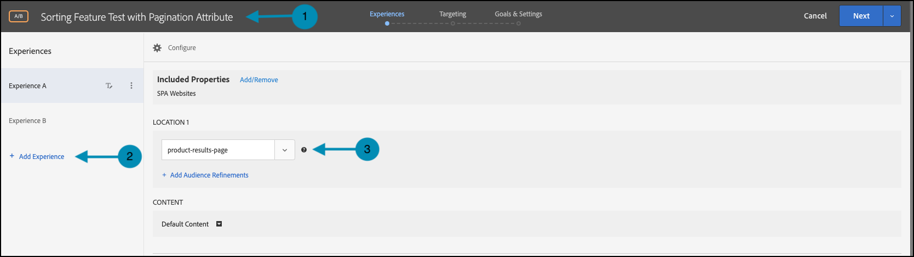
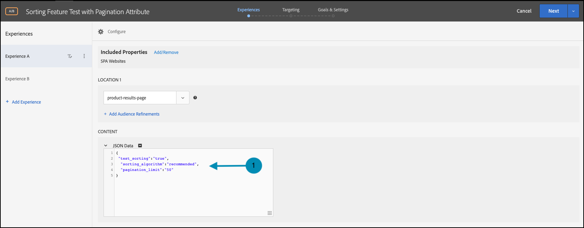

# Eseguire test di funzionalità con attributi

## Riepilogo dei passaggi

1. Abilita [!UICONTROL on-device decisioning] per la tua organizzazione
1. Crea un&#39;attività [!UICONTROL A/B Test]
1. Definire A e B
1. Aggiungere un pubblico
1. Imposta allocazione traffico
1. Impostare la distribuzione del traffico sulle varianti
1. Configurare la generazione di rapporti
1. Aggiungere metriche per il tracciamento dei KPI
1. Implementare il codice per eseguire test di funzionalità con attributi
1. Implementare il codice per tenere traccia degli eventi di conversione
1. Attivare i test delle funzioni con gli attributi

>[!NOTE]
>
>Supponiamo di essere una società di e-commerce per la vendita al dettaglio. Desideri aumentare il tasso di conversione quando i clienti sfogliano e ordinano il catalogo dei prodotti. Si ipotizza che alcuni algoritmi di ordinamento e strategie di impaginazione producano risultati migliori rispetto ad altri. Per testare questa teoria, decidi di eseguire un test di funzionalità che implica la riprogettazione del widget di ordinamento utilizzando diverse opzioni di ordinamento per gli utenti finali. Assicurati che questo test delle funzioni venga eseguito con latenza prossima allo zero, in modo che non influisca negativamente sulle esperienze utente e non distorca i risultati.

## 1. Abilita [!UICONTROL on-device decisioning] per la tua organizzazione

L’abilitazione del decisioning sul dispositivo garantisce che un’attività A/B venga eseguita con latenza vicina allo zero. Per abilitare questa funzione, passare a **[!UICONTROL Administration]** > **[!UICONTROL Implementation]** > **[!UICONTROL Account details]** in [!DNL Adobe Target] e attivare/disattivare **[!UICONTROL On-Device Decisioning]**.


>[!NOTE]
>
>Per abilitare o disabilitare l&#39;attivazione/disattivazione di **[!UICONTROL On-Device Decisioning]**, è necessario disporre del ruolo utente [amministratore o approvatore](https://experienceleague.adobe.com/docs/target/using/administer/manage-users/user-management.html).

Dopo aver attivato l&#39;interruttore **[!UICONTROL On-Device Decisioning]**, [!DNL Adobe Target] inizia a generare *artefatti regola* per il client.

## 2. Creare un&#39;attività [!UICONTROL A/B Test]

1. In [!DNL Adobe Target], passare alla pagina **[!UICONTROL Activities]**, quindi selezionare **[!UICONTROL Create Activity]** > **[!UICONTROL A/B test]**.

   

1. Nel modale **[!UICONTROL Create A/B Test Activity]**, lascia selezionata l&#39;opzione predefinita **[!UICONTROL Web]** (1), seleziona **[!UICONTROL Form]** come compositore esperienza (2), seleziona **[!UICONTROL Default Workspace]** con **[!UICONTROL No Property Restrictions]** (3), quindi fai clic su **[!UICONTROL Next]** (4).

   

## 3. Definire A e B

1. Nel passaggio **[!UICONTROL Experiences]** della creazione di attività, fornisci un nome per l&#39;attività (1) e aggiungi una seconda esperienza, Esperienza B, facendo clic sul pulsante **[!UICONTROL Add Experience]** (2). Inserisci il nome della posizione (3) all’interno dell’applicazione in cui desideri eseguire il test delle funzioni con gli attributi. Nell&#39;esempio seguente, `product-results-page` è la posizione definita per l&#39;Esperienza A. È anche la posizione definita per l&#39;Esperienza B.

   

   **[!UICONTROL Experience A]** conterrà il JSON che segnala la logica di business per eseguire le seguenti operazioni:

   * Avvia la funzionalità dell&#39;algoritmo di ordinamento tramite il flag di funzionalità `test_sorting`
   * Eseguire l&#39;algoritmo di ordinamento consigliato definito in `sorting_algorithm _**_attribute`
   * Restituisce 50 prodotti per pagina come definito dalla strategia di impaginazione definita in `pagination_limit`

1. Nell&#39;Esperienza A, fare clic per modificare il contenuto da **[!UICONTROL Default Content]** a JSON selezionando **[!UICONTROL Create JSON Offer]** come mostrato di seguito (1).

   

1. Definisci il JSON con `test_sorting`, `sorting_algorithm` e `pagination_limit` flag e attributi che verranno utilizzati per avviare l&#39;algoritmo di ordinamento consigliato con un limite di impaginazione di 50 prodotti.

   >[!NOTE]
   >
   >Quando [!DNL Adobe Target] inserisce un bucket in un utente per visualizzare l&#39;esperienza A, verrà restituito il JSON con gli attributi definiti nell&#39;esempio. Nel codice, sarà necessario controllare il valore del flag di funzionalità `test_sorting` per verificare se la funzionalità di ordinamento deve essere attivata. In tal caso, verrà utilizzato il valore consigliato dell&#39;attributo `sorting_algorithm` per visualizzare i prodotti consigliati nella visualizzazione elenco prodotti. Il limite di prodotti da mostrare per l&#39;applicazione sarà 50, poiché questo è il valore dell&#39;attributo `pagination_limit`.

   

   **[!UICONTROL Experience B]** definirà il JSON che segnala la logica di business per eseguire le seguenti operazioni:

   * Avviare la feature dell&#39;algoritmo di ordinamento tramite il flag della feature test_sorting
   * Eseguire l&#39;algoritmo di ordinamento `best_sellers` definito in `sorting_algorithm _**_attribute`
   * Restituisce 50 prodotti per pagina come definito dalla strategia di impaginazione definita in `pagination_limit`

   >[!NOTE]
   >
   >Quando [!DNL Adobe Target] inserisce un bucket in un utente per visualizzare l&#39;esperienza B, verrà restituito il JSON con gli attributi definiti nell&#39;esempio. Nel codice, sarà necessario controllare il valore del flag di funzionalità `test_sorting` per verificare se la funzionalità di ordinamento deve essere attivata. In tal caso, utilizzerai il valore `best_sellers` dell&#39;attributo `sorting_algorithm` per mostrare i prodotti più venduti nella visualizzazione elenco prodotti. Il limite di prodotti da mostrare per l&#39;applicazione sarà 50, poiché questo è il valore dell&#39;attributo `pagination_limit`.

   

## 4. Aggiungere un pubblico

Nel passaggio **[!UICONTROL Targeting]**, mantieni il pubblico **[!UICONTROL All Visitors]**. Questo consente di comprendere l’impatto della funzione di ordinamento, nonché l’algoritmo e il numero di elementi che influenzano meglio i risultati.


## 5. Impostare l’allocazione del traffico

Definisci la percentuale di visitatori rispetto alla quale desideri testare gli algoritmi di ordinamento e la strategia di impaginazione. In altre parole, a quale percentuale degli utenti desideri eseguire il test? In questo esempio, per distribuire il test a tutti gli utenti connessi, mantieni l’allocazione del traffico al 100%.


## 6. Impostare la distribuzione del traffico sulle varianti

Definisci la percentuale di visitatori che vedranno l’algoritmo di ordinamento consigliato rispetto a quello dei best seller, con un limite di 50 prodotti per pagina. In questo esempio, mantieni la distribuzione del traffico come suddivisione 50/50 tra le esperienze A e B.


## 7. Impostare la generazione rapporti

Nel passaggio **[!UICONTROL Goals & Settings]**, scegli **[!UICONTROL Adobe Target]** come **[!UICONTROL Reporting Source]** per visualizzare i risultati del test A/B nell&#39;interfaccia utente [!DNL Adobe Target] oppure scegli **[!UICONTROL Adobe Analytics]** per visualizzarli nell&#39;interfaccia utente di Adobe Analytics.


## 8. Aggiungere metriche per il tracciamento dei KPI

Scegliere un **[!UICONTROL Goal Metric]** per misurare il test delle funzionalità con gli attributi. In questo esempio, il successo si basa sull’acquisto di un prodotto da parte dell’utente, a seconda dell’algoritmo di ordinamento e della strategia di impaginazione mostrati.

## 9. Implementare nell’applicazione i test delle funzioni con gli attributi

>[!BEGINTABS]

>[!TAB Node.js]

```js {line-numbers="true"}
const TargetClient = require("@adobe/target-nodejs-sdk");
const options = {
  client: "testClient",
  organizationId: "ABCDEF012345677890ABCDEF0@AdobeOrg",
  decisioningMethod: "on-device",
  events: {
    clientReady: targetClientReady
  }
};
const targetClient = TargetClient.create(options);

function targetClientReady() {
  return targetClient.getAttributes(["product-results-page"]).then(function(attributes) {
    const test_sorting = attributes.getValue("product-results-page", "test-sorting");
    const sorting_algorithm = attributes.getValue("product-results-page", "sorting_algorithm");
    const pagination_limit = attributes.getValue("product-results-page", "pagination_limit");
  });
}
```

>[!TAB Java]

```java {line-numbers="true"}
import com.adobe.target.edge.client.ClientConfig;
import com.adobe.target.edge.client.TargetClient;
import com.adobe.target.delivery.v1.model.ChannelType;
import com.adobe.target.delivery.v1.model.Context;
import com.adobe.target.delivery.v1.model.ExecuteRequest;
import com.adobe.target.delivery.v1.model.MboxRequest;
import com.adobe.target.edge.client.entities.TargetDeliveryRequest;
import com.adobe.target.edge.client.model.TargetDeliveryResponse;

ClientConfig config = ClientConfig.builder()
    .client("testClient")
    .organizationId("ABCDEF012345677890ABCDEF0@AdobeOrg")
    .build();
TargetClient targetClient = TargetClient.create(config);
MboxRequest mbox = new MboxRequest().name("product-results-page").index(0);
TargetDeliveryRequest request = TargetDeliveryRequest.builder()
    .context(new Context().channel(ChannelType.WEB))
    .execute(new ExecuteRequest().mboxes(Arrays.asList(mbox)))
    .build();
Attributes attributes = targetClient.getAttributes(request, "product-results-page");
String testSorting = attributes.getString("product-results-page", "test-sorting");
String sortingAlgorithm = attributes.getString("product-results-page", "sorting_algorithm");
String paginationLimit = attributes.getString("product-results-page", "pagination_limit");
```

>[!ENDTABS]

## 10. Implementa il codice per tenere traccia degli eventi di conversione

>[!BEGINTABS]

>[!TAB Node.js]

```js {line-numbers="true"}
//... Code removed for brevity

//When a conversion happens
TargetClient.sendNotifications({
    targetCookie,
    "request" : {
      "notifications" : [
        {
          type: "click",
          timestamp : Date.now(),
          id: "conversion",
          mbox : {
            name : "product-results-page"
          }
        }
      ]
    }
})
```

>[!TAB Java]

```java {line-numbers="true"}
ClientConfig config = ClientConfig.builder()
  .client("acmeclient")
  .organizationId("1234567890@AdobeOrg")
  .build();
TargetClient targetClient = TargetClient.create(config);

Context context = new Context().channel(ChannelType.WEB);

ExecuteRequest executeRequest = new ExecuteRequest();

NotificationDeliveryService notificationDeliveryService = new NotificationDeliveryService();

Notification notification = new Notification();
notification.setId("conversion");
notification.setImpressionId(UUID.randomUUID().toString());
notification.setType(MetricType.CLICK);
notification.setTimestamp(System.currentTimeMillis());
notification.setTokens(
    Collections.singletonList(
        "IbG2Jz2xmHaqX7Ml/YRxRGqipfsIHvVzTQxHolz2IpSCnQ9Y9OaLL2gsdrWQTvE54PwSz67rmXWmSnkXpSSS2Q=="));

TargetDeliveryRequest targetDeliveryRequest =
    TargetDeliveryRequest.builder()
        .context(context)
        .execute(executeRequest)
        .notifications(Collections.singletonList(notification))
        .build();

TargetDeliveryResponse offers = targetClient.getOffers(request);
notificationDeliveryService.sendNotification(request);

Attributes attributes = targetClient.getAttributes(request, "product-results-page");
String testSorting = attributes.getString("product-results-page", "test-sorting");
String sortingAlgorithm = attributes.getString("product-results-page", "sorting_algorithm");
String paginationLimit = attributes.getString("product-results-page", "pagination_limit");
```

>[!ENDTABS]

## 11. Attivare i test delle funzioni con gli attributi


