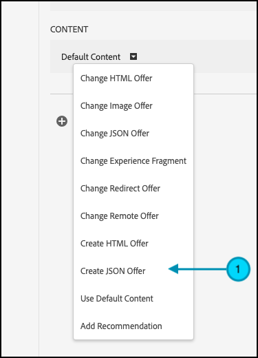

# Eseguire test di funzionalità con attributi

## Riepilogo dei passaggi

1. Abilita [!UICONTROL decisioning sul dispositivo] per la tua organizzazione
1. Creare un [!UICONTROL Test A/B] attività
1. Definire A e B
1. Aggiungere un pubblico
1. Imposta allocazione traffico
1. Impostare la distribuzione del traffico sulle varianti
1. Configurare la generazione di rapporti
1. Aggiungere metriche per il tracciamento dei KPI
1. Implementare il codice per eseguire test di funzionalità con attributi
1. Implementare il codice per tenere traccia degli eventi di conversione
1. Attivare i test delle funzioni con gli attributi

>[!NOTE]
>
>Supponiamo di essere una società di e-commerce per la vendita al dettaglio. Desideri aumentare il tasso di conversione quando i clienti sfogliano e ordinano il catalogo dei prodotti. Si ipotizza che alcuni algoritmi di ordinamento e strategie di impaginazione producano risultati migliori rispetto ad altri. Per testare questa teoria, decidi di eseguire un test di funzionalità che implica la riprogettazione del widget di ordinamento utilizzando diverse opzioni di ordinamento per gli utenti finali. Assicurati che questo test delle funzioni venga eseguito con latenza prossima allo zero, in modo che non influisca negativamente sulle esperienze utente e non distorca i risultati.

## 1. Abilita [!UICONTROL decisioning sul dispositivo] per la tua organizzazione

L’abilitazione del decisioning sul dispositivo garantisce che un’attività A/B venga eseguita con latenza vicina allo zero. Per abilitare questa funzione, vai a **[!UICONTROL Amministrazione]** > **[!UICONTROL Implementazione]** > **[!UICONTROL Dettagli account]** in [!DNL Adobe Target], e abilita **[!UICONTROL Decisioning sul dispositivo]** attivare/disattivare.


>[!NOTE]
>
>È necessario disporre dell&#39;amministratore o dell&#39;approvatore [ruolo utente](https://experienceleague.adobe.com/docs/target/using/administer/manage-users/user-management.html) per abilitare o disabilitare **[!UICONTROL Decisioning sul dispositivo]** attivare/disattivare.

Dopo aver abilitato **[!UICONTROL Decisioning sul dispositivo]** attivare/disattivare, [!DNL Adobe Target] inizia a generare *artefatti regola* per il tuo cliente.

## 2. Creare un [!UICONTROL Test A/B] attività

1. In entrata [!DNL Adobe Target], passare alla **[!UICONTROL Attività]** , quindi seleziona **[!UICONTROL Crea attività]** > **[!UICONTROL Test A/B]**.

   

1. In **[!UICONTROL Crea attività test A/B]** , lascia il valore predefinito **[!UICONTROL Web]** opzione selezionata (1), seleziona **[!UICONTROL Modulo]** come compositore esperienza (2), seleziona **[!UICONTROL Area di lavoro predefinita]** con **[!UICONTROL Nessuna restrizione di proprietà]** (3) e fai clic su **[!UICONTROL Successivo]** 4).

   

## 3. Definire A e B

1. In **[!UICONTROL Esperienze]** fase di creazione dell’attività, fornisci un nome per l’attività (1) e aggiungi una seconda esperienza, Esperienza B, facendo clic sul pulsante **[!UICONTROL Aggiungi esperienza]** (2) Inserisci il nome della posizione (3) all’interno dell’applicazione in cui desideri eseguire il test delle funzioni con gli attributi. Nell’esempio riportato di seguito, `product-results-page` è la posizione definita per l&#39;Esperienza A (è anche la posizione definita per l&#39;Esperienza B).

   

   **[!UICONTROL Esperienza A]** conterrà il JSON che indica la logica di business per eseguire le seguenti operazioni:

   * Avvia la funzione di algoritmo di ordinamento tramite `test_sorting` flag di funzione
   * Esegui l’algoritmo di ordinamento consigliato definito in `sorting_algorithm _**_attribute`
   * Restituisci 50 prodotti per pagina, in base a quanto definito dalla strategia di impaginazione di `pagination_limit`

1. Nell’Esperienza A, fai clic su per modificare il contenuto da **[!UICONTROL Contenuto predefinito]** al JSON selezionando **[!UICONTROL Crea offerta JSON]** come illustrato di seguito (1).

   

1. Definire il JSON con `test_sorting`, `sorting_algorithm`, e `pagination_limit` flag e attributi che verranno utilizzati per avviare l’algoritmo di ordinamento consigliato con un limite di impaginazione di 50 prodotti.

   >[!NOTE]
   >
   >Quando [!DNL Adobe Target] Quando un utente riceve un bucket per visualizzare l’esperienza A, viene restituito il JSON con gli attributi definiti nell’esempio. Nel codice, dovrai controllare il valore del flag di funzione `test_sorting` per verificare se la funzione di ordinamento deve essere attivata. In tal caso, utilizzerai il valore consigliato di `sorting_algorithm` per mostrare i prodotti consigliati nella vista elenco prodotti. Il limite di prodotti da mostrare per l’applicazione sarà 50, poiché è il valore del `pagination_limit` attributo.

   

   **[!UICONTROL Esperienza B]** definirà il JSON che segnala la logica di business per eseguire le seguenti operazioni:

   * Avviare la feature dell&#39;algoritmo di ordinamento tramite il flag della feature test_sorting
   * Esegui il `best_sellers` algoritmo di ordinamento definito in `sorting_algorithm _**_attribute`
   * Restituisci 50 prodotti per pagina, in base a quanto definito dalla strategia di impaginazione di `pagination_limit`

   >[!NOTE]
   >
   >Quando [!DNL Adobe Target] Quando un utente riceve un bucket per visualizzare l’esperienza B, viene restituito il JSON con gli attributi definiti nell’esempio. Nel codice, dovrai controllare il valore del flag di funzione `test_sorting` per verificare se la funzione di ordinamento deve essere attivata. In tal caso, utilizzerai `best_sellers` valore del `sorting_algorithm` per visualizzare i prodotti più venduti nella vista elenco prodotti. Il limite di prodotti da mostrare per l’applicazione sarà 50, poiché è il valore del `pagination_limit` attributo.

   

## 4. Aggiungere un pubblico

In **[!UICONTROL Targeting]** passaggio, mantieni **[!UICONTROL Tutti i visitatori]** pubblico. Questo consente di comprendere l’impatto della funzione di ordinamento, nonché l’algoritmo e il numero di elementi che influenzano meglio i risultati.


## 5. Impostare l’allocazione del traffico

Definisci la percentuale di visitatori rispetto alla quale desideri testare gli algoritmi di ordinamento e la strategia di impaginazione. In altre parole, a quale percentuale degli utenti desideri eseguire il test? In questo esempio, per distribuire il test a tutti gli utenti connessi, mantieni l’allocazione del traffico al 100%.


## 6. Impostare la distribuzione del traffico sulle varianti

Definisci la percentuale di visitatori che vedranno l’algoritmo di ordinamento consigliato rispetto a quello dei best seller, con un limite di 50 prodotti per pagina. In questo esempio, mantieni la distribuzione del traffico come suddivisione 50/50 tra le esperienze A e B.


## 7. Impostare la generazione rapporti

In **[!UICONTROL Obiettivi e impostazioni]** passo, scegli **[!UICONTROL Adobe Target]** come **[!UICONTROL Origine per la generazione di rapporti]** per visualizzare i risultati dei test A/B in [!DNL Adobe Target] UI o scegli **[!UICONTROL Adobe Analytics]** per visualizzarli nell’interfaccia utente di Adobe Analytics.


## 8. Aggiungere metriche per il tracciamento dei KPI

Scegli un **[!UICONTROL Metrica per obiettivo]** per misurare il test della funzione con gli attributi. In questo esempio, il successo si basa sull’acquisto di un prodotto da parte dell’utente, a seconda dell’algoritmo di ordinamento e della strategia di impaginazione mostrati.

## 9. Implementare nell’applicazione i test delle funzioni con gli attributi

>[!BEGINTABS]

>[!TAB Node.js]

```js {line-numbers="true"}
const TargetClient = require("@adobe/target-nodejs-sdk");
const options = {
  client: "testClient",
  organizationId: "ABCDEF012345677890ABCDEF0@AdobeOrg",
  decisioningMethod: "on-device",
  events: {
    clientReady: targetClientReady
  }
};
const targetClient = TargetClient.create(options);

function targetClientReady() {
  return targetClient.getAttributes(["product-results-page"]).then(function(attributes) {
    const test_sorting = attributes.getValue("product-results-page", "test-sorting");
    const sorting_algorithm = attributes.getValue("product-results-page", "sorting_algorithm");
    const pagination_limit = attributes.getValue("product-results-page", "pagination_limit");
  });
}
```

>[!TAB Java]

```java {line-numbers="true"}
import com.adobe.target.edge.client.ClientConfig;
import com.adobe.target.edge.client.TargetClient;
import com.adobe.target.delivery.v1.model.ChannelType;
import com.adobe.target.delivery.v1.model.Context;
import com.adobe.target.delivery.v1.model.ExecuteRequest;
import com.adobe.target.delivery.v1.model.MboxRequest;
import com.adobe.target.edge.client.entities.TargetDeliveryRequest;
import com.adobe.target.edge.client.model.TargetDeliveryResponse;

ClientConfig config = ClientConfig.builder()
    .client("testClient")
    .organizationId("ABCDEF012345677890ABCDEF0@AdobeOrg")
    .build();
TargetClient targetClient = TargetClient.create(config);
MboxRequest mbox = new MboxRequest().name("product-results-page").index(0);
TargetDeliveryRequest request = TargetDeliveryRequest.builder()
    .context(new Context().channel(ChannelType.WEB))
    .execute(new ExecuteRequest().mboxes(Arrays.asList(mbox)))
    .build();
Attributes attributes = targetClient.getAttributes(request, "product-results-page");
String testSorting = attributes.getString("product-results-page", "test-sorting");
String sortingAlgorithm = attributes.getString("product-results-page", "sorting_algorithm");
String paginationLimit = attributes.getString("product-results-page", "pagination_limit");
```

>[!ENDTABS]

## 10. Implementa il codice per tenere traccia degli eventi di conversione

>[!BEGINTABS]

>[!TAB Node.js]

```js {line-numbers="true"}
//... Code removed for brevity

//When a conversion happens
TargetClient.sendNotifications({
    targetCookie,
    "request" : {
      "notifications" : [
        {
          type: "click",
          timestamp : Date.now(),
          id: "conversion",
          mbox : {
            name : "product-results-page"
          }
        }
      ]
    }
})
```

>[!TAB Java]

```java {line-numbers="true"}
ClientConfig config = ClientConfig.builder()
  .client("acmeclient")
  .organizationId("1234567890@AdobeOrg")
  .build();
TargetClient targetClient = TargetClient.create(config);

Context context = new Context().channel(ChannelType.WEB);

ExecuteRequest executeRequest = new ExecuteRequest();

NotificationDeliveryService notificationDeliveryService = new NotificationDeliveryService();

Notification notification = new Notification();
notification.setId("conversion");
notification.setImpressionId(UUID.randomUUID().toString());
notification.setType(MetricType.CLICK);
notification.setTimestamp(System.currentTimeMillis());
notification.setTokens(
    Collections.singletonList(
        "IbG2Jz2xmHaqX7Ml/YRxRGqipfsIHvVzTQxHolz2IpSCnQ9Y9OaLL2gsdrWQTvE54PwSz67rmXWmSnkXpSSS2Q=="));

TargetDeliveryRequest targetDeliveryRequest =
    TargetDeliveryRequest.builder()
        .context(context)
        .execute(executeRequest)
        .notifications(Collections.singletonList(notification))
        .build();

TargetDeliveryResponse offers = targetClient.getOffers(request);
notificationDeliveryService.sendNotification(request);

Attributes attributes = targetClient.getAttributes(request, "product-results-page");
String testSorting = attributes.getString("product-results-page", "test-sorting");
String sortingAlgorithm = attributes.getString("product-results-page", "sorting_algorithm");
String paginationLimit = attributes.getString("product-results-page", "pagination_limit");
```

>[!ENDTABS]

## 11. Attivare i test delle funzioni con gli attributi


