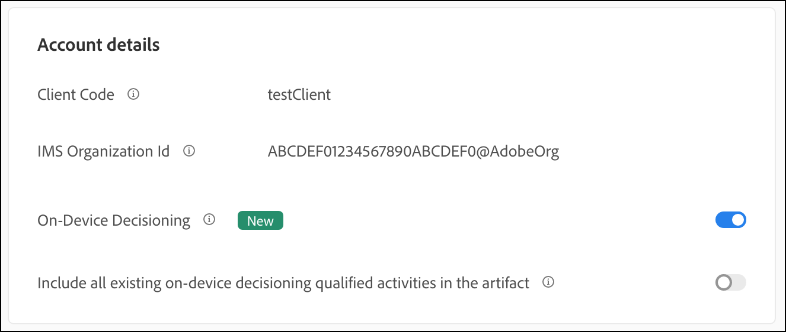

# Gestire i rollout per i test delle funzioni

## Riepilogo dei passaggi

1. Abilita [!UICONTROL on-device decisioning] per la tua organizzazione
1. Crea un&#39;attività [!UICONTROL A/B Test]
1. Definire la funzione e le impostazioni di rollout
1. Implementare ed eseguire il rendering della funzione nell’applicazione
1. Implementa il tracciamento degli eventi nell’applicazione
1. Attivare l’attività A/B
1. Regola rollout e allocazione del traffico in base alle esigenze

## 1. Abilita [!UICONTROL on-device decisioning] per la tua organizzazione

L’abilitazione del decisioning sul dispositivo garantisce che un’attività A/B venga eseguita con latenza vicina allo zero. Per abilitare questa funzione, passare a **[!UICONTROL Administration]** > **[!UICONTROL Implementation]** > **[!UICONTROL Account details]** in [!DNL Adobe Target] e attivare/disattivare **[!UICONTROL On-Device Decisioning]**.



>[!NOTE]
>
>Per abilitare o disabilitare l&#39;attivazione/disattivazione di [!UICONTROL On-Device Decisioning], è necessario disporre del ruolo utente [amministratore o approvatore](https://experienceleague.adobe.com/docs/target/using/administer/manage-users/user-management.html).

Dopo aver attivato l&#39;interruttore [!UICONTROL On-Device Decisioning], [!DNL Adobe Target] inizia a generare *artefatti regola* per il client.

## 2. Creare un&#39;attività [!UICONTROL A/B Test]

1. In [!DNL Adobe Target], passare alla pagina **[!UICONTROL Activities]**, quindi selezionare **[!UICONTROL Create Activity]** > **[!UICONTROL A/B test]**.

   

1. Nel modale **[!UICONTROL Create A/B Test Activity]**, lascia selezionata l&#39;opzione predefinita **[!UICONTROL Web]** (1), seleziona **[!UICONTROL Form]** come compositore esperienza (2), seleziona **[!UICONTROL Default Workspace]** con **[!UICONTROL No Property Restrictions]** (3), quindi fai clic su **[!UICONTROL Next]** (4).

   

## 3. Definisci la funzione e le impostazioni di rollout

Nel passaggio **[!UICONTROL Experiences]** della creazione di attività, fornisci un nome per l&#39;attività (1). Immetti il nome della posizione (2) all&#39;interno dell&#39;applicazione in cui desideri gestire i rollout per la funzione. Ad esempio, `ondevice-rollout` o `homepage-addtocart-rollout` sono nomi di posizione che indicano le destinazioni per la gestione dei rollout di funzionalità. Nell&#39;esempio seguente, `ondevice-rollout` è la posizione definita per l&#39;Esperienza A. Facoltativamente, puoi aggiungere perfezionamenti del pubblico (4) per limitare la qualifica all’attività.


1. Nella sezione **[!UICONTROL Content]** della stessa pagina, seleziona **[!UICONTROL Create JSON Offer]** nel menu a discesa (1) come mostrato.

   

1. Nella casella di testo **[!UICONTROL JSON Data]** che viene visualizzata, immetti la variabile del flag di funzione per la funzione che intendi eseguire il rollout con questa attività nell&#39;Esperienza A (1), utilizzando un oggetto JSON valido (2).

   

1. Fai clic su **[!UICONTROL Next]** (1) per passare al passaggio **[!UICONTROL Targeting]** della creazione di attività.

   

1. Nel passaggio **[!UICONTROL Targeting]**, mantieni il pubblico **[!UICONTROL All Visitors]** (1), per semplicità. Ma regola l&#39;allocazione del traffico (2) al 10%. In questo modo la funzione sarà limitata al 10% dei visitatori del sito. Fare clic su Avanti (3) per passare al passaggio **[!UICONTROL Goals & Settings]**.

   

1. Nel passaggio **[!UICONTROL Goals & Settings]**, scegli **[!UICONTROL Adobe Target]** (1) come **[!UICONTROL Reporting Source]** per visualizzare i risultati dell&#39;attività nell&#39;interfaccia utente [!DNL Adobe Target].

1. Scegli un **[!UICONTROL Goal Metric]** per misurare l&#39;attività. In questo esempio, una conversione corretta si basa sull&#39;acquisto o meno di un articolo da parte dell&#39;utente, come indicato dal fatto che l&#39;utente abbia raggiunto o meno la posizione orderConfirm (2).

1. Fare clic su **[!UICONTROL Save & Close]** (3) per salvare l&#39;attività.

   

## 4. Implementare ed eseguire il rendering della funzione nell’applicazione

>[!BEGINTABS]

>[!TAB Node.js]

```js {line-numbers="true"}
targetClient.getAttributes(["ondevice-rollout"]).then(function(attributes) {
      const featureFlags = attributes.asObject("ondevice-rollout");

      // Your flag variables are now available in the featureFlags object variable.
      //If you failed to qualify for the Activity, you will have an empty object.
      console.log(featureFlags);
    });
```

>[!TAB Java]

```java {line-numbers="true"}
    Attributes attrs = targetJavaClient.getAttributes(targetDeliveryRequest, "ondevice-rollout");
    Map<String, Object> featureFlags = attrs.toMboxMap("ondevice-rollout");
​
    // Your flag variables are now available in the featureFlags object variable.
    //If you failed to qualify for the Activity, you will have an empty object.
    System.out.println(featureFlags);
```

>[!ENDTABS]

## 5. Implementa il tracciamento degli eventi nell’applicazione

Dopo aver reso disponibile nell’applicazione la variabile flag di funzione, puoi utilizzarla per abilitare qualsiasi funzione che fa già parte dell’applicazione. Se un visitatore non è idoneo per l’attività, significa che non è stato incluso nel bucket del 10% definito come pubblico.

>[!BEGINTABS]

>[!TAB Node.js]

```js {line-numbers="true"}
//... Code removed for brevity

if(featureFlags.enable == "yes") { //Fell within 10% traffic
    console.log("Render Feature");
}
else {
    console.log("Disable Feature");
}

// alternatively, the getValue method could be used on the Attributes object.

if(attributes.getValue("ondevice-rollout", "enable") === "yes") { //Fell within 10% traffic
    console.log("Render Feature");
}
else {
    console.log("Disable Feature");
}
```

>[!TAB Java]

```java {line-numbers="true"}
//... Code removed for brevity
​
if("yes".equals(String.valueOf(featureFlags.get("enable")))) { //Fell within 10% traffic
    System.out.println("Render Feature");
}
else {
    System.out.println("Disable Feature");
}
​
// alternatively, the getString method could be used on the Attributes object.
​
if("yes".equals(attrs.getString("ondevice-rollout", "enable"))) { //Fell within 10% traffic
    System.out.println("Render Feature");
}
else {
    System.out.println("Disable Feature");
}
```

>[!ENDTABS]

## 6. Attivare l’attività di rollout


## 7. Regola il rollout e l’allocazione del traffico in base alle esigenze

Dopo aver attivato l’attività, modificala in qualsiasi momento per aumentare o ridurre l’allocazione del traffico in base alle esigenze.

Aumento dell’allocazione del traffico dal 10% al 50% a causa del successo del rollout iniziale.


