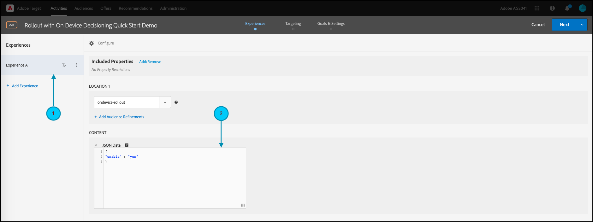

# Gestire i rollout per i test delle funzioni

## Riepilogo dei passaggi

1. Abilita [!UICONTROL decisioning sul dispositivo] per la tua organizzazione
1. Creare un [!UICONTROL Test A/B] attività
1. Definire la funzione e le impostazioni di rollout
1. Implementare ed eseguire il rendering della funzione nell’applicazione
1. Implementa il tracciamento degli eventi nell’applicazione
1. Attivare l’attività A/B
1. Regola rollout e allocazione del traffico in base alle esigenze

## 1. Abilita [!UICONTROL decisioning sul dispositivo] per la tua organizzazione

L’abilitazione del decisioning sul dispositivo garantisce che un’attività A/B venga eseguita con latenza vicina allo zero. Per abilitare questa funzione, vai a **[!UICONTROL Amministrazione]** > **[!UICONTROL Implementazione]** > **[!UICONTROL Dettagli account]** in [!DNL Adobe Target], e abilita **[!UICONTROL Decisioning sul dispositivo]** attivare/disattivare.


>[!NOTE]
>
>È necessario disporre dell&#39;amministratore o dell&#39;approvatore [ruolo utente](https://experienceleague.adobe.com/docs/target/using/administer/manage-users/user-management.html) per abilitare o disabilitare [!UICONTROL Decisioning sul dispositivo] attivare/disattivare.

Dopo aver abilitato [!UICONTROL Decisioning sul dispositivo] attivare/disattivare, [!DNL Adobe Target] inizia a generare *artefatti regola* per il tuo cliente.

## 2. Creare un [!UICONTROL Test A/B] attività

1. In entrata [!DNL Adobe Target], passare alla **[!UICONTROL Attività]** , quindi seleziona **[!UICONTROL Crea attività]** > **[!UICONTROL Test A/B]**.

   

1. In **[!UICONTROL Crea attività test A/B]** , lascia il valore predefinito **[!UICONTROL Web]** opzione selezionata (1), seleziona **[!UICONTROL Modulo]** come compositore esperienza (2), seleziona **[!UICONTROL Area di lavoro predefinita]** con **[!UICONTROL Nessuna restrizione di proprietà]** (3) e fai clic su **[!UICONTROL Successivo]** 4).

   

## 3. Definisci la funzione e le impostazioni di rollout

In **[!UICONTROL Esperienze]** passaggio di creazione dell’attività, specifica un nome per l’attività (1). Immetti il nome della posizione (2) all&#39;interno dell&#39;applicazione in cui desideri gestire i rollout per la funzione. Ad esempio:  `ondevice-rollout` o `homepage-addtocart-rollout` sono nomi di posizione che indicano le destinazioni per la gestione dei rollout di funzioni. Nell’esempio riportato di seguito, `ondevice-rollout` è la posizione definita per l’Esperienza A. Facoltativamente, puoi aggiungere perfezionamenti del pubblico (4) per limitare la qualifica all’attività.


1. In **[!UICONTROL Contenuto]** nella stessa pagina, seleziona **[!UICONTROL Crea offerta JSON]** nell’elenco a discesa (1), come illustrato.

   

1. In **[!UICONTROL Dati JSON]** Casella di testo che appare, inserisci la variabile del flag di funzione per la funzione che intendi eseguire il rollout con questa attività nell’Esperienza A (1), utilizzando un oggetto JSON valido (2).

   

1. Clic **[!UICONTROL Successivo]** (1) anticipare al **[!UICONTROL Targeting]** passaggio di creazione dell’attività.

   

1. In **[!UICONTROL Targeting]** passaggio, mantieni **[!UICONTROL Tutti i visitatori]** pubblico (1), per semplicità. Ma regola l&#39;allocazione del traffico (2) al 10%. In questo modo la funzione sarà limitata al 10% dei visitatori del sito. Fai clic su Successivo (3) per passare al **[!UICONTROL Obiettivi e impostazioni]** passaggio.

   

1. In **[!UICONTROL Obiettivi e impostazioni]** passo, scegli **[!UICONTROL Adobe Target]** (1) in quanto **[!UICONTROL Origine per la generazione di rapporti]** per visualizzare i risultati dell’attività in [!DNL Adobe Target] UI.

1. Scegli un **[!UICONTROL Metrica per obiettivo]** per misurare l’attività. In questo esempio, una conversione corretta si basa sull&#39;acquisto o meno di un articolo da parte dell&#39;utente, come indicato dal fatto che l&#39;utente abbia raggiunto o meno la posizione orderConfirm (2).

1. Clic **[!UICONTROL Salva e chiudi]** (3) per salvare l’attività.

   

## 4. Implementare ed eseguire il rendering della funzione nell’applicazione

>[!BEGINTABS]

>[!TAB Node.js]

```js {line-numbers="true"}
targetClient.getAttributes(["ondevice-rollout"]).then(function(attributes) {
      const featureFlags = attributes.asObject("ondevice-rollout");

      // Your flag variables are now available in the featureFlags object variable.
      //If you failed to qualify for the Activity, you will have an empty object.
      console.log(featureFlags);
    });
```

>[!TAB Java]

```java {line-numbers="true"}
    Attributes attrs = targetJavaClient.getAttributes(targetDeliveryRequest, "ondevice-rollout");
    Map<String, Object> featureFlags = attrs.toMboxMap("ondevice-rollout");
​
    // Your flag variables are now available in the featureFlags object variable.
    //If you failed to qualify for the Activity, you will have an empty object.
    System.out.println(featureFlags);
```

>[!ENDTABS]

## 5. Implementa il tracciamento degli eventi nell’applicazione

Dopo aver reso disponibile nell’applicazione la variabile flag di funzione, puoi utilizzarla per abilitare qualsiasi funzione che fa già parte dell’applicazione. Se un visitatore non è idoneo per l’attività, significa che non è stato incluso nel bucket del 10% definito come pubblico.

>[!BEGINTABS]

>[!TAB Node.js]

```js {line-numbers="true"}
//... Code removed for brevity

if(featureFlags.enable == "yes") { //Fell within 10% traffic
    console.log("Render Feature");
}
else {
    console.log("Disable Feature");
}

// alternatively, the getValue method could be used on the Attributes object.

if(attributes.getValue("ondevice-rollout", "enable") === "yes") { //Fell within 10% traffic
    console.log("Render Feature");
}
else {
    console.log("Disable Feature");
}
```

>[!TAB Java]

```java {line-numbers="true"}
//... Code removed for brevity
​
if("yes".equals(String.valueOf(featureFlags.get("enable")))) { //Fell within 10% traffic
    System.out.println("Render Feature");
}
else {
    System.out.println("Disable Feature");
}
​
// alternatively, the getString method could be used on the Attributes object.
​
if("yes".equals(attrs.getString("ondevice-rollout", "enable"))) { //Fell within 10% traffic
    System.out.println("Render Feature");
}
else {
    System.out.println("Disable Feature");
}
```

>[!ENDTABS]

## 6. Attivare l’attività di rollout


## 7. Regola il rollout e l’allocazione del traffico in base alle esigenze

Dopo aver attivato l’attività, modificala in qualsiasi momento per aumentare o ridurre l’allocazione del traffico in base alle esigenze.

Aumento dell’allocazione del traffico dal 10% al 50% a causa del successo del rollout iniziale.


