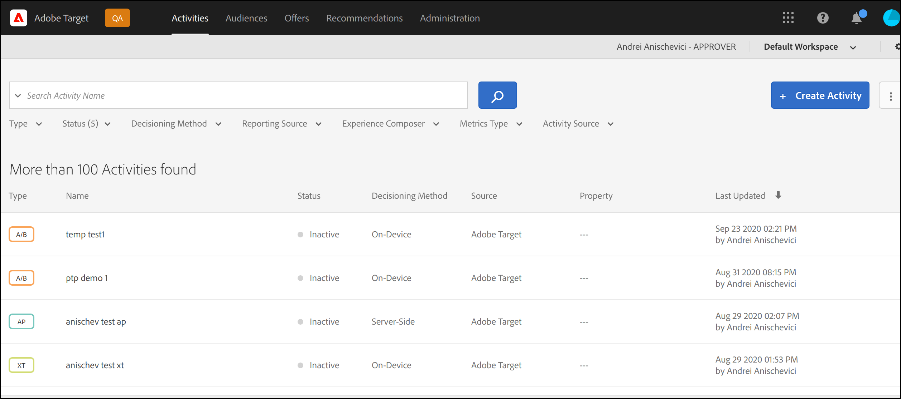

# Panoramica del decisioning sul dispositivo

Gli SDK [!DNL Adobe Target] di nuova generazione offrono ora [!UICONTROL on-device decisioning], che consente di memorizzare nella cache le campagne A/B e Targeting esperienza (XT) sul server ed eseguire decisioni in memoria con latenza pressoché pari a zero, senza bloccare le richieste di rete ad Edge Network di [!DNL Adobe Target].

[!DNL Adobe Target] offre anche la flessibilità di fornire l&#39;esperienza più rilevante e aggiornata dalle tue campagne di sperimentazione e personalizzazione basate su apprendimento automatico tramite una chiamata al server live. In altre parole, quando le prestazioni sono più importanti, è possibile scegliere di utilizzare [!UICONTROL on-device decisioning], ma quando è necessaria l&#39;esperienza più rilevante e aggiornata, è possibile effettuare una chiamata al server. Consulta [quando utilizzare su dispositivo rispetto a Edge Decisioning](../../sdk-guides/on-device-decisioning/supported-features.md) per informazioni sui casi d&#39;uso che giustificano l&#39;utilizzo di uno rispetto all&#39;altro.

>[!NOTE]
>
>Le decisioni sul dispositivo sono disponibili sia per le implementazioni lato client che per quelle lato server. Questo articolo descrive [!UICONTROL on-device decisioning] per lato server. Per informazioni su [!UICONTROL on-device decisioning] per lato client, consulta la documentazione sull&#39;implementazione lato client [qui](../../../client-side/atjs/on-device-decisioning/on-device-decisioning.md).

## Come funziona?

Quando si installa e si inizializza un SDK [!DNL Adobe Target] con [!UICONTROL on-device decisioning] abilitato, un *artefatto regola* viene scaricato e memorizzato nella cache locale sul server, dalla rete CDN Akamai più vicina al server. Quando viene effettuata una richiesta per recuperare un&#39;esperienza [!DNL Adobe Target] nell&#39;applicazione lato server, la decisione relativa al contenuto da restituire viene presa in memoria, in base ai metadati codificati nell&#39;artefatto della regola memorizzata nella cache, che definisce tutte le attività [!UICONTROL on-device decisioning] A/B e XT.

Il diagramma seguente mostra l&#39;architettura di [!UICONTROL on-device decisioning]. Fai clic su per espandere l’immagine.

(Fare clic sull&#39;immagine per espanderla a larghezza intera.)

{zoomable="yes"}

## Quali sono i vantaggi?

* **Distribuisci decisioni di latenza prossime allo zero.** Il bucket e il decisioning vengono eseguiti in memoria e su dispositivo per evitare il blocco delle richieste di rete.
* **Migliora le prestazioni dell&#39;applicazione.** Esegui esperimenti e fornisci personalizzazione ai clienti e agli utenti senza compromettere le esperienze degli utenti finali.
* **Miglioramento del punteggio di qualità del sito Google.** Con le decisioni prese in memoria e sul lato server, migliora il punteggio di qualità del sito Google del tuo business online per renderlo più individuabile dai consumatori.
* **Scopri da analisi in tempo reale.** Ottieni informazioni approfondite sulle prestazioni dell&#39;attività in tempo reale tramite [!DNL Adobe Target] o reporting A4T, consentendo di eseguire il pivot della tua strategia nei momenti critici.

## Funzionalità supportate

### Attività

Il decisioning sul dispositivo supporta i seguenti tipi di attività creati dal [Compositore esperienza basato su moduli](https://experienceleague.adobe.com/docs/target/using/experiences/form-experience-composer.html):

* [!UICONTROL A/B Test]
* [!UICONTROL Experience Targeting] (XT)

### Metodo di allocazione

Le decisioni sul dispositivo supportano il seguente metodo di allocazione:

* Manuale

### Targeting del pubblico

Le decisioni sul dispositivo supportano le seguenti regole per il pubblico:

| Regola pubblico | Decisioning sul dispositivo |
| --- | --- |
| [Geo](https://experienceleague.adobe.com/docs/target/using/audiences/create-audiences/categories-audiences/geo.html) | Sì
Quando si utilizzano le decisioni sul dispositivo, sono supportati i seguenti attributi geografici:<ul><li>Paese/Area geografica</li><li>Città</li><li>Latitudine</li><li>Longitudine</li></ul> |
| [Rete](https://experienceleague.adobe.com/docs/target/using/audiences/create-audiences/categories-audiences/network.html) | No |
| [Mobile](https://experienceleague.adobe.com/docs/target/using/audiences/create-audiences/categories-audiences/mobile.html) | No |
| [Parametri personalizzati](https://experienceleague.adobe.com/docs/target/using/audiences/create-audiences/categories-audiences/custom-parameters.html) | Sì |
| [Sistema operativo](https://experienceleague.adobe.com/docs/target/using/audiences/create-audiences/categories-audiences/operating-system.html) | Sì |
| [Pagine del sito](https://experienceleague.adobe.com/docs/target/using/audiences/create-audiences/categories-audiences/site-pages.html) | Sì |
| [Browser](https://experienceleague.adobe.com/docs/target/using/audiences/create-audiences/categories-audiences/browser.html) | Sì |
| [Profilo visitatore](https://experienceleague.adobe.com/docs/target/using/audiences/create-audiences/categories-audiences/visitor-profile.html) | No |
| [Origini del traffico](https://experienceleague.adobe.com/docs/target/using/audiences/create-audiences/categories-audiences/traffic-sources.html) | No |
| [Arco temporale](https://experienceleague.adobe.com/docs/target/using/audiences/create-audiences/categories-audiences/time-frame.html) | Sì |
| [Tipi di pubblico di Experience Cloud](https://experienceleague.adobe.com/docs/target/using/integrate/mmp.html) (tipi di pubblico da Adobe Audience Manager, Adobe Analytics e Adobe Experience Manager) | No |

## Come posso eseguire il provisioning del mio client per utilizzare [!UICONTROL on-device decisioning]?

Le decisioni sul dispositivo sono disponibili per tutti i clienti [!DNL Adobe Target] che utilizzano [!DNL Adobe Target] SDK lato server. Per abilitare questa funzione, passa a **[!UICONTROL Administration]** > **[!UICONTROL Implementation]** > **[!UICONTROL Account details]** nell&#39;interfaccia utente [!DNL Adobe Target] e abilita l&#39;interruttore **[!UICONTROL On-Device Decisioning]**.

>[!NOTE]
>
>Per abilitare o disabilitare l&#39;attivazione/disattivazione di [!UICONTROL On-Device Decisioning], è necessario disporre del ruolo utente *amministratore o approvatore*.

Dopo aver attivato l&#39;interruttore Decisioning sul dispositivo, [!DNL Adobe Target] inizierà a generare e propagare *artefatti regola* per il client.

>[!NOTE]
>
>Assicurarsi di attivare l&#39;interruttore prima di inizializzare il SDK [!DNL Adobe Target] per utilizzare [!UICONTROL on-device decisioning]. Gli artefatti della regola dovranno prima essere generati e propagati ai CDN Akamai affinché [!UICONTROL on-device decisioning] funzioni.

### Includi tutte le [!UICONTROL on-device decisioning] attività qualificate esistenti nell&#39;interruttore artefatto

Attiva **il** per includere automaticamente nell&#39;artefatto tutte le attività di [!DNL Target] live idonee per [!UICONTROL on-device decisioning].

Se si lascia questa opzione **disattivata**, sarà necessario ricreare e attivare tutte le attività [!UICONTROL on-device decisioning] affinché vengano incluse nell&#39;artefatto delle regole generato.

## Come posso sapere che un&#39;attività supporta [!UICONTROL on-device decisioning]?

Dopo la creazione di un&#39;attività, un&#39;etichetta denominata **[!UICONTROL Decisioning Method]**, visibile nella pagina dei dettagli dell&#39;attività, indica se l&#39;attività supporta [!UICONTROL on-device decisioning].

È inoltre possibile visualizzare tutte le attività che supportano [!UICONTROL on-device decisioning] nella pagina **[!UICONTROL Activities]** aggiungendo la colonna **[!UICONTROL Decisioning Method]** all&#39;elenco delle attività.

>[!NOTE]
>
>Dopo aver creato e attivato un&#39;attività che supporta [!UICONTROL on-device decisioning], potrebbero essere necessari 20 minuti prima che venga inclusa nell&#39;artefatto delle regole generato e propagato ai PoP della rete CDN di Akamai.

## Qual è il riepilogo dei passaggi da seguire per garantire che le attività [!UICONTROL on-device decisioning] vengano consegnate correttamente tramite il SDK lato server di [!DNL Adobe Target]?

1. Accedi all&#39;interfaccia utente di [!DNL Adobe Target] e passa a **[!UICONTROL Administration]** > **[!UICONTROL Implementation]** > **[!UICONTROL Account details]** per abilitare l&#39;opzione **[!UICONTROL On-Device Decisioning]**.
1. Attiva/disattiva **[!UICONTROL Include all existing [!UICONTROL on-device decisioning] qualified activities in the artifact]**.
1. Creare e attivare un tipo di attività supportato da [!UICONTROL on-device decisioning] e verificare che **[!UICONTROL Decisioning Method]** sia **[!UICONTROL On-Device Decisioning]** per tale attività.
1. Installa e inizializza [Node.js](../../node-js/overview.md) o [Java](../../java/overview.md) SDK con `decisioningMethod = on-device`.
1. Implementa `getOffers()` o `getAttributes()` nel codice per recuperare un&#39;esperienza sul dispositivo.
1. Distribuisci il codice.

Per esempi che illustrano come iniziare con i passaggi 1-3 di cui sopra, consulta la sezione [Guida introduttiva](../getting-started/getting-started.md).

## Risorse aggiuntive

### Webinar: personalizzare e testare a latenza zero con decisioni su dispositivi da [!DNL Adobe Target]

Più che mai, gli esperti di marketing, i proprietari dei prodotti e gli sviluppatori hanno il compito di ottimizzare l’esperienza complessiva del cliente su siti, app e ovunque si connettano con i loro clienti. Strumenti multipli con silos di dati e implementazioni complicate sono inadeguati.

In questo webinar registrato, gli esperti di prodotto [!DNL Adobe Target] discutono di come le decisioni di ottimizzazione dell&#39;esperienza critica sul dispositivo, eseguite localmente con latenza quasi pari a zero, possano aprire le porte a nuovi casi d&#39;uso interessanti e al contempo migliorare le prestazioni del sito per i clienti.

>[!VIDEO](https://video.tv.adobe.com/v/328148/?quality=12)

### Tutorial: decisioning sul dispositivo

[!DNL Adobe Target] [!UICONTROL on-device decisioning] abilita la distribuzione dei contenuti con latenza quasi zero.

Questo video di 7 minuti:

* Descrive [!UICONTROL on-device decisioning], incluso il confronto con altri metodi dell&#39;implementazione di [!DNL Target]
* Dimostra come abilitare [!UICONTROL on-device decisioning] in Target
* Esamina un esempio di attività del compositore basato su moduli configurata con contenuto JSON
* Mostra un esempio di codice SDK di Node.JS contenente la configurazione chiave richiesta per [!UICONTROL on-device decisioning]
* Mostra i risultati in un browser

>[!VIDEO](https://video.tv.adobe.com/v/329032/?quality=12)

Per ulteriori video e tutorial, consulta [[!DNL Adobe Target] Tutorial](https://experienceleague.adobe.com/docs/target-learn/tutorials/overview.html?lang=it).

### Adobe Tech Blog - Parte 1: esegui il SDK NodeJS [!DNL Adobe Target] per la sperimentazione e la personalizzazione su piattaforme edge (Akamai Edge Workers)

[Fare clic qui per accedere al post del blog](https://medium.com/adobetech/part-1-run-adobe-target-nodejs-sdk-for-experimentation-and-personalization-on-edge-platforms-4d8660964ed9).

### Adobe Tech Blog - Parte 2: eseguire l’SDK NodeJS di [!DNL Adobe Target] a scopo di sperimentazione e personalizzazione su piattaforme edge (AWS Lambda@Edge)

[Fare clic qui per accedere al post del blog](https://medium.com/adobetech/part-2-run-adobe-target-nodejs-sdk-for-experimentation-and-personalization-on-edge-platforms-aws-4d6bdac24563).
