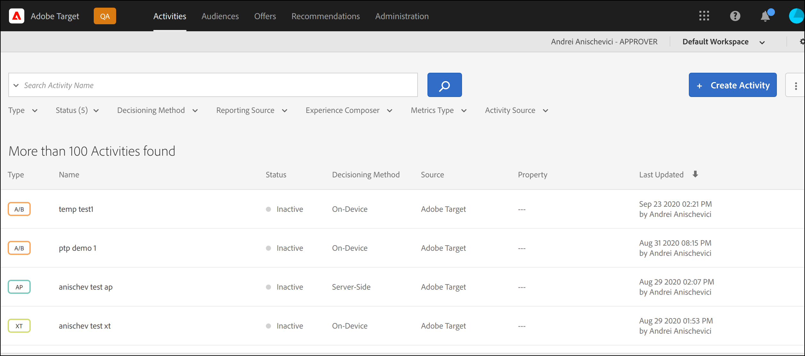

# Panoramica del decisioning sul dispositivo

La nuova generazione [!DNL Adobe Target] Gli SDK ora offrono [!UICONTROL on-device decisioning], che consente di memorizzare nella cache le campagne A/B e Experience Targeting (XT) sul server ed eseguire decisioni in memoria con latenza pressoché pari a zero, senza bloccare le richieste di rete a [!DNL Adobe Target]Edge Network di.

[!DNL Adobe Target] offre anche la flessibilità di fornire l’esperienza più rilevante e aggiornata dalla tua sperimentazione e dalle campagne di personalizzazione basate su apprendimento automatico tramite una chiamata al server live. In altre parole, quando le prestazioni sono più importanti, puoi scegliere di utilizzare [!UICONTROL on-device decisioning], ma quando è necessaria l’esperienza più rilevante e aggiornata, è possibile effettuare una chiamata al server. Consulta [quando utilizzare decisioni su dispositivi rispetto a decisioni edge](../../sdk-guides/on-device-decisioning/supported-features.md) per scoprire i casi d’uso che richiedono l’utilizzo l’uno rispetto all’altro.

>[!NOTE]
>
>Le decisioni sul dispositivo sono disponibili sia per le implementazioni lato client che per quelle lato server. Questo articolo descrive [!UICONTROL on-device decisioning] per lato server. Per informazioni su [!UICONTROL on-device decisioning] per il lato client, fai riferimento alla documentazione sull&#39;implementazione lato client [qui](../../../client-side/atjs/on-device-decisioning/on-device-decisioning.md).

## Come funziona?

Quando si installa e si inizializza un [!DNL Adobe Target] SDK con [!UICONTROL on-device decisioning] abilitato, un *artefatto regola* viene scaricato e memorizzato nella cache locale sul server, dalla rete CDN Akamai più vicina al server. Quando una richiesta di recupero di un [!DNL Adobe Target] viene effettuata nell’applicazione lato server, la decisione relativa al contenuto da restituire viene presa in memoria, in base ai metadati codificati nell’artefatto della regola memorizzata nella cache, che definisce tutti i [!UICONTROL on-device decisioning] Attività A/B e XT.

Il diagramma seguente mostra [!UICONTROL on-device decisioning] architettura. Fai clic su per espandere l’immagine.

(Fare clic sull&#39;immagine per espanderla a larghezza intera.)

{zoomable=&quot;yes&quot;}

## Quali sono i vantaggi?

* **Fornire decisioni di latenza pressoché nulle.** Il bucket e il decisioning vengono eseguiti in memoria e su dispositivo per evitare il blocco delle richieste di rete.
* **Miglioramento delle prestazioni delle applicazioni.** Esegui esperimenti e fornisci personalizzazione ai clienti e agli utenti senza compromettere le esperienze degli utenti finali.
* **Migliora il punteggio di qualità del sito Google.** Con le decisioni prese in memoria e sul lato server, migliora il punteggio di qualità del sito Google del tuo business online per renderlo più individuabile dai consumatori.
* **Scopri le funzionalità di analisi in tempo reale.** Ottieni informazioni approfondite sulle prestazioni dell’attività in tempo reale tramite [!DNL Adobe Target] o reporting A4T, che consente di eseguire il pivot della strategia nei momenti critici.

## Funzionalità supportate

### Attività

Le decisioni sul dispositivo supportano i seguenti tipi di attività creati da [Compositore esperienza basato su moduli](https://experienceleague.adobe.com/docs/target/using/experiences/form-experience-composer.html):

* [!UICONTROL A/B Test]
* [!UICONTROL Experience Targeting] (XT)

### Metodo di allocazione

Le decisioni sul dispositivo supportano il seguente metodo di allocazione:

* Manuale

### Targeting del pubblico

Le decisioni sul dispositivo supportano le seguenti regole per il pubblico:

| Regola pubblico | Decisioning sul dispositivo |
| --- | --- |
| [Geo](https://experienceleague.adobe.com/docs/target/using/audiences/create-audiences/categories-audiences/geo.html) | Sì
Quando si utilizzano le decisioni sul dispositivo, sono supportati i seguenti attributi geografici:<ul><li>Paese/Area geografica</li><li>Città</li><li>Latitudine</li><li>Longitudine</li></ul> |
| [Rete](https://experienceleague.adobe.com/docs/target/using/audiences/create-audiences/categories-audiences/network.html) | No |
| [Mobile](https://experienceleague.adobe.com/docs/target/using/audiences/create-audiences/categories-audiences/mobile.html) | No |
| [Parametri personalizzati](https://experienceleague.adobe.com/docs/target/using/audiences/create-audiences/categories-audiences/custom-parameters.html) | Sì |
| [Sistema operativo](https://experienceleague.adobe.com/docs/target/using/audiences/create-audiences/categories-audiences/operating-system.html) | Sì |
| [Pagine del sito](https://experienceleague.adobe.com/docs/target/using/audiences/create-audiences/categories-audiences/site-pages.html) | Sì |
| [Browser](https://experienceleague.adobe.com/docs/target/using/audiences/create-audiences/categories-audiences/browser.html) | Sì |
| [Profilo visitatore](https://experienceleague.adobe.com/docs/target/using/audiences/create-audiences/categories-audiences/visitor-profile.html) | No |
| [Origini del traffico](https://experienceleague.adobe.com/docs/target/using/audiences/create-audiences/categories-audiences/traffic-sources.html) | No |
| [Arco temporale](https://experienceleague.adobe.com/docs/target/using/audiences/create-audiences/categories-audiences/time-frame.html) | Sì |
| [Tipi di pubblico di Experience Cloud](https://experienceleague.adobe.com/docs/target/using/integrate/mmp.html) (Tipi di pubblico da Adobe Audience Manager, Adobe Analytics e Adobe Experience Manager | No |

## Come posso effettuare il provisioning del mio client per l’utilizzo di [!UICONTROL on-device decisioning]?

Le decisioni sul dispositivo sono disponibili per tutti [!DNL Adobe Target] clienti che utilizzano [!DNL Adobe Target] SDK lato server. Per abilitare questa funzione, vai a **[!UICONTROL Administration]** > **[!UICONTROL Implementation]** > **[!UICONTROL Account details]** nel [!DNL Adobe Target] e abilitare **[!UICONTROL On-Device Decisioning]** attivare/disattivare.

>[!NOTE]
>
>È necessario disporre dell&#39;amministratore o dell&#39;approvatore *ruolo utente* per abilitare o disabilitare [!UICONTROL On-Device Decisioning] attivare/disattivare.

Dopo aver attivato l’opzione Decisioning sul dispositivo, [!DNL Adobe Target] inizierà la generazione e la propagazione *artefatti regola* per il tuo cliente.

>[!NOTE]
>
>Assicurati di abilitare l’interruttore prima di inizializzare [!DNL Adobe Target] SDK da utilizzare [!UICONTROL on-device decisioning]. Gli artefatti della regola dovranno prima generare e propagarsi alle reti CDN di Akamai per [!UICONTROL on-device decisioning] al lavoro.

### Includi tutti gli esistenti [!UICONTROL on-device decisioning] attivazione/disattivazione di attività qualificate nell’artefatto

Attiva/Disattiva **il** quando vorresti che tutto il tuo live [!DNL Target] attività che soddisfano i requisiti per [!UICONTROL on-device decisioning] da includere automaticamente nell’artefatto.

Lasciando questa opzione **disattivato** significa che dovrai ricreare e attivare qualsiasi [!UICONTROL on-device decisioning] per includerle nell’artefatto delle regole generato.

## Come faccio a sapere che un’attività è [!UICONTROL on-device decisioning] capace?

Dopo aver creato un’attività, un’etichetta denominata **[!UICONTROL Decisioning Method]**, visibile nella pagina dei dettagli dell&#39;attività, indica se l&#39;attività è [!UICONTROL on-device decisioning] in grado.

Puoi anche visualizzare tutte le attività che sono [!UICONTROL on-device decisioning] in grado di **[!UICONTROL Activities]** pagina aggiungendo la colonna **[!UICONTROL Decisioning Method]** all’elenco delle attività.

>[!NOTE]
>
>Dopo aver creato e attivato un’attività che è [!UICONTROL on-device decisioning] Se questa opzione è supportata, potrebbero essere necessari 20 minuti prima che venga inclusa nell’artefatto delle regole generato e propagato ai PoP della rete CDN di Akamai.

## Qual è il riepilogo dei passaggi da seguire per garantire che [!UICONTROL on-device decisioning] le attività vengono consegnate correttamente tramite [!DNL Adobe Target]Dell’SDK lato server?

1. Accedere a [!DNL Adobe Target] Interfaccia utente e naviga su **[!UICONTROL Administration]** > **[!UICONTROL Implementation]** > **[!UICONTROL Account details]** per attivare **[!UICONTROL On-Device Decisioning]** attivare/disattivare.
1. Abilita **[!UICONTROL Include all existing [!UICONTROL on-device decisioning] qualified activities in the artifact]** attivare/disattivare.
1. Creare e attivare un tipo di attività supportato da [!UICONTROL on-device decisioning], e verifica che **[!UICONTROL Decisioning Method]** è **[!UICONTROL On-Device Decisioning]** per tale attività.
1. Installare e inizializzare [Node.js](../../node-js/overview.md) o [Java](../../java/overview.md) SDK con `decisioningMethod = on-device`.
1. Implementare `getOffers()` o `getAttributes()` nel codice per recuperare un’esperienza sul dispositivo.
1. Distribuisci il codice.

Per esempi che illustrano come iniziare a utilizzare i passaggi 1-3 di cui sopra, consulta la [Introduzione](../getting-started/getting-started.md) sezione.

## Risorse aggiuntive

### Webinar: personalizzare e testare a latenza zero con decisioni su dispositivi da [!DNL Adobe Target]

Più che mai, gli esperti di marketing, i proprietari dei prodotti e gli sviluppatori hanno il compito di ottimizzare l’esperienza complessiva del cliente su siti, app e ovunque si connettano con i loro clienti. Strumenti multipli con silos di dati e implementazioni complicate sono inadeguati.

In questo webinar registrato, [!DNL Adobe Target] gli esperti di prodotto spiegano come le decisioni di ottimizzazione delle esperienze critiche sul dispositivo, eseguite localmente con latenza pressoché pari a zero, possano aprire le porte a nuovi casi d’uso interessanti e al contempo migliorare le prestazioni del sito per i clienti.

>[!VIDEO](https://video.tv.adobe.com/v/328148/?quality=12)

### Tutorial: decisioning sul dispositivo

[!DNL Adobe Target] [!UICONTROL on-device decisioning] consente la distribuzione di contenuti con latenza quasi pari a zero.

Questo video di 7 minuti:

* Descrive [!UICONTROL on-device decisioning], incluso il confronto con altri metodi di [!DNL Target] implementazione
* Dimostra come abilitare [!UICONTROL on-device decisioning] in Target
* Esamina un esempio di attività del compositore basato su moduli configurata con contenuto JSON
* Mostra un esempio di codice SDK Node.JS contenente la configurazione della chiave richiesta per [!UICONTROL on-device decisioning]
* Mostra i risultati in un browser

>[!VIDEO](https://video.tv.adobe.com/v/329032/?quality=12)

Per ulteriori video e tutorial, consulta [[!DNL Adobe Target] Tutorials](https://experienceleague.adobe.com/docs/target-learn/tutorials/overview.html?lang=it).

### Blog di tecnologia Adobe - Parte 1: esecuzione [!DNL Adobe Target] SDK di NodeJS per la sperimentazione e la personalizzazione su piattaforme edge (Akamai Edge Workers)

[Fai clic qui per accedere al post del blog](https://medium.com/adobetech/part-1-run-adobe-target-nodejs-sdk-for-experimentation-and-personalization-on-edge-platforms-4d8660964ed9).

### Adobe Tech Blog - Parte 2: eseguire l’SDK NodeJS di [!DNL Adobe Target] a scopo di sperimentazione e personalizzazione su piattaforme edge (AWS Lambda@Edge)

[Fai clic qui per accedere al post del blog](https://medium.com/adobetech/part-2-run-adobe-target-nodejs-sdk-for-experimentation-and-personalization-on-edge-platforms-aws-4d6bdac24563).
