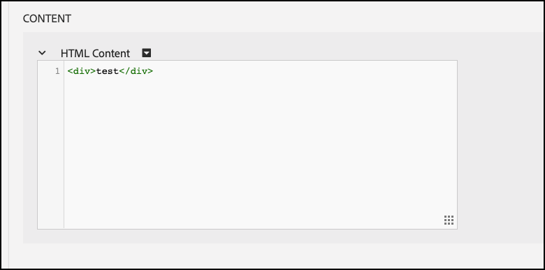

# Risoluzione dei problemi [!UICONTROL decisioning sul dispositivo]

## Convalida della configurazione

### Riepilogo dei passaggi

1. Assicurati che `logger` è configurato
1. Assicurare [!DNL Target] tracce è abilitato
1. Verificare la [!UICONTROL decisioning sul dispositivo] *artefatto regola* è stato recuperato e memorizzato nella cache in base all’intervallo di polling definito.
1. Convalidare la distribuzione dei contenuti tramite l’artefatto della regola memorizzata nella cache creando un test [!UICONTROL decisioning sul dispositivo] tramite il Compositore esperienza basato su moduli.
1. Errori di notifica di invio Inspect

## 1. Verifica che il logger sia configurato

Quando inizializzi l’SDK, accertati di abilitare la registrazione.

**Node.js**

Per l’SDK di Node.js a `logger` deve essere fornito l&#39;oggetto.

```js {line-numbers="true"}
const CONFIG = {
  client: "<your client code>",
  organizationId: "<your organization ID>",
  logger: console
};
```

**SDK Java**

Per l’SDK Java `logRequests` il `ClientConfig` deve essere abilitato.

```js {line-numbers="true"}
ClientConfig config = ClientConfig.builder()
  .client("<your client code>")
  .organizationId("<your organization ID>")
  .logRequests(true)
  .build();
```

Inoltre, la JVM deve essere avviata con il seguente parametro della riga di comando:

```bash {line-numbers="true"}
java -Dorg.slf4j.simpleLogger.defaultLogLevel=DEBUG ...
```

## 2. Assicurare[!DNL Target]Tracce abilitate

L&#39;abilitazione delle tracce genera ulteriori informazioni da [!DNL Adobe Target] per quanto riguarda l’artefatto delle regole.

1. Accedi a[!DNL Target]Interfaccia utente in [!DNL Experience Cloud].

   

1. Accedi a **[!UICONTROL Amministrazione]** > **[!UICONTROL Implementazione]** e fai clic su **[!UICONTROL Genera nuovo token di autorizzazione]**.

   

1. Copia il token di autorizzazione appena generato negli Appunti e aggiungilo al[!DNL Target]richiesta:

   **Node.js**

   ```js {line-numbers="true"}
   const request = {
     trace: {
       authorizationToken: "88f1a924-6bc5-4836-8560-2f9c86aeb36b"
     },
     execute: {
       mboxes: [{
         name: "sdk-mbox"
       }]
   }};
   ```

   **Java**

   ```js {line-numbers="true"}
   Trace trace = new Trace()
     .authorizationToken("88f1a924-6bc5-4836-8560-2f9c86aeb36b");
   Context context = new Context()
     .channel(ChannelType.WEB);
   MboxRequest mbox = new MboxRequest()
     .name("sdk-mbox")
     .index(0);
   ExecuteRequest executeRequest = new ExecuteRequest()
     .mboxes(Arrays.asList(mbox));
   
   TargetDeliveryRequest request = TargetDeliveryRequest.builder()
     .trace(trace)
     .context(context)
     .execute(executeRequest)
     .build();
   ```

1. Con il logger e la traccia posizionati, avvia l’app e monitora il terminale del server. L’output seguente del logger conferma che l’artefatto della regola è stato recuperato:

   **SDK di Node.js**

   ```text {line-numbers="true"}
     AT: LD.ArtifactProvider fetching artifact - https://assets.adobetarget.com/your-client-code/production/v1/rules.json
     AT: LD.ArtifactProvider artifact received - status=200
   ```

## 3. Verificare la [!UICONTROL decisioning sul dispositivo] *artefatto regola* è stato recuperato e memorizzato nella cache in base all’intervallo di polling definito.

1. Attendi la durata dell&#39;intervallo di polling (il valore predefinito è 5 minuti) e assicurati che l&#39;artefatto venga recuperato dall&#39;SDK. Vengono generati gli stessi registri del terminale.

   Inoltre, le informazioni provenienti dal[!DNL Target]La traccia deve essere inviata al terminale con i dettagli dell’artefatto della regola.

   ```text {line-numbers="true"}
   "trace": {
     "clientCode": "your-client-code",
     "artifact": {
       "artifactLocation": "https://assets.adobetarget.com/your-client-code/production/v1/rules.json",
       "pollingInterval": 300000,
       "pollingHalted": false,
       "artifactVersion": "1.0.0",
       "artifactRetrievalCount": 10,
       "artifactLastRetrieved": "2020-09-20T00:09:42.707Z",
       "clientCode": "your-client-code",
       "environment": "production",
       "generatedAt": "2020-09-22T17:17:59.783Z"
     },
   ```

## 4. Convalidare la distribuzione dei contenuti tramite l’artefatto della regola memorizzata nella cache creando un test [!UICONTROL decisioning sul dispositivo] attività tramite il compositore esperienza basato su moduli

1. Accedi a[!DNL Target]Interfaccia utente in Experience Cloud

   

1. Crea una nuova attività Targeting esperienza utilizzando il Compositore esperienza basato su moduli.

   

1. Inserisci il nome mbox utilizzato nel tuo[!DNL Target]come posizione per l’attività XT (nota: deve trattarsi di un nome mbox univoco specifico a scopo di sviluppo).

   

1. Modifica il contenuto in un’offerta HTML o in un’offerta JSON. Questo verrà restituito nel[!DNL Target]alla tua applicazione. Lascia il targeting per l’attività come &quot;Tutti i visitatori&quot; e seleziona la metrica desiderata. Assegna un nome all’attività, salvala e quindi attivala per assicurarti che la mbox/posizione in uso sia solo per lo sviluppo.

   

1. Nell’applicazione, aggiungi un’istruzione di registro per il contenuto ricevuto nella risposta dal tuo[!DNL Target]richiesta

   **SDK di Node.js**

   ```js {line-numbers="true"}
   try {
     const response = await targetClient.getOffers({ request });
     console.log('Response: ', response.response.execute.mboxes[0].options[0].content);
   } catch (error) {
     console.error('Something went wrong', error);
   }
   ```

   **SDK Java**

   ```js {line-numbers="true"}
   try {
     Context context = new Context()
       .channel(ChannelType.WEB);
     MboxRequest mbox = new MboxRequest()
       .name("sdk-mbox")
       .index(0);
     ExecuteRequest executeRequest = new ExecuteRequest()
       .mboxes(Arrays.asList(mbox));
   
     TargetDeliveryRequest request = TargetDeliveryRequest.builder()
       .context(context)
       .decisioningMethod(DecisioningMethod.ON_DEVICE)
       .execute(executeRequest)
       .build();
   
       TargetDeliveryResponse response = targetClient.getOffers(request);
     logger.debug("Response: ", response.getResponse().getExecute().getMboxes().get(0).getOptions().get(0).getContent());
   } catch (Exception exception) {
     logger.error("Something went wrong", exception);
   }
   ```

1. Esamina i registri nel terminale per verificare che il contenuto sia consegnato e che sia stato consegnato tramite l’artefatto delle regole sul server. Il `LD.DeciscionProvider` L’oggetto viene generato quando la qualifica dell’attività e il processo decisionale sono stati determinati sul dispositivo in base all’artefatto delle regole. Inoltre, a causa della registrazione `content`, dovresti vedere `<div>test</div>` oppure in base alla risposta che hai deciso di dare durante la creazione dell’attività di test.

   **Uscita logger**

   ```text {line-numbers="true"}
   AT: LD.DecisionProvider {...}
   AT: Response received {...}
   Response:  <div>test</div>
   ```

## Errori di notifica di invio Inspect

Quando si utilizza il decisioning sul dispositivo, le notifiche vengono inviate automaticamente per le richieste di esecuzione getOffers. Queste richieste vengono inviate automaticamente in background. Eventuali errori possono essere esaminati abbonandosi a un evento denominato `sendNotificationError`. Di seguito è riportato un esempio di codice che mostra come effettuare la sottoscrizione a errori di notifica utilizzando l’SDK di Node.js.

```js {line-numbers="true"}
const TargetClient = require("@adobe/target-nodejs-sdk");
let client;

function onSendNotificationError({ notification, error }) {
  console.log(
    `There was an error when sending a notification: ${error.message}`
  );
  console.log(`Notification Payload: ${JSON.stringify(notification, null, 2)}`);
}

async function targetClientReady() {
  const request = {
    context: { channel: "web" },
    execute: {
      mboxes: [{
        name: "a1-serverside-ab",
        index: 1
      }]
    }
  };
  const targetResponse = await client.getOffers({ request });
}

client = TargetClient.create({
  events: {
    clientReady: targetClientReady,
    sendNotificationError: onSendNotificationError
  }
});
```

## Scenari comuni per la risoluzione dei problemi

Assicurati di rivedere [funzioni supportate](supported-features.md) per [!UICONTROL decisioning sul dispositivo] quando si verificano dei problemi.

### Attività di decisioning sul dispositivo non in esecuzione a causa di un pubblico o di un’attività non supportata

Un problema comune che può verificarsi è [!UICONTROL decisioning sul dispositivo] attività non in esecuzione a causa del pubblico in uso o del tipo di attività non supportato.

(1) Utilizzando l’output del logger, controlla le voci nella proprietà trace nell’oggetto di risposta. Identifica in modo specifico la proprietà delle campagne:

**Output di traccia**

```text {line-numbers="true"}
  "execute": {
  "mboxes": [
    {
      "name": "your-mbox-name",
      "index": 0,
      "trace": {
        "clientCode": "your-client-code",
        ...
        "campaigns": [],
        ...
      }
    }
```

Noterai che l’attività per la quale stai tentando di qualificarti non è nel `campaigns` perché il tipo di pubblico o di attività non è supportato. Se l’attività è elencata in `campaigns` , il problema non è dovuto a un tipo di pubblico o di attività non supportato.

(2) Inoltre, individua il `rules.json` file osservando il `trace` > `artifact` > `artifactLocation` nell’output del logger e osserva che l’attività non è presente nel `rules` > `mboxes` proprietà:

**Uscita logger**

```text {line-numbers="true"}
 ...
 rules: {
   mboxes: { },
   views: { }
 }
```

Infine, passa a[!DNL Target]e individuare l’attività in questione: [experience.adobe.com/target](https://experience.adobe.com/target)

Esamina le regole utilizzate nel pubblico e assicurati di utilizzare solo quelle di cui sopra che sono supportate. Inoltre, assicurati che il tipo di attività sia A/B o XT.


### Attività di decisioning sul dispositivo non in esecuzione a causa di un pubblico non qualificato

Se un’attività di decisioning sul dispositivo non è in esecuzione, ma hai verificato che il file rules.json contenga l’attività, esegui i seguenti passaggi:

(1) Assicurati che la mbox in esecuzione nell&#39;applicazione sia la stessa utilizzata dall&#39;attività:

>[!BEGINTABS]

>[!TAB rule.json]

```text {line-numbers="true"}
 ...
 rules: {
   mboxes: {
    target-only-node-sdk-mbox: [{ // this mbox name must match the mbox in your request
      ...
    }]
   }
 ...
```

>[!TAB SDK di Node.js]

```js {line-numbers="true"}
 const request = {
   trace: {
     authorizationToken: '2dfc1dce-1e58-4e05-bbd6-a6725893d4d6'
   },
   execute: {
     mboxes: [{
       address: getAddress(req),
       name: "target-only-node-sdk-mbox-two" // this mbox name must match the mbox the activity is using
     }]
   }};
```

>[!TAB SDK Java]

```js {line-numbers="true"}
Context context = new Context()
  .channel(ChannelType.WEB);
MboxRequest mbox = new MboxRequest()
  .name("target-only-node-sdk-mbox-two")
  .index(0);
ExecuteRequest executeRequest = new ExecuteRequest()
  .mboxes(Arrays.asList(mbox));

TargetDeliveryRequest request = TargetDeliveryRequest.builder()
  .context(context)
  .decisioningMethod(DecisioningMethod.ON_DEVICE)
  .execute(executeRequest)
  .build();

TargetDeliveryResponse response = targetClient.getOffers(request);
```

>[!ENDTABS]

(2) Assicurati di essere qualificato per il pubblico per la tua attività esaminando il `matchedRuleConditions` o `unmatchedRuleConditions` proprietà dell&#39;output di traccia:

**Output di traccia**

```text {line-numbers="true"}
...
},
"campaignId": 368564,
"campaignType": "landing",
"matchedSegmentIds": [],
"unmatchedSegmentIds": [
  6188838
      ],
      "matchedRuleConditions": [],
          "unmatchedRuleConditions": [
            {
              "in": [
                "true",
                {
                  "var": "mbox.auth_lc"
                }
              ]
            }
          ]
    ...
```

Se le condizioni della regola non corrispondono, non sei qualificato per l’attività e pertanto l’attività non viene eseguita. Esamina le regole nel pubblico per capire perché non ti qualifichi.

### L’attività di decisioning sul dispositivo non viene eseguita, ma il motivo non è evidente

Potrebbe non essere facilmente evidente il motivo per cui un’attività di decisioning sul dispositivo non viene eseguita. In questo caso, per identificare il problema, effettuare le seguenti operazioni:

(1) Leggi l’output di traccia del logger nella console e identifica la proprietà dell’artefatto, che sarà simile alla seguente:

**Output di traccia**

```text {line-numbers="true"}
...
      "artifact": {
          "artifactLocation": "https://assets.adobetarget.com/your-client-code/production/v1/rules.json",
          "pollingInterval": 300000,
          "pollingHalted": false,
          "artifactVersion": "1.0.0",
          "artifactRetrievalCount": 3,
          "artifactLastRetrieved": "2020-10-16T00:56:27.596Z",
          "clientCode": "adobeinterikleisch",
          "environment": "production"
        },
...
```

Osserva la `artifactLastRetrieved` data dell’artefatto e assicurati di disporre dell’ultima `rules.json` file scaricato nell&#39;app.

(2) Trova il `evaluatedCampaignTargets` proprietà nell&#39;output del logger:

**Uscita logger**

```text {line-numbers="true"}
...
  "evaluatedCampaignTargets": [
      {
        "context": {
          "current_timestamp": 1602812599608,
          "current_time": "0143",
          "current_day": 5,
          "user": {
            "browserType": "unknown",
            "platform": "Unknown",
            "locale": "en",
            "browserVersion": -1
          },
          "page": {
            "url": "localhost:3000/",
            "path": "/",
            "query": "",
            "fragment": "",
            "subdomain": "",
            "domain": "3000",
            "topLevelDomain": "",
            "url_lc": "localhost:3000/",
            "path_lc": "/",
            "query_lc": "",
            "fragment_lc": "",
            "subdomain_lc": "",
            "domain_lc": "3000",
            "topLevelDomain_lc": ""
          },
          "referring": {
            "url": "localhost:3000/",
            "path": "/",
            "query": "",
            "fragment": "",
            "subdomain": "",
            "domain": "3000",
            "topLevelDomain": "",
            "url_lc": "localhost:3000/",
            "path_lc": "/",
            "query_lc": "",
            "fragment_lc": "",
            "subdomain_lc": "",
            "domain_lc": "3000",
            "topLevelDomain_lc": ""
          },
          "geo": {},
          "mbox": {},
          "allocation": 23.79
        },
        "campaignId": 368564,
        "campaignType": "landing",
        "matchedSegmentIds": [],
        "unmatchedSegmentIds": [
          6188838
        ],
        "matchedRuleConditions": [],
        "unmatchedRuleConditions": [
          {
            "in": [
              "true",
              {
                "var": "mbox.auth_lc"
              }
            ]
          }
        ]
...
```

(3) Rivedere `context`, `page`, e `referring` dati per garantire che sia come previsto, in quanto ciò può influenzare la qualifica di targeting dell’attività.

(4) Rivedere `campaignId` affinché vengano valutate l&#39;attività o le attività che si prevede di eseguire. Il `campaignId` corrisponderà all’ID attività nella scheda panoramica attività in[!DNL Target]Interfaccia utente:


(5) Rivedere `matchedRuleConditions` e `unmatchedRuleConditions` per identificare i problemi relativi all’idoneità alle regole per il pubblico per una determinata attività.

(6) Rivedi il `rules.json` per garantire che le attività che desideri eseguire localmente siano incluse. Al punto 1 si fa riferimento alla posizione.

(7) Assicurati di utilizzare gli stessi nomi mbox nella richiesta e nelle attività.

(8) Assicurati di utilizzare le regole per il pubblico supportate e i tipi di attività supportati.

### Viene effettuata una chiamata al server anche se l’attività si configura in una mbox che indica &quot;Idoneo a Decisioning sul dispositivo&quot; nel[!DNL Target]interfaccia utente

Ci sono alcuni motivi per cui viene effettuata una chiamata al server anche se il dispositivo è idoneo per le decisioni sul dispositivo:

* Quando la mbox utilizzata per un’attività &quot;Idonea a Decisioning sul dispositivo&quot; viene utilizzata anche per altre attività che non sono &quot;Idonee a Decisioning sul dispositivo&quot;, la mbox è elencata in `remoteMboxes` sezione nella sezione `rules.json` artefatto. Quando una mbox è elencata in `remoteMboxes`, qualsiasi `getOffer(s)` le chiamate a tale mbox generano una chiamata al server.

* Se imposti un’attività in un’area di lavoro/una proprietà e non includi gli stessi durante la configurazione dell’SDK, ciò può causare la `rules.josn` dell&#39;area di lavoro predefinita da scaricare, che può utilizzare la mbox sotto `remoteMboxes` sezione.
